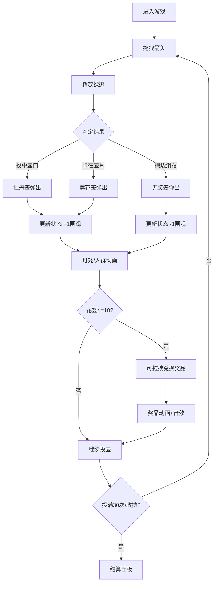

## 1. 产品概述
一款基于浏览器的北宋汴京州桥夜市投壶博彩交互模拟游戏，用户扮演夜市摊主，通过拖拽箭矢进行投壶游戏，体验古代夜市的热闹氛围。

- 核心玩法：拖拽箭矢投向铜壶，根据投中结果获得花签并兑换奖品
- 目标用户：喜欢中国古代文化、休闲小游戏的用户
- 产品价值：通过精美的夜市场景和互动玩法，沉浸式体验古代民俗文化

## 2. 核心功能

### 2.1 用户角色
| 角色 | 注册方式 | 核心权限 |
|------|----------|----------|
| 游客用户 | 无需注册 | 进行投壶游戏、兑换奖品、查看成绩 |

### 2.2 功能模块
1. **游戏主场景**：铜壶、箭矢拖拽、投中判定、花签弹出动画
2. **摊位装饰系统**：灯笼颜色动态变化、围观人群密度控制
3. **音效系统**：叫卖声节奏控制、兑换音效
4. **花签兑换系统**：花签拖拽兑换、奖品发放动画
5. **成绩面板**：实时统计投壶数据、翻页动画
6. **结算面板**：游戏结束统计、卷轴动画

### 2.3 页面详情
| 页面名称 | 模块名称 | 功能描述 |
|----------|----------|----------|
| 游戏主页面 | 投壶区域 | 展示铜壶、箭筒，支持拖拽箭矢投壶 |
| 游戏主页面 | 摊位装饰 | 灯笼动画、人群密度变化、叫卖声 |
| 游戏主页面 | 兑换区域 | 花签拖拽兑换奖品 |
| 游戏主页面 | 成绩面板 | 实时显示投壶统计数据 |
| 结算弹窗 | 结算面板 | 展示最终成绩和奖品统计 |

## 3. 核心流程

用户进入游戏 → 拖拽箭矢投向铜壶 → 系统判定投中结果 → 弹出对应花签 → 更新灯笼颜色和人群密度 → 积累花签后可拖拽兑换奖品 → 投满30次或点击收摊 → 显示结算面板

## 4. 界面设计

### 4.1 设计风格
- **主色调**：深蓝夜空#0a0a2a、木色#6b4e3a、青砖#6b7b6b
- **点缀色**：暖黄灯笼#ffa500、铜壶金色#cd7f32、花签粉色#ff69b4、莲花蓝#b0e0e6
- **字体**：古风字体（如Ma Shan Zheng、ZCOOL XiaoWei），营造古典氛围
- **按钮风格**：木制圆角按钮，带有古朴纹理
- **布局**：居中对称的夜市摊位剖面图，层次分明
- **动画风格**：使用framer-motion实现流畅的抛物线、呼吸、闪烁等动画效果

### 4.2 页面设计概述
| 页面名称 | 模块名称 | UI元素 |
|----------|----------|--------|
| 游戏主页面 | 投壶区域 | 青砖地面、木制摊位、铜壶（带壶耳）、箭筒、可拖拽箭矢 |
| 游戏主页面 | 灯笼装饰 | 正中八角大灯笼、左右六角小灯笼，发光径向渐变 |
| 游戏主页面 | 围观人群 | 圆形小人，不同颜色区分，淡入淡出动画 |
| 游戏主页面 | 兑换区域 | 花签存放区、奖品展示区 |
| 游戏主页面 | 成绩木牌 | 悬挂在木柱上，古风字体显示统计 |
| 结算弹窗 | 卷轴面板 | 仿古宣纸背景，暗红色边框，卷轴展开动画 |

### 4.3 响应式
- Desktop-first设计，屏幕宽度<768px时：
  - 摊位整体缩放至80%
  - 花签和奖品图标按比例缩小
  - 叫卖声节奏加快20%
  - 触控操作优化

## 5. 性能要求
- 投壶判定和动画保持60FPS
- 单次拖拽+动画响应≤16ms
- 花签弹出动画异步执行，不阻塞后续操作
- 人群密度变化无布局抖动
