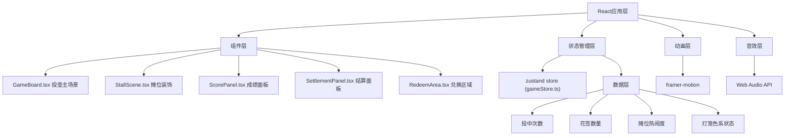

## 1. 架构设计



## 2. 技术描述
- **前端框架**：React@18 + TypeScript
- **构建工具**：Vite@5 + @vitejs/plugin-react
- **状态管理**：zustand@4
- **动画库**：framer-motion@11
- **CSS方案**：CSS Modules + 内联样式（动态样式）
- **音效**：Web Audio API（原生实现，无需额外依赖）
- **拖拽**：原生HTML5 Drag and Drop API + 鼠标/触摸事件监听

## 3. 目录结构
```
auto20/
├── package.json
├── vite.config.js
├── tsconfig.json
├── index.html
└── src/
    ├── main.tsx
    ├── components/
    │   ├── GameBoard.tsx      # 投壶主场景
    │   ├── StallScene.tsx     # 摊位装饰（灯笼、人群）
    │   ├── ScorePanel.tsx     # 成绩面板
    │   ├── SettlementPanel.tsx # 结算面板
    │   └── RedeemArea.tsx     # 兑换区域
    ├── store/
    │   └── gameStore.ts       # zustand全局状态
    ├── hooks/
    │   ├── useAudio.ts        # 音效Hook
    │   └── useDragAndDrop.ts  # 拖拽Hook
    ├── types/
    │   └── game.ts            # 类型定义
    └── utils/
        └── gameLogic.ts       # 游戏逻辑工具
```

## 4. 类型定义

```typescript
// 投壶结果类型
export type ThrowResult = 'peony' | 'lotus' | 'miss';

// 灯笼状态类型
export type LanternColor = 'default' | 'red' | 'green' | 'blue';

// 游戏状态接口
export interface GameState {
  totalThrows: number;
  hitCount: number;
  earHitCount: number;
  missCount: number;
  peonyTickets: number;
  lotusTickets: number;
  crowdDensity: number;
  lanternColor: LanternColor;
  recentResults: ThrowResult[];
  prizes: {
    honeyCake: number;
    silkFlower: number;
  };
  isGameOver: boolean;
  showSettlement: boolean;
}

// 游戏Action接口
export interface GameActions {
  playRound: (result: ThrowResult) => void;
  redeemPrize: (ticketType: 'peony' | 'lotus') => void;
  updateLanternColor: () => void;
  endGame: () => void;
  resetGame: () => void;
}
```

## 5. 核心数据模型

### 5.1 状态管理 (gameStore.ts)
- 存储所有游戏状态：投中次数、花签数量、人群密度、灯笼颜色
- 提供action方法：playRound、redeemPrize、updateLanternColor、endGame、resetGame
- 灯笼颜色判定逻辑：
  - 最近3次连续投中 → 红色闪烁
  - 最近2次连续卡耳 → 绿色呼吸
  - 最近2次连续落空 → 蓝色抖动
  - 其他情况 → 默认暖黄色

### 5.2 游戏判定逻辑 (gameLogic.ts)
- `calculateThrowResult(hitPosition: {x: number, y: number}, potDimensions: PotDimensions): ThrowResult`
  - 计算箭矢落点与壶口、壶耳的碰撞检测
  - 返回投中结果类型

- `getLanternColor(recentResults: ThrowResult[]): LanternColor`
  - 根据最近5次结果判定灯笼颜色

## 6. 性能优化策略
1. **动画隔离**：花签弹出动画使用framer-motion的animatePresence异步执行
2. **状态批量更新**：zustand支持批量action，减少重渲染
3. **虚拟列表**：围观人群使用CSS transform定位，避免重排
4. **useMemo/useCallback**：合理使用React Hooks缓存计算结果和回调
5. **requestAnimationFrame**：拖拽逻辑使用RAF优化，确保60FPS
6. **Web Worker**：复杂碰撞检测可移至Worker（按需）
