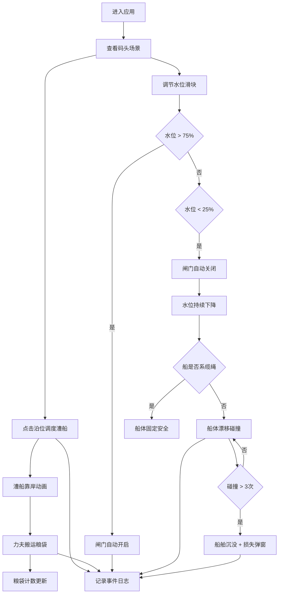

## 1. 产品概述

古渡漕运调度是一款明代京杭大运河漕运码头模拟Web应用，用户扮演巡检官，负责漕船调度、货物装卸与船闸水位联动管理。

- 核心目标：通过互动式模拟体验古代漕运码头的运作流程，融合历史文化与游戏化交互
- 目标用户：历史爱好者、教育场景用户、休闲游戏玩家
- 市场价值：寓教于乐的历史文化传播载体，兼具教育意义与互动趣味性

## 2. 核心功能

### 2.1 用户角色

| 角色 | 注册方式 | 核心权限 |
|------|----------|----------|
| 巡检官 | 无需注册，直接进入 | 调度漕船、指挥装卸、控制水位、查看日志 |

### 2.2 功能模块

1. **码头场景主界面**：CSS绘制的俯视图漕运码头，包含堤岸、系船柱、独轮车、石闸、栈房等元素
2. **漕船调度系统**：点击泊位使漕船靠岸，拖拽船舶到系船柱系缆绳
3. **力夫装卸动画**：3个简笔小人循环搬运粮袋从船到栈房，粮袋计数实时更新
4. **船闸水位控制**：滑块调节水位，水位阈值自动控制闸门开关，水纹波动动画
5. **碰撞与沉没机制**：未系缆绳的船在水位下降时漂移碰撞，超过3次沉没并显示损失账单
6. **调度日志系统**：实时记录所有事件，支持过滤和清空，数据持久化到本地

### 2.3 页面详情

| 页面名称 | 模块名称 | 功能描述 |
|----------|----------|----------|
| 主调度界面 | 左栏控制面板 | 水位滑块控制、待调度船只列表显示 |
| 主调度界面 | 中栏场景渲染区 | CSS绘制的码头俯视图、漕船、力夫、闸门动画交互 |
| 主调度界面 | 右栏事件日志 | 调度事件表格、类型过滤、清空功能 |
| 弹窗组件 | 损失账单弹窗 | 船舶沉没时显示漕运损失明细 |

## 3. 核心流程

用户进入应用后，首先看到完整的码头场景。点击泊位区域触发漕船靠岸动画，随后力夫开始循环搬运粮袋，粮袋数量在栈房屋顶看板实时累加。用户可通过左栏滑块调节闸口水位，水位高于75%时闸门自动开启允许船只过闸，低于25%时自动关闭。当闸门关闭且水位持续下降时，用户需拖拽船舶到系船柱附近扣合缆绳，否则船体会随水流漂移碰撞闸门，碰撞超过3次导致船舶沉没并弹出损失账单。所有事件实时记录到右栏日志面板，并通过后端API持久化存储。

## 4. 用户界面设计

### 4.1 设计风格

- **配色方案**：青绿山水画风格
  - 主色：#4a6a4a（岸堤）、#3a8aff（水面）、#c4a64a（建筑木结构）
  - 辅助色：#b8a070（土黄堤岸）、#cc0000（朱红系船柱）、#5d3a1a（船体棕色）
  - 背景色：#4a6a4a（深青绿色）
- **按钮样式**：圆角矩形，木纹质感边框，悬停有轻微上浮效果，点击有按压反馈
- **字体**：衬线体（SimSun/宋体），营造古文化氛围
- **布局风格**：三栏式布局，左中右结构，中栏为核心场景区，左右两栏为控制面板
- **视觉元素**：CSS绘制的纯DOM元素，无图片资源，所有动画使用CSS/framer-motion实现

### 4.2 页面设计概述

| 页面名称 | 模块名称 | UI元素 |
|----------|----------|--------|
| 主调度界面 | 左栏控制面板 | 水位滑块（带刻度）、船只列表卡片、当前状态指示灯 |
| 主调度界面 | 中栏场景区 | 土黄色堤岸、三根朱红系船柱、两辆独轮车、石砌闸门、青灰色栈房、漕船、力夫小人、蓝色水面 |
| 主调度界面 | 右栏事件日志 | 表格（时间戳、事件类型、船舶编号、影响描述、损失金额）、过滤下拉框、清空按钮 |
| 损失账单弹窗 | 弹窗内容 | 仿古卷轴样式、损失明细列表、总计金额、确认按钮 |

### 4.3 响应式

- 桌面端优先设计，核心场景区采用视口单位实现自适应
- 中栏场景使用百分比定位，元素随窗口大小等比例缩放
- 左右两栏最小宽度280px，窗口过小时可折叠为侧边抽屉
- 触控交互支持：移动端可拖动滑块和船舶

### 4.4 动画设计

- 船舶靠岸：水平滑动+轻微摇摆，持续2秒
- 力夫路径：三点式路径动画（船→岸→栈房），循环播放，单个循环3秒
- 水位升降：高度过渡+水纹波动clip-path动画，持续1秒
- 闸门开合：水平位移动画，持续0.8秒
- 船体漂移：随机水平位移+旋转摇摆，碰撞时有抖动特效
- 事件日志：新事件整行从右侧滑入，持续0.3秒
- 所有状态变化缓动：0.3s cubic-bezier(0.4, 0, 0.2, 1)
- 帧率保证：所有动画不低于30fps
