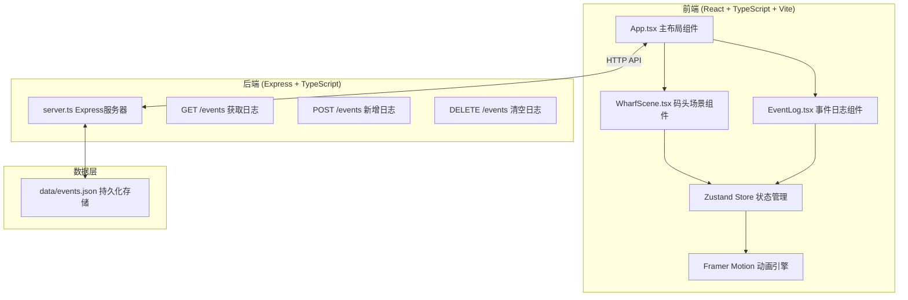
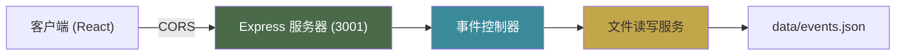
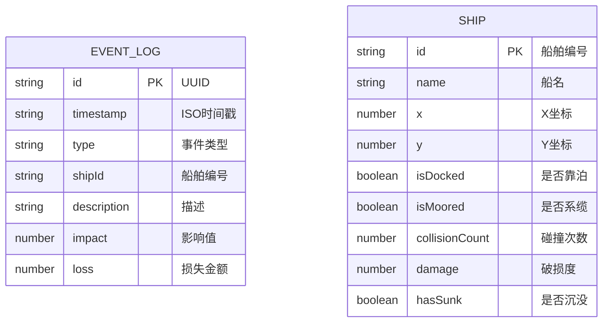

## 1. 架构设计



## 2. 技术描述

- **前端**：React@18 + TypeScript@5 + Vite@5
- **后端**：Express@4 + TypeScript@5
- **状态管理**：Zustand@4
- **动画库**：Framer Motion@11
- **跨域**：CORS中间件
- **UUID生成**：uuid@9
- **构建工具**：Vite@5 + @vitejs/plugin-react@4
- **开发模式**：前端3000端口，后端3001端口同时运行

## 3. 目录结构

```
.
├── package.json
├── index.html
├── vite.config.js
├── tsconfig.json
├── src/
│   ├── main.tsx
│   ├── App.tsx
│   ├── store/
│   │   └── useWharfStore.ts
│   ├── types/
│   │   └── index.ts
│   ├── components/
│   │   ├── WharfScene.tsx
│   │   └── EventLog.tsx
│   └── utils/
│       └── api.ts
├── backend/
│   └── server.ts
└── data/
    └── events.json
```

## 4. API 定义

### 4.1 类型定义

```typescript
type EventType = 'dock' | 'unload' | 'lock' | 'collision' | 'sink';

interface EventLog {
  id: string;
  timestamp: string;
  type: EventType;
  shipId: string;
  description: string;
  impact: number;
  loss: number;
}

interface Ship {
  id: string;
  name: string;
  x: number;
  y: number;
  isDocked: boolean;
  isMoored: boolean;
  collisionCount: number;
  damage: number;
  hasSunk: boolean;
}

interface WharfState {
  ships: Ship[];
  waterLevel: number;
  gateOpen: boolean;
  grainCount: number;
  events: EventLog[];
  selectedShipId: string | null;
  setWaterLevel: (level: number) => void;
  dockShip: (shipId: string) => void;
  moorShip: (shipId: string) => void;
  unloadGrain: (shipId: string, amount: number) => void;
  recordCollision: (shipId: string) => void;
  recordEvent: (event: Omit<EventLog, 'id' | 'timestamp'>) => void;
  fetchEvents: () => Promise<void>;
  clearEvents: () => Promise<void>;
}
```

### 4.2 接口定义

| 方法 | 路径 | 描述 | 请求参数 | 响应格式 |
|------|------|------|----------|----------|
| GET | /events | 获取所有事件日志 | 无 | `EventLog[]` |
| POST | /events | 新增事件日志 | `Omit<EventLog, 'id' | 'timestamp'>` | `EventLog` |
| DELETE | /events | 清空事件日志 | 无 | `{ success: boolean }` |

## 5. 服务器架构图



### 5.1 后端中间件流程

1. CORS 中间件：允许来自 http://localhost:3000 的跨域请求
2. JSON 解析中间件：解析请求体
3. 静态文件服务（可选）：提供静态资源
4. 路由处理：分发到对应的端点处理器
5. 错误处理：统一捕获并返回错误响应

## 6. 数据模型

### 6.1 实体关系图



### 6.2 事件类型说明

| 类型 | 描述 | impact 含义 | loss 计算 |
|------|------|-------------|-----------|
| dock | 靠泊 | 泊位编号 | 0 |
| unload | 卸货 | 粮袋数量 | 0 |
| lock | 过闸 | 水位值 | 0 |
| collision | 碰撞 | 碰撞角度 | 50 * 碰撞次数 |
| sink | 沉没 | 破损度 | 1000 + 货物价值 |

### 6.3 初始数据

**data/events.json** 初始化为空数组：
```json
[]
```

**ships 初始状态**：
```typescript
[
  { id: 'ship-001', name: '福安号', x: 5, y: 30, isDocked: false, isMoored: false, collisionCount: 0, damage: 0, hasSunk: false },
  { id: 'ship-002', name: '顺昌号', x: 5, y: 50, isDocked: false, isMoored: false, collisionCount: 0, damage: 0, hasSunk: false },
  { id: 'ship-003', name: '永济号', x: 5, y: 70, isDocked: false, isMoored: false, collisionCount: 0, damage: 0, hasSunk: false },
]
```

## 7. 动画实现方案

### 7.1 核心动画组件

1. **漕船靠岸**：Framer Motion `animate` 函数驱动 x 坐标从 5% → 25%，同时 y 坐标有 ±2% 的正弦波动
2. **力夫搬运**：3个力夫依次出发，使用 `keyframes` 实现三点式路径（船→岸→栈房），循环播放
3. **水位波动**：CSS `clip-path` + `@keyframes` 实现水纹效果，高度变化使用 `transition`
4. **闸门开合**：Framer Motion 驱动水平位移，开闸时闸板向两侧各移动 20px
5. **船体漂移**：`useAnimationFrame` 实现随机漂移算法，碰撞时触发 `animate` 抖动
6. **粮袋计数**：使用 `useSpring` 实现数字平滑过渡

### 7.2 性能优化

- 使用 `will-change: transform` 提升动画性能
- 力夫动画使用 CSS transforms 而非 top/left
- 水位动画使用 `transform: scaleY()` 而非 height
- 碰撞检测使用 requestAnimationFrame 节流
