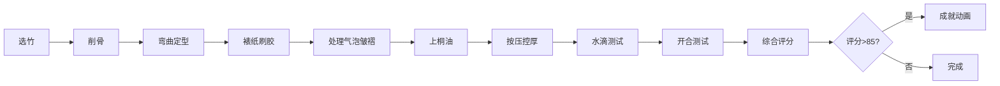

## 1. 产品概述

本应用是一个古代油纸伞制作工艺的交互式演示工具，通过浏览器模拟从选竹、削骨、裱纸到上桐油的完整制作流程，解决传统工艺中参数影响无法直观感受和反复试错成本高的问题。

- 核心价值：让用户直观理解伞骨弯曲角度、伞面拼接纹样和桐油涂抹厚度对最终成品防水与开合耐用度的影响
- 目标用户：手工艺爱好者、文化学习者、工艺教学者

## 2. 核心功能

### 2.1 用户角色
| 角色 | 注册方式 | 核心权限 |
|------|----------|----------|
| 普通用户 | 无需注册 | 完整体验制作流程、查看评分、重复练习 |

### 2.2 功能模块
1. **选竹削骨模块**：竹段拖拽、刮刀削刮、弯曲角度控制
2. **裱纸模块**：黏合剂刷涂、气泡生成与消除、皱褶检测、扇形拼接
3. **上桐油模块**：油滴蘸取、按压时长控制厚度、防水性能水滴测试
4. **开合测试模块**：伞骨展开/收拢动画、流畅度进度条、综合评分
5. **记录面板模块**：步骤耗时与精度记录、工艺评分、成就动画

### 2.3 页面详情
| 页面名称 | 模块名称 | 功能描述 |
|---------|----------|----------|
| 主操作台 | 选竹削骨 | 拖拽竹段到台面，鼠标模拟刮刀削刮，旋转控制柄调整弯曲度0-60度 |
| 主操作台 | 裱纸 | 刷具蘸取黏合剂沿伞骨刷涂，速度影响服帖度，气泡可点击消除 |
| 主操作台 | 上桐油 | 从陶罐蘸取桐油，按压时长控制油层厚度，水壶倒水测试防水 |
| 主操作台 | 开合测试 | 拖拽控制柄模拟开合，进度条显示流畅度，综合评分计算 |
| 右侧面板 | 记录面板 | 实时显示各步骤耗时、精度指标、工艺评分、成就展示 |

## 3. 核心流程

用户从材料架拖拽竹段→用刮刀削出骨条雏形→调整弯曲角度卡入凹槽→刷涂黏合剂裱纸→处理气泡和皱褶→蘸取桐油涂抹伞面→按压控制油层厚度→水滴测试防水→开合伞测试流畅度→获得综合评分→触发成就动画。

## 4. 用户界面设计

### 4.1 设计风格
- 主色调：暖棕色（#5d3a1a）+ 米白色（#f5deb3），竹青色（#6b8e23）点缀
- 视觉质感：手工木作温润质感，木纹光晕，竹简纹理背景
- 字体：标题使用"Ma Shan Zheng"书法字体，正文使用系统无衬线字体
- 交互反馈：悬停微光描边（#ffd700）、拖动弹性缩放（scale(1.05)）、落点阴影凹陷
- 动画：CSS过渡动画配合framer-motion，音频振荡模拟竹节咔嗒声

### 4.2 页面设计概述
| 页面名称 | 模块名称 | UI元素 |
|---------|----------|--------|
| 主操作台 | 场景布局 | 三栏结构：左15%材料区、中60%操作台、右25%信息面板 |
| 主操作台 | 宋代作坊 | 青砖地面#6b7b6b、左侧材料架青竹段、中央木工台#5d3a1a、右侧半成品伞架 |
| 主操作台 | 工具交互 | 刮刀、刷具、陶罐、水壶，悬停发光，拖动缩放 |
| 右侧面板 | 简牍记录 | 红木简牍#8b2500背景，竹简纹理，步骤记录与评分 |
| 主操作台 | 成就动画 | 金线绣梅#ffd700贝塞尔曲线，2秒淡出 |

### 4.3 响应式设计
- 桌面端（≥768px）：三栏网格布局，工具横向排列
- 移动端（<768px）：全宽单列布局，工具竖向排列
- 触摸优化：增大可交互区域，支持触摸拖拽和长按

### 4.4 视觉特效
- 木纹光晕：CSS径向渐变#5d3a1a至#4a2e1a
- 棉纸纤维：细密CSS渐变纹理
- 竹简纹理：重复线性渐变模拟
- 水滴效果：CSS球形渐变+box-shadow高光
- 桐油层次：透明度过渡模拟厚薄效果
