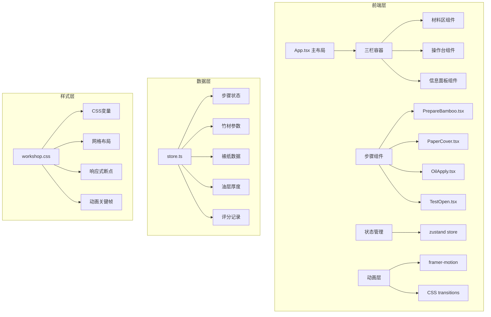
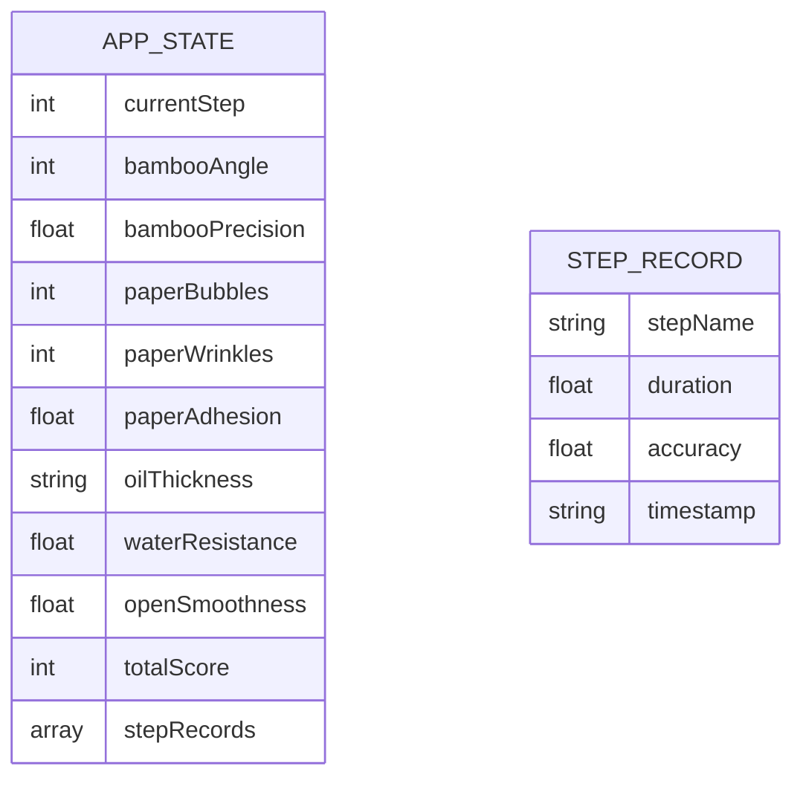

## 1. 架构设计



## 2. 技术描述

- 前端框架：React@18 + TypeScript
- 构建工具：Vite@5
- 状态管理：zustand@4
- 动画库：framer-motion@11
- 样式方案：CSS Modules + 全局CSS变量
- 音频：Web Audio API（振荡模拟竹节声）
- 字体：Google Fonts "Ma Shan Zheng"

## 3. 路由定义

| 路由 | 用途 |
|------|------|
| / | 主应用页面，单页应用无额外路由 |

## 4. 数据模型

### 4.1 状态模型定义



### 4.2 类型定义

```typescript
interface BambooState {
  angle: number;
  precision: number;
  isShaped: boolean;
}

interface PaperState {
  bubbles: Array<{ x: number; y: number; size: number }>;
  wrinkles: Array<{ x: number; y: number }>;
  adhesion: number;
  isApplied: boolean;
}

interface OilState {
  thickness: 'thin' | 'medium' | 'thick';
  coverage: number;
  waterResistance: number;
  isApplied: boolean;
}

interface StepRecord {
  name: string;
  duration: number;
  accuracy: number;
  timestamp: number;
}

interface AppState {
  currentStep: number;
  bamboo: BambooState;
  paper: PaperState;
  oil: OilState;
  records: StepRecord[];
  totalScore: number;
  showAchievement: boolean;
}
```

## 5. 性能优化

### 5.1 帧率保障
- 动画使用CSS transforms和opacity，避免触发重排
- 气泡和油滴动画使用will-change优化
- 复杂计算使用requestAnimationFrame分批处理
- 开合伞动画每帧计算控制在2ms内

### 5.2 性能指标
- 主线程帧率 ≥ 45fps
- 首次内容绘制 < 2s
- 最大潜在断点 < 100ms
- 动画帧计算 < 2ms/帧

## 6. 项目文件结构

```
├── index.html
├── package.json
├── vite.config.js
├── tsconfig.json
└── src/
    ├── main.tsx
    ├── App.tsx
    ├── data/
    │   └── store.ts
    ├── steps/
    │   ├── PrepareBamboo.tsx
    │   ├── PaperCover.tsx
    │   ├── OilApply.tsx
    │   └── TestOpen.tsx
    └── styles/
        └── workshop.css
```
