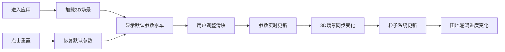

## 1. 产品概述

古代水车（翻车）提水灌溉与水流路径交互模拟3D可视化应用，让用户以汉代农夫的视角，在虚拟溪流边观察水车被水流推动的过程，通过调整水车轮叶角度、入水深度和齿轮传动比，实时观察水流被提升的高度、流量变化以及灌溉渠中水流的波动态势。

- 核心目的：通过交互式3D模拟，直观展示古代水车的工作原理和灌溉过程
- 目标用户：历史教育学习者、古代科技爱好者、博物馆参观者
- 产品价值：将抽象的古代机械原理转化为可视化、可交互的沉浸式体验

## 2. 核心功能

### 2.1 用户角色

| 角色 | 注册方式 | 核心权限 |
|------|----------|----------|
| 普通用户 | 无需注册 | 自由调整水车参数，观察3D模拟效果，重置状态 |

### 2.2 功能模块

1. **3D场景模块**：动态溪流、木制水车、齿轮传动、灌溉渠、田地的3D可视化
2. **参数控制模块**：轮叶角度滑块、入水深度滑块、齿轮比滑块、重置按钮
3. **状态显示模块**：水车转速、提水高度、灌溉流量数字显示与进度条
4. **粒子模拟模块**：水流粒子沿渠道流动、水车提水粒子动画、灌溉面积渐变
5. **视觉效果模块**：古纸纹理遮罩、ShaderMaterial水面、响应式布局

### 2.3 页面详情

| 页面名称 | 模块名称 | 功能描述 |
|-----------|-------------|---------------------|
| 主页面 | 3D场景区域 | 展示完整的水车灌溉3D场景，包含溪流、水车、齿轮、灌溉渠、田地，可自由旋转观察 |
| 主页面 | 顶部状态栏 | 实时显示水车转速、提水高度、灌溉流量的数值和进度条 |
| 主页面 | 底部控制面板 | 三个滑块控制轮叶角度、入水深度、齿轮比，重置按钮恢复默认值 |

## 3. 核心流程

用户进入应用后，首先看到完整的3D水车灌溉场景。用户可以通过鼠标拖拽旋转视角、滚轮缩放观察场景细节。调整底部滑块时，水车参数实时变化，3D场景同步更新视觉效果和物理模拟。粒子系统根据当前流量动态生成水流粒子，沿灌溉渠流动到田地，田地颜色随灌溉进度渐变。点击重置按钮可将所有参数恢复默认值。

## 4. 用户界面设计

### 4.1 设计风格

- **主色调**：浅米色#f5e6c8背景，半透明棕色#8b6914控制面板，木色#6b4e3a至#5d3a1a渐变水车
- **点缀色**：青绿#2a6b4a至浅蓝#6ba3c0渐变水面，蓝绿渐变#4a90d9至#2a7a2a进度条
- **滑块样式**：槽色#d2b48c，滑块头#5d3a1a圆角矩形（宽120px高10px）
- **字体**：宋体数字显示滑块值
- **整体风格**：古典田园风格，古纸纹理遮罩增添历史质感

### 4.2 页面设计概述

| 页面名称 | 模块名称 | UI元素 |
|-----------|-------------|-------------|
| 主页面 | 3D场景区域 | 全屏Three.js场景，半透明古纸纹理遮罩（透明度0.15），可交互3D视角控制 |
| 主页面 | 顶部状态栏 | 三个数值显示卡片，分别显示转速、提水高度、流量，每个包含数值标签和蓝绿渐变进度条 |
| 主页面 | 底部控制面板 | 三个水平排列的滑块控件，每个带有中文标签和数值显示，右侧重置按钮，移动端自动换行 |

### 4.3 响应式设计

- **桌面端**：滑块水平排列为一行，3D场景占大部分视口高度
- **移动端（<768px）**：滑块自动排列为两行，3D场景高度占视口55%，控件区占45%
- **触控优化**：滑块支持触摸拖动，3D场景支持触控旋转和缩放

### 4.4 3D场景指导

- **环境与氛围**：古典田园风光，柔和自然光，古纸纹理遮罩营造历史感
- **光照设置**：环境光+方向光，模拟自然日光，水车和水面有适当高光
- **相机设置**：初始位置稍高俯视场景，支持OrbitControls自由旋转、缩放、平移
- **构图与焦点**：水车位于场景中央偏左，灌溉渠向右延伸，田地在右下角，视觉焦点在水车
- **交互与动画**：水车持续旋转，轮叶角度变化时有0.5秒平滑过渡，水流粒子持续运动，田地颜色渐变
- **后处理效果**：古纸纹理叠加，轻微雾化效果增加纵深感
- **性能预算**：粒子数量不超过300个，稳定30FPS以上

## 5. 交互细节

### 5.1 滑块交互

- **轮叶角度**：范围15°-45°，默认30°，调整时轮叶即时旋转到对应角度
- **入水深度**：范围0.5-1.5单位，默认1.0单位，调整时水车整体上下移动
- **齿轮比**：范围1:3-1:6，默认1:4，调整时转速和提水高度相应变化

### 5.2 粒子系统

- **灌溉粒子**：50个蓝色小球（直径0.05，透明度0.7），从水车顶部出发沿渠道流动，速度随流量变化（0.3-0.8单位/秒）
- **提水粒子**：24个白色半透明小球（大小0.03），沿辐条从底部向顶部运动，密度和速度随参数变化
- **粒子消失**：到达田间后闪烁0.2秒后消失

### 5.3 灌溉进度

- 田地初始为干旱棕色#8b6914
- 逐渐变为湿润棕色#5c3a0a
- 最终变为绿色#3a7a2a
- 颜色变化随灌溉流量累积渐变
