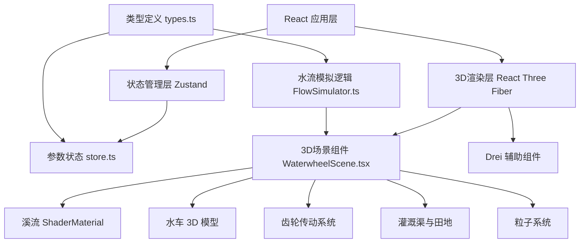
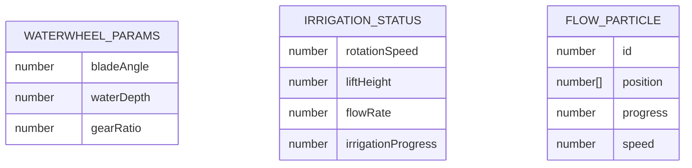

## 1. 架构设计



## 2. 技术描述

- **前端框架**：React@18 + TypeScript@5 + Vite@5
- **3D渲染**：three@0.160 + @react-three/fiber@8 + @react-three/drei@9
- **状态管理**：zustand@4
- **构建工具**：Vite@5 + @vitejs/plugin-react@4
- **样式方案**：原生CSS + CSS变量，无需Tailwind
- **初始化方式**：使用vite-init创建react-ts模板

## 3. 项目文件结构

| 文件路径 | 职责描述 |
|----------|----------|
| package.json | 项目依赖和脚本配置 |
| vite.config.js | Vite构建配置 |
| tsconfig.json | TypeScript严格模式配置 |
| index.html | 入口页面，挂载点 |
| src/types.ts | WaterwheelParams、IrrigationStatus、FlowPath等数据接口和类型定义 |
| src/store.ts | Zustand状态管理，导出useStore hook |
| src/WaterwheelScene.tsx | 核心3D场景组件，构建溪流、水车、齿轮、灌溉渠模型 |
| src/FlowSimulator.ts | 水流模拟逻辑模块，计算提水高度、流量、粒子路径 |
| src/App.tsx | 主应用组件，整合3D场景和UI控件 |
| src/main.tsx | 应用入口 |
| src/index.css | 全局样式 |
| public/textures/parchment.png | 古纸纹理图片 |

## 4. 数据模型

### 4.1 数据模型定义



### 4.2 TypeScript 类型定义

```typescript
// src/types.ts
export interface WaterwheelParams {
  bladeAngle: number;      // 轮叶角度 15-45度
  waterDepth: number;      // 入水深度 0.5-1.5单位
  gearRatio: number;       // 齿轮比 3-6 (1:3 到 1:6)
}

export interface IrrigationStatus {
  rotationSpeed: number;   // 水车转速 0.2-1.5转/秒
  liftHeight: number;      // 提水高度 0.5-3.0单位
  flowRate: number;        // 灌溉流量 0.1-0.8立方米/秒
  irrigationProgress: number; // 灌溉进度 0-1
}

export interface FlowParticle {
  id: number;
  position: [number, number, number];
  progress: number;
  speed: number;
}

export interface WaterParticle {
  id: number;
  position: [number, number, number];
  progress: number;
  spokeIndex: number;
}

export type ParticlePool = FlowParticle[];
export type WaterParticlePool = WaterParticle[];
```

## 5. 核心算法

### 5.1 水车转速计算

```
基础转速 = 0.2 + (入水深度 - 0.5) * 0.8 + (轮叶角度 - 15) * 0.02
实际转速 = 基础转速 * (齿轮比 / 4) * 0.8
转速范围限制在 [0.2, 1.5] 转/秒
```

### 5.2 提水高度计算

```
提水高度 = 0.5 + (齿轮比 - 3) * 0.8 + (入水深度 - 0.5) * 0.5
高度范围限制在 [0.5, 3.0] 单位
```

### 5.3 灌溉流量计算

```
流量 = 0.1 + (转速 - 0.2) * 0.6 + (轮叶角度 - 15) * 0.01
流量范围限制在 [0.1, 0.8] 立方米/秒
```

### 5.4 灌溉进度计算

```
灌溉进度 += 流量 * 时间增量 * 0.1
进度范围限制在 [0, 1]
```

### 5.5 粒子路径计算

灌溉粒子沿直线路径从水车顶部出水口(0, liftHeight, 0)到田间(8, 0, -2)，使用线性插值计算位置：
```
position = start + (end - start) * progress
```

提水粒子沿12根辐条从底部向顶部运动，每根辐条分配2个粒子，使用球面坐标计算位置。

## 6. 性能优化策略

1. **粒子池复用**：固定粒子数量（灌溉50个 + 提水24个 = 74个），循环复用，不超过300限制
2. **帧速率控制**：使用useFrame的delta参数控制动画速度，与帧率解耦
3. **几何体复用**：相同类型的粒子使用instancedMesh减少绘制调用
4. **材质复用**：相同属性的物体共享材质实例
5. **按需更新**：仅在参数变化时重新计算3D模型属性，避免每帧重建
6. **渲染器设置**：启用antialias和alpha，使用硬件加速

## 7. 配置文件要点

### 7.1 vite.config.js

```javascript
import { defineConfig } from 'vite';
import react from '@vitejs/plugin-react';

export default defineConfig({
  plugins: [react()],
  server: {
    port: 5173,
    open: true
  }
});
```

### 7.2 tsconfig.json

```json
{
  "compilerOptions": {
    "target": "ES2020",
    "useDefineForClassFields": true,
    "lib": ["ES2020", "DOM", "DOM.Iterable"],
    "module": "ESNext",
    "skipLibCheck": true,
    "moduleResolution": "bundler",
    "allowImportingTsExtensions": true,
    "resolveJsonModule": true,
    "isolatedModules": true,
    "noEmit": true,
    "jsx": "react-jsx",
    "strict": true,
    "noUnusedLocals": true,
    "noUnusedParameters": true,
    "noFallthroughCasesInSwitch": true
  },
  "include": ["src"],
  "references": [{ "path": "./tsconfig.node.json" }]
}
```

### 7.3 package.json 依赖

```json
{
  "dependencies": {
    "react": "^18.2.0",
    "react-dom": "^18.2.0",
    "three": "^0.160.0",
    "@react-three/fiber": "^8.15.0",
    "@react-three/drei": "^9.92.0",
    "zustand": "^4.4.0"
  },
  "devDependencies": {
    "@types/react": "^18.2.0",
    "@types/react-dom": "^18.2.0",
    "@types/three": "^0.160.0",
    "typescript": "^5.3.0",
    "vite": "^5.0.0",
    "@vitejs/plugin-react": "^4.2.0"
  },
  "scripts": {
    "dev": "vite",
    "build": "tsc && vite build",
    "preview": "vite preview"
  }
}
```
