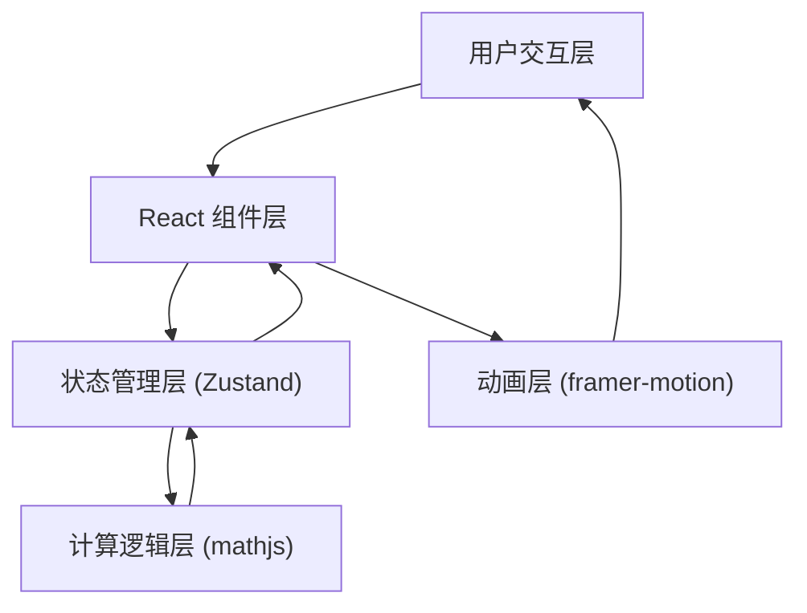

## 1. 架构设计



## 2. 技术描述
- **前端框架**：React 18 + TypeScript
- **构建工具**：Vite 5
- **状态管理**：Zustand 4
- **动画库**：framer-motion 11
- **数学计算**：mathjs 12
- **UI渲染**：SVG + CSS
- **项目初始化**：vite-init react-ts 模板

## 3. 目录结构
```
├── src/
│   ├── components/
│   │   ├── GridCanvas.tsx      # 云图网格画布组件
│   │   ├── ControlPanel.tsx    # 左侧控制面板
│   │   └── ResultPanel.tsx     # 右侧结果面板
│   ├── store/
│   │   └── useStore.ts         # Zustand 状态管理
│   ├── utils/
│   │   └── regression.ts       # 多项式拟合算法
│   ├── App.tsx                 # 主布局组件
│   ├── main.tsx                # React 入口
│   └── index.css               # 全局样式
├── index.html
├── vite.config.ts
├── tsconfig.json
└── package.json
```

## 4. 数据模型

### 4.1 状态定义
```typescript
interface DataPoint {
  id: string;
  x: number;
  y: number;
}

interface FitResult {
  coefficients: number[];  // 多项式系数，从低次到高次
  rSquared: number;         // R² 决定系数
  mse: number;              // 均方误差
  equation: string;         // 格式化的方程字符串
}

interface AppState {
  points: DataPoint[];
  degree: number;           // 多项式阶数 1-5
  fitResult: FitResult | null;
  selectedPointId: string | null;
  draggingPointId: string | null;
  
  // Actions
  addPoint: (x: number, y: number) => void;
  updatePoint: (id: string, x: number, y: number) => void;
  deletePoint: (id: string) => void;
  clearPoints: () => void;
  setDegree: (degree: number) => void;
  setSelectedPoint: (id: string | null) => void;
  setDraggingPoint: (id: string | null) => void;
  loadSampleData: () => void;
  calculateFit: () => void;
}
```

### 4.2 核心算法
使用最小二乘法进行多项式拟合：
1. 构造范德蒙德矩阵
2. 求解正规方程得到系数
3. 计算R²和MSE误差指标
4. 使用mathjs进行矩阵运算

## 5. 性能优化
- 曲线重绘使用requestAnimationFrame保证60fps
- 拖拽过程中使用节流计算，避免频繁拟合
- SVG渲染使用路径缓存，减少重绘开销
- 状态更新使用Zustand的选择性订阅避免不必要重渲染

## 6. 关键交互实现
1. **数据点拖拽**：使用framer-motion的drag属性，结合onDrag事件实时更新位置
2. **曲线动画**：使用framer-motion的animate属性实现路径平滑过渡
3. **发光效果**：SVG filter + CSS drop-shadow实现石青色发光
4. **云纹背景**：SVG pattern + 多层透明度渐变实现水墨效果

