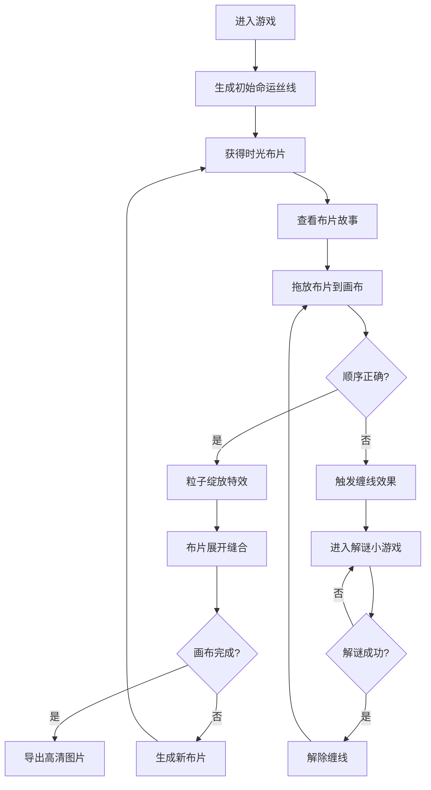

## 1. 产品概述

"时光裁缝"是一款模拟经营类网页游戏，玩家扮演时间织布师，通过收集不同时空的命运丝线，编织出能够改变角色命运的时光布片，最终缝合出完整的人生轨迹画布。

- **核心玩法**：收集命运丝线 → 编织时光布片 → 按时间顺序缝合 → 完成人生画布
- **目标用户**：喜欢休闲模拟、治愈系游戏的玩家
- **产品价值**：提供沉浸式的编织体验，结合微故事叙事与解谜元素，让玩家在放松中感受时间与命运的魅力

## 2. 核心功能

### 2.1 用户角色

| 角色 | 注册方式 | 核心权限 |
|------|----------|----------|
| 玩家 | 无需注册，直接进入游戏 | 完整游戏体验，包含织布、缝合、解谜、导出等功能 |

### 2.2 功能模块

1. **织布机3D场景**：中央3D织布机展示，支持旋转缩放视角
2. **布片库存面板**：左侧展示可缝合的布片列表
3. **缝合操作面板**：中央织布画布，支持拖放缝合
4. **缠线解谜小游戏**：错误缝合时触发的符号匹配游戏
5. **图鉴系统**：已解锁布片的时代图鉴
6. **导出功能**：将完成的织布导出为高清图片

### 2.3 页面详情

| 页面名称 | 模块名称 | 功能描述 |
|---------|----------|----------|
| 主游戏页面 | 3D织布机场景 | Three.js渲染织布机，支持鼠标拖拽旋转、滚轮缩放 |
| 主游戏页面 | 布片库存列表 | 左侧垂直列表展示待缝合布片，点击放大查看故事 |
| 主游戏页面 | 缝合画布 | 中央展示织布进度，拖放布片到正确位置 |
| 主游戏页面 | 功能按钮区 | 右侧图鉴按钮、导出按钮、新布片生成按钮 |
| 解谜弹窗 | 缠线小游戏 | 符号匹配/顺序点击解谜，成功解除缠线 |
| 图鉴弹窗 | 布片图鉴 | 按时代分类展示已解锁的布片和故事 |

## 3. 核心流程

玩家进入游戏后，首先生成初始布片，通过拖放将布片按时间顺序缝合到画布上。缝合正确触发粒子特效，错误则进入缠线解谜。完成所有布片缝合后，可导出高清图片。

## 4. 用户界面设计

### 4.1 设计风格

**时光复古风**
- **主色调**：古铜色 `#b87333`
- **辅助色**：深棕 `#4a3b2c`
- **点缀色**：淡金 `#f5e6b8`、宝石蓝 `#2a6f97`
- **背景**：微弱旧纸纹理 + 暖色光晕渐变

**视觉元素**
- 按钮：复古金属质感，圆角4px，悬停时古铜色发光
- 字体：标题使用衬线体（Playfair Display），正文使用优雅无衬线体（Noto Serif SC）
- 布局：三栏式布局，中央3D场景为视觉焦点
- 装饰：缝线纹理、织布图案、时光齿轮装饰元素

### 4.2 页面设计概述

| 页面名称 | 模块名称 | UI元素 |
|---------|----------|--------|
| 主游戏页面 | 3D织布机场景 | 木质织布机模型、丝线流动动画、布片展开效果、暖色点光源 |
| 主游戏页面 | 布片库存 | 卷轴式卡片、悬停上浮、古铜色边框、时代标签徽章 |
| 主游戏页面 | 缝合画布 | 网格参考线、淡金高亮目标位置、丝线连接动画 |
| 主游戏页面 | 功能按钮 | 圆形金属按钮、图标+文字、点击波纹效果 |
| 解谜弹窗 | 小游戏面板 | 半透明深色背景、发光符号、震动反馈 |
| 图鉴弹窗 | 图鉴列表 | 时代分类标签、布片卡片网格、故事展开动画 |

### 4.3 响应式设计

**桌面端（1920×1080）**
- 三栏布局：左栏280px，中央自适应，右栏200px
- 3D场景占中央区域80%高度

**平板端（1024×768）**
- 三栏布局：左栏240px，中央自适应，右栏180px
- 3D场景适当缩小，缩放比例0.85
- 按钮和文字缩小10%

### 4.4 3D场景指导

**环境与氛围**
- 背景：深棕色渐变 + 微弱噪点纹理模拟旧纸张
- 雾气：指数雾，颜色与背景融合，营造沉浸感
- 光晕：场景中心暖色放射光，模拟台灯效果

**光照设置**
- 主光源：暖白色方向光，强度0.8，投射柔和阴影
- 环境光：淡金色，强度0.4，提供基础照明
- 点光源：织布机两侧各一盏古铜色点光源，强度0.6

**相机设置**
- 初始位置：(0, 1.5, 4)，看向场景中心
- 控制：OrbitControls，限制俯仰角，禁止平移
- 动画：空闲时相机缓慢环绕，交互时停止

**交互与动画**
- 布片缝合：从库存位置飞行到目标位置，缩放过渡
- 丝线流动：shader动画，模拟丝线编织流动
- 粒子特效：花瓣/星光粒子，从缝合点向外扩散绽放
- 错误反馈：布片抖动，灰阶滤镜，红色边框闪烁

**后处理效果**
- Bloom：淡金色泛光，强度0.3
- 轻微颗粒感：模拟胶片质感
-  vignette：暗角效果，聚焦中心

**性能预算**
- 三角形数量：< 50,000
- 粒子数量：< 500
- 绘制调用：< 20
- 目标帧率：60fps

## 5. 动画效果规范

### 5.1 缝合动画
- 丝线流动：framer-motion path动画，从起点到终点，持续1.2s
- 布片展开：scale从0.8到1，opacity从0到1，弹性缓动
- 粒子绽放：50-100个粒子，随机方向飞出，持续1.5s

### 5.2 交互反馈
- 正确缝合：屏幕边缘金色光晕闪烁3次，持续0.5s
- 错误缝合：布片水平抖动，饱和度降至0.3，持续0.4s
- 布片点击：scale从1到1.1再回到1，故事卡片淡入

### 5.3 转场动画
- 弹窗出现：backdrop-filter模糊，scale从0.9到1，持续0.3s
- 页面元素入场：stagger动画，依次淡入上浮
