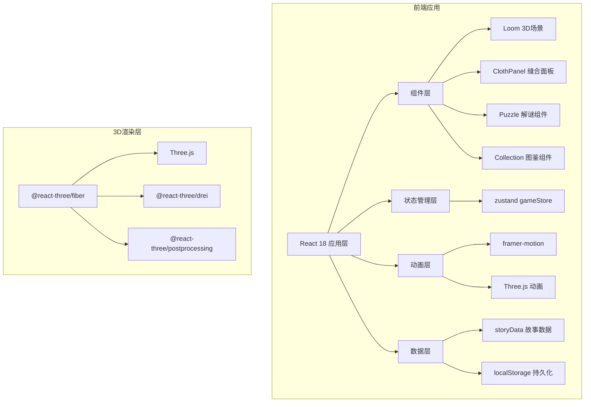

## 1. 架构设计



## 2. 技术描述

- **前端框架**：React@18 + TypeScript@5
- **构建工具**：Vite@5
- **3D渲染**：three@0.160 + @react-three/fiber@8 + @react-three/drei@9 + @react-three/postprocessing@2
- **状态管理**：zustand@4
- **动画库**：framer-motion@10
- **样式方案**：Tailwind CSS@3
- **图标库**：lucide-react@0.294

## 3. 目录结构

```
├── src/
│   ├── components/
│   │   ├── Loom.tsx              # 3D织布机场景组件
│   │   ├── ClothPanel.tsx        # 布片显示和缝合面板
│   │   ├── Puzzle.tsx            # 缠线解谜小游戏
│   │   ├── Collection.tsx        # 布片图鉴组件
│   │   ├── ClothCard.tsx         # 布片卡片组件
│   │   ├── ParticleEffect.tsx    # 粒子特效组件
│   │   └── ExportButton.tsx      # 导出按钮组件
│   ├── store/
│   │   └── gameStore.ts          # zustand状态管理
│   ├── data/
│   │   └── storyData.ts          # 布片故事数据
│   ├── types/
│   │   └── index.ts              # TypeScript类型定义
│   ├── utils/
│   │   ├── export.ts             # 导出图片工具
│   │   └── particles.ts          # 粒子系统工具
│   ├── App.tsx                   # 主应用组件
│   ├── main.tsx                  # React入口
│   └── index.css                 # 全局样式
├── package.json
├── vite.config.ts
├── tsconfig.json
└── index.html
```

## 4. 数据模型

### 4.1 TypeScript类型定义

```typescript
// 时代类型
type Era = 'ancient' | 'medieval' | 'renaissance' | 'industrial' | 'modern' | 'future';

// 布片状态
type ClothStatus = 'inventory' | 'sewn' | 'selected';

// 布片数据
interface ClothPiece {
  id: string;
  title: string;
  story: string;
  era: Era;
  eraLabel: string;
  correctOrder: number;
  status: ClothStatus;
  color: string;
  pattern: string;
  createdAt: number;
}

// 解谜类型
type PuzzleType = 'symbol-match' | 'sequence-click';

// 解谜状态
interface PuzzleState {
  isActive: boolean;
  type: PuzzleType;
  clothId: string | null;
  attempts: number;
}

// 游戏状态
interface GameState {
  clothPieces: ClothPiece[];
  sewnOrder: string[];
  currentEra: Era;
  puzzle: PuzzleState;
  collection: Record<Era, string[]>;
  isComplete: boolean;
  showCollection: boolean;
  selectedCloth: ClothPiece | null;
}
```

### 4.2 状态管理设计

```typescript
// zustand store actions
interface GameActions {
  generateClothPiece: () => void;
  selectCloth: (cloth: ClothPiece | null) => void;
  attemptSew: (clothId: string, targetOrder: number) => boolean;
  triggerPuzzle: (clothId: string) => void;
  solvePuzzle: (success: boolean) => void;
  toggleCollection: () => void;
  exportImage: () => void;
  resetGame: () => void;
}
```

## 5. 核心模块设计

### 5.1 3D织布机模块 (Loom.tsx)
- 使用 @react-three/fiber 创建3D场景
- 包含织布机模型、画布平面、布片网格
- 支持 OrbitControls 旋转缩放
- 集成后处理效果（Bloom、颗粒感）
- 粒子系统用于缝合特效

### 5.2 缝合面板模块 (ClothPanel.tsx)
- 拖放API实现布片拖放
- 缝合位置网格显示
- 丝线连接动画（framer-motion）
- 正确/错误反馈动画

### 5.3 解谜模块 (Puzzle.tsx)
- 符号匹配：显示4个符号，找出匹配对
- 顺序点击：按正确顺序点击发光符号
- 计时器和尝试次数统计
- 成功/失败状态反馈

### 5.4 粒子特效模块
- 基于 framer-motion 的DOM粒子
- 500个粒子上限，对象池管理
- 花瓣/星光两种粒子类型
- 支持颜色、速度、生命周期配置

## 6. 性能优化策略

### 6.1 3D性能
- 几何体复用，避免重复创建
- 粒子系统使用 InstancedMesh
- 后处理效果按需启用
- 限制阴影投射接收范围

### 6.2 动画性能
- 优先使用 transform 和 opacity 动画
- 粒子数量动态调整（根据设备性能）
- 页面不可见时暂停动画

### 6.3 内存管理
- 组件卸载时清理Three.js资源
- 粒子对象池复用
- 事件监听器及时移除

## 7. 响应式适配方案

```typescript
// 断点配置
const breakpoints = {
  desktop: 1920,
  tablet: 1024,
  mobile: 768
};

// 布局配置
const layoutConfig = {
  desktop: {
    leftPanel: '280px',
    rightPanel: '200px',
    sceneScale: 1
  },
  tablet: {
    leftPanel: '240px',
    rightPanel: '180px',
    sceneScale: 0.85
  }
};
```

## 8. 导出功能实现

- 使用 html2canvas 捕获3D场景和UI
- 支持2倍和4倍分辨率导出
- 自动添加边框和水印
- 导出格式：PNG
