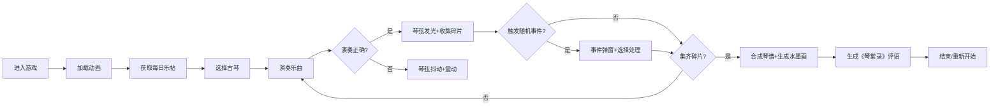

## 1. 产品概述

"墨韵琴堂"是一款以宋代古琴文化为背景的全栈互动Web应用，用户扮演宋代琴师，在虚拟琴堂中挑选古琴、演奏乐曲、应对随机事件，体验中国传统文人雅士的琴艺生活。

- 核心价值：融合古琴演奏、水墨画生成、随机事件等多元玩法，沉浸式体验宋代文人琴道文化
- 目标用户：对中国传统文化、古琴艺术、水墨美学感兴趣的玩家与文化爱好者

## 2. 核心功能

### 2.1 用户角色
| 角色 | 注册方式 | 核心权限 |
|------|----------|----------|
| 琴师 | 无需注册，直接进入游戏 | 挑选古琴、演奏乐曲、处理事件、收集琴谱、生成水墨画 |

### 2.2 功能模块
1. **琴堂主界面**：古琴3D展示、琴桌互动、演奏操作
2. **乐帖系统**：每日生成琴谱、节气、时辰组合
3. **演奏系统**：指法点击、音色播放、评分计算
4. **琴谱收集**：碎片收集动画、进度展示、合成完整琴谱
5. **水墨画生成**：前端算法根据旋律生成水墨扩散动画
6. **随机事件系统**：琴弦断裂、弟子请教、文人雅集等事件
7. **《琴堂录》评语**：根据演奏评分和事件处理生成个性化评语

### 2.3 页面详情
| 页面名称 | 模块名称 | 功能描述 |
|----------|----------|----------|
| 加载页 | 古琴简笔画动画 | 水墨风格loading动画 |
| 琴堂主界面 | 古琴3D模型 | CSS 3D transform实现可旋转古琴展示 |
| 琴堂主界面 | 琴桌互动区 | 七弦古琴演奏区域，点击琴弦触发音效动画 |
| 琴堂主界面 | 乐帖展示区 | 展示琴谱、节气、时辰、指法序列 |
| 琴堂主界面 | 琴谱收集区 | 碎片进度条、收集动画展示 |
| 事件弹窗 | 随机事件处理 | 半透明弹窗，水墨晕开背景，选项交互 |
| 合成界面 | 水墨画生成 | 墨迹扩散动画，AI算法生成意象画 |
| 结算界面 | 《琴堂录》评语 | 展示本次演奏评分、事件处理结果、综合评语 |

## 3. 核心流程

## 4. 用户界面设计

### 4.1 设计风格
- **主色调**：宣纸白#f5f0e6、墨黑#2c2c2c、朱砂红#c0392b、石青#4a7c59
- **字体**：使用具有中国书法韵味的字体，标题使用"Ma Shan Zheng"或"ZCOOL XiaoWei"，正文使用"Noto Serif SC"
- **装饰元素**：木质纹理边角、水墨晕染边框、古琴纹样
- **按钮风格**：圆角木质感按钮，点击时水波涟漪反馈
- **整体氛围**：宋代书院风格，典雅、静谧、富有文人气息

### 4.2 页面设计概述
| 页面名称 | 模块名称 | UI元素 |
|----------|----------|--------|
| 加载页 | 古琴简笔画动画 | 水墨笔触渐变绘制古琴轮廓，粒子飘散效果 |
| 琴堂主界面 | 古琴3D模型 | 七弦古琴，可拖动旋转，木质纹理，琴弦发光效果 |
| 琴堂主界面 | 乐帖卡片 | 卷轴造型，印泥印章，竖排文字展示琴谱节气 |
| 琴堂主界面 | 进度条 | 水墨晕染进度填充，碎片飞入动画 |
| 事件弹窗 | 事件面板 | 半透明宣纸背景，四周水墨晕开动画，朱砂红按钮 |
| 合成界面 | 水墨画生成 | 黑白灰墨迹扩散，随机生成山水意象，渐显效果 |
| 结算界面 | 《琴堂录》 | 古籍竖排排版，印章落款，毛笔书法评语 |

### 4.3 响应式设计
- **桌面端**：三栏布局（左：琴谱收集进度，中：古琴琴堂，右：乐帖展示）
- **平板端**：两栏布局（古琴居中，乐帖和进度收纳为可折叠侧栏）
- **移动端**：单栏全屏（古琴占主，乐帖和进度通过底部标签切换）
- **触摸优化**：琴弦点击区域放大，按钮最小触控尺寸48x48px

### 4.4 3D场景设计
- **环境**：古朴琴堂，木质纹理桌面，宣纸背景
- **光照**：柔和自然光，模拟窗边光线效果，古琴琴弦高光
- **相机**：默认45°俯视视角，支持鼠标拖动旋转，滚轮缩放
- **交互**：悬停琴弦高亮，点击琴弦振动发光
- **动画**：琴弦拨动时的振动动画，碎片收集的抛物线轨迹
- **性能**：使用CSS 3D Transform而非Three.js，确保60fps流畅度
