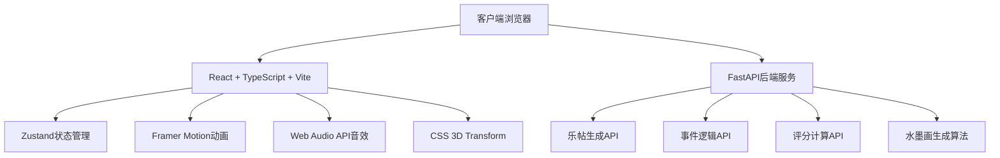
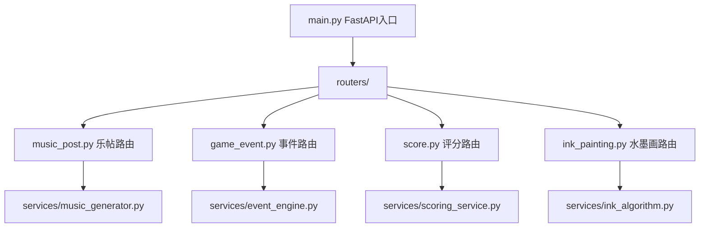
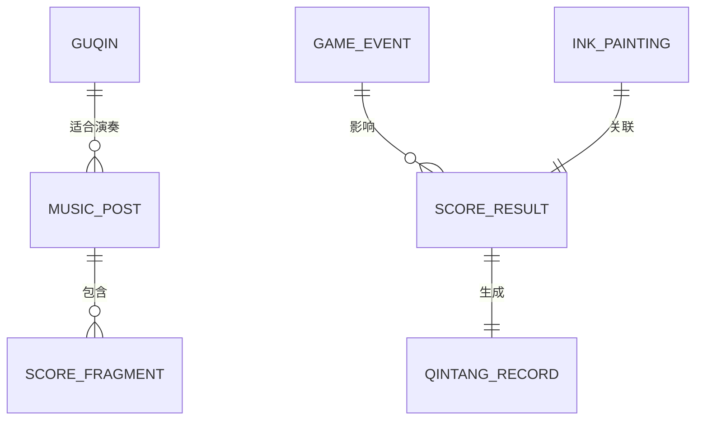

## 1. 架构设计



## 2. 技术描述

### 2.1 前端技术栈
- **框架**：React@18 + TypeScript
- **构建工具**：Vite@5
- **状态管理**：Zustand@4
- **动画库**：Framer Motion@11
- **样式方案**：Tailwind CSS@3 + CSS Variables
- **3D实现**：CSS 3D Transform（轻量级，无Three.js依赖）
- **音频处理**：Web Audio API
- **图标库**：Lucide React

### 2.2 后端技术栈
- **框架**：FastAPI@0.110
- **编程语言**：Python@3.11
- **数据格式**：JSON
- **部署**：Uvicorn ASGI服务器

### 2.3 项目初始化
- 前端：使用 `vite-init` 模板 `react-ts` 初始化
- 后端：手动创建 FastAPI 项目结构

## 3. 路由定义

| 路由路径 | 页面/组件 | 功能描述 |
|----------|-----------|----------|
| `/` | Studio.tsx | 琴堂主界面 |
| `/event` | EventPanel.tsx | 事件弹窗（以Modal形式展示，非独立路由） |

## 4. API 定义

### 4.1 TypeScript 类型定义

```typescript
// 古琴类型
interface Guqin {
  id: string;
  name: string; // 焦尾、绿绮、九霄环佩等
  description: string;
  toneColor: string;
  imageUrl: string;
}

// 指法类型
type FingerTechnique = '勾' | '挑' | '抹' | '剔' | '打' | '摘' | '擘' | '托';

// 乐帖类型
interface MusicPost {
  id: string;
  date: string;
  solarTerm: string; // 节气
  timeOfDay: string; // 时辰
  score: {
    notes: string[]; // 琴谱音符
    techniques: FingerTechnique[]; // 对应指法序列
    stringNumbers: number[]; // 对应弦号 1-7
  };
  requiredGuqin: string; // 推荐古琴
  mood: string; // 意境描述
}

// 事件类型
interface GameEvent {
  id: string;
  type: 'string_break' | 'disciple_question' | 'scholar_gathering';
  title: string;
  description: string;
  options: {
    id: string;
    text: string;
    scoreEffect: number;
    resultText: string;
  }[];
}

// 碎片类型
interface ScoreFragment {
  id: string;
  collected: boolean;
  position: { x: number; y: number };
}

// 游戏状态类型
interface GameState {
  currentGuqin: Guqin | null;
  currentPost: MusicPost | null;
  fragments: ScoreFragment[];
  totalFragments: number;
  score: number;
  combo: number;
  currentEvent: GameEvent | null;
  isPlaying: boolean;
  currentNoteIndex: number;
  finalScore: number;
  qintangRecord: string;
}

// 评分结果
interface ScoreResult {
  totalScore: number;
  accuracy: number;
  combo: number;
  eventBonus: number;
  comment: string;
}

// 水墨画参数
interface InkPaintingParams {
  melody: number[]; // 旋律数据
  mood: string;
  seed: number;
}
```

### 4.2 API 接口定义

| HTTP方法 | 路径 | 功能 | 请求参数 | 响应 |
|----------|------|------|----------|------|
| `GET` | `/api/daily-post` | 获取每日乐帖 | - | `MusicPost` |
| `POST` | `/api/calculate-score` | 计算演奏评分 | `{ correctNotes: number, totalNotes: number, combo: number, eventEffects: number[] }` | `ScoreResult` |
| `GET` | `/api/random-event` | 获取随机事件 | - | `GameEvent` |
| `POST` | `/api/generate-ink-painting` | 生成水墨画参数 | `InkPaintingParams` | `{ svgPath: string, animationData: object }` |
| `GET` | `/api/guqin-list` | 获取古琴列表 | - | `Guqin[]` |
| `POST` | `/api/generate-qintang-record` | 生成《琴堂录》评语 | `{ score: ScoreResult, events: string[] }` | `{ record: string }` |

## 5. 服务端架构



## 6. 数据模型

### 6.1 实体关系图



### 6.2 数据字典

**古琴表 (guqin)**
| 字段名 | 类型 | 说明 |
|--------|------|------|
| id | string | 主键 |
| name | string | 琴名 |
| description | string | 描述 |
| tone_color | string | 音色特点 |
| image_url | string | 图片URL |

**乐帖表 (music_post)**
| 字段名 | 类型 | 说明 |
|--------|------|------|
| id | string | 主键 |
| date | string | 日期 |
| solar_term | string | 节气 |
| time_of_day | string | 时辰 |
| notes | string[] | 音符序列 |
| techniques | string[] | 指法序列 |
| string_numbers | int[] | 弦号序列 |
| required_guqin | string | 推荐古琴ID |
| mood | string | 意境 |

**事件表 (game_event)**
| 字段名 | 类型 | 说明 |
|--------|------|------|
| id | string | 主键 |
| type | string | 事件类型 |
| title | string | 标题 |
| description | string | 描述 |
| options | JSON | 选项数组 |

## 7. 项目文件结构

```
auto238/
├── package.json              # 前端依赖配置
├── vite.config.ts            # Vite配置
├── tsconfig.json             # TypeScript配置
├── tailwind.config.js        # Tailwind配置
├── index.html                # 入口HTML
├── src/
│   ├── main.tsx              # React挂载点
│   ├── App.tsx               # 主应用和路由
│   ├── store/
│   │   └── gameStore.ts      # Zustand状态管理
│   ├── pages/
│   │   ├── Studio.tsx        # 琴堂主界面
│   │   └── EventPanel.tsx    # 事件弹窗
│   ├── components/
│   │   ├── Guqin3D.tsx       # 古琴3D组件
│   │   ├── MusicPost.tsx     # 乐帖展示
│   │   ├── FragmentProgress.tsx # 碎片进度
│   │   ├── InkPainting.tsx   # 水墨画生成
│   │   ├── QintangRecord.tsx # 《琴堂录》评语
│   │   └── LoadingScreen.tsx # 加载动画
│   ├── hooks/
│   │   ├── useAudio.ts       # Web Audio音效
│   │   └── useInkAlgorithm.ts # 水墨画算法
│   ├── utils/
│   │   ├── constants.ts      # 常量定义
│   │   └── api.ts            # API请求封装
│   └── types/
│       └── index.ts          # 类型定义
└── server/
    ├── main.py               # FastAPI入口
    ├── requirements.txt      # Python依赖
    ├── routers/
    │   ├── music_post.py
    │   ├── game_event.py
    │   ├── score.py
    │   └── ink_painting.py
    └── services/
        ├── music_generator.py
        ├── event_engine.py
        ├── scoring_service.py
        └── ink_algorithm.py
```

## 8. 性能优化策略

1. **动画性能**：使用 `transform` 和 `opacity` 属性实现动画，避免触发重排重绘
2. **粒子特效**：使用 CSS 变量和 `will-change` 优化渲染性能
3. **音频处理**：Web Audio API 预加载音频样本，复用 AudioContext
4. **状态管理**：Zustand 选择性订阅，避免不必要的重渲染
5. **响应式图片**：根据屏幕尺寸加载不同分辨率资源
6. **代码分割**：按需加载非核心模块（如水墨画生成算法）
7. **帧率控制**：使用 `requestAnimationFrame` 确保 60fps 流畅度
8. **内存管理**：及时清理事件监听器和动画定时器
