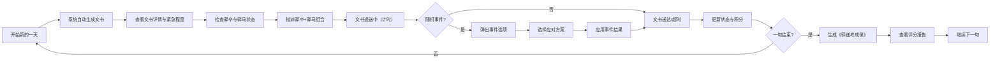

## 1. 产品概述

驿传烽火 - 明代驿站模拟经营游戏，玩家扮演驿丞管理驿站日常运转，体验古代公文传递系统的运作。

- 核心玩法：管理驿卒与驿马资源，处理不同紧急程度的文书递送，应对随机事件，每旬根据绩效评分
- 目标用户：历史爱好者、模拟经营游戏玩家
- 产品价值：寓教于乐，让玩家了解古代驿传制度，体验资源管理与决策的乐趣

## 2. 核心功能

### 2.1 用户角色

| 角色 | 注册方式 | 核心权限 |
|------|----------|----------|
| 驿丞（玩家） | 无需注册，直接进入游戏 | 管理驿站所有事务、指派驿卒驿马、处理随机事件、查看考评结果 |

### 2.2 功能模块

1. **主游戏界面**：驿站大院场景、文书列表、资源面板、导航栏、状态栏
2. **文书管理**：文书生成、详情查看、紧急程度标记、指派递送
3. **资源管理**：驿卒体力/经验管理、驿马耐力/速度管理、资源轮换
4. **随机事件系统**：事件触发、选项选择、结果反馈
5. **考评系统**：每旬评分、《驿递考成录》生成、历史记录

### 2.3 页面详情

| 页面名称 | 模块名称 | 功能描述 |
|---------|----------|----------|
| 主游戏界面 | 顶部导航栏 | 显示当前日期、旬进度条、积分总数、游戏控制按钮 |
| 主游戏界面 | 左侧文书卷轴列表 | 卷轴样式展示待处理文书，按紧急程度着色，支持虚拟滚动 |
| 主游戏界面 | 中央驿站大院 | CSS绘制驿站场景，包含马厩、驿卒宿舍、文书台，支持点击交互 |
| 主游戏界面 | 右侧资源面板 | 显示驿卒和驿马列表及状态条，支持选择指派 |
| 主游戏界面 | 底部事件通知栏 | 滚动显示最新事件通知和系统消息 |
| 事件弹窗 | 事件展示 | 随机事件描述、选项按钮、结果反馈动画 |
| 考评报告 | 考成录展示 | 每旬结束时显示评分详情、文书送达率、马匹损耗、事件处理结果 |

## 3. 核心流程

玩家每日游戏流程：查看当日文书 → 检查驿卒驿马状态 → 指派合适组合递送文书 → 处理随机事件 → 等待送达结果 → 每旬结束查看考评。

## 4. 用户界面设计

### 4.1 设计风格

- **主色调**：宣纸黄 `#f5e6c8`、墨黑 `#2c2c2c`、朱砂红 `#b03a2e`、石青 `#3b6e8f`、驿马棕 `#8b5e3c`
- **按钮风格**：仿古纸质纹理，线装书边框，悬停时微微上浮
- **字体**：标题使用宋体/楷体风格，正文使用清晰易读的衬线字体
- **布局风格**：三栏式布局（左文书、中场景、右资源），仿古卷轴和线装书元素
- **动效风格**：卷轴展开/卷起动画、状态变化抖动、弹窗淡入淡出、马蹄声效

### 4.2 页面设计概述

| 页面名称 | 模块名称 | UI元素 |
|---------|----------|--------|
| 主游戏界面 | 顶部导航栏 | 司天监风格云纹装饰、日期显示、旬进度条、积分显示、设置按钮 |
| 主游戏界面 | 文书卷轴 | 卷轴形状容器、朱砂红加急标记、石青普通标记、剩余天数标签、展开动画 |
| 主游戏界面 | 驿站大院 | CSS绘制建筑、马厩图标、驿卒休息区、文书台、点击高亮效果 |
| 主游戏界面 | 资源面板 | 驿卒卡片（体力/经验条）、驿马卡片（耐力/速度条）、选中放大效果 |
| 主游戏界面 | 事件通知栏 | 宣纸底色、滚动文字、最新消息高亮 |
| 事件弹窗 | 事件卡片 | 背景变暗模糊、卷轴展开动画、选项按钮、结果反馈 |
| 考评报告 | 考成录 | 线装书样式、评分大字、详细数据表、印章效果 |

### 4.3 响应式设计

- **桌面端**：三栏完整布局，左右面板固定宽度，中间场景自适应
- **平板端**：左右面板可折叠收起，点击展开
- **手机端**：垂直堆叠布局，场景在上，文书和资源面板可切换标签
- **触摸优化**：按钮最小尺寸44px，滑动操作支持，双击缩放场景

### 4.4 交互反馈细节

- 驿卒选中：人物高亮 + 轻微放大动画（scale 1.05）
- 驿马选中：马蹄响声效（Web Audio API）+ 马蹄图标跳动
- 文书送达：卷轴展开动画 + 成功音效
- 事件弹窗：背景变暗模糊（backdrop-filter）+ 卷轴展开
- 状态变化：数值变化时微微抖动动画（shake 0.3s）
- 按钮悬停：纸质纹理加深 + 轻微上浮 + 阴影变化
