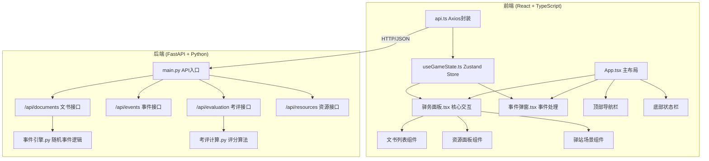
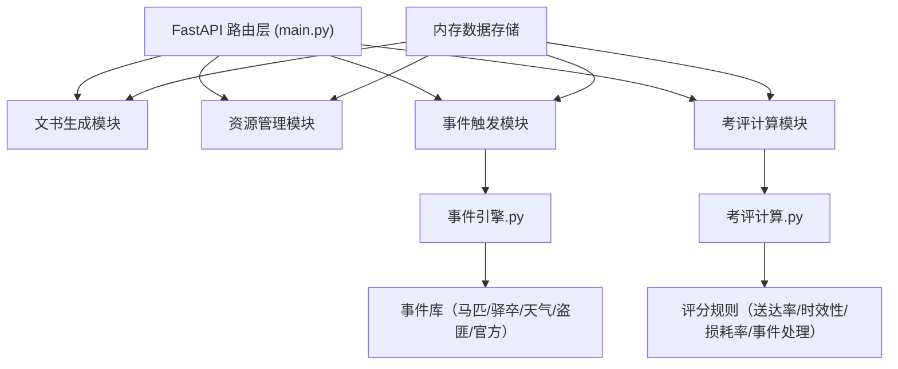
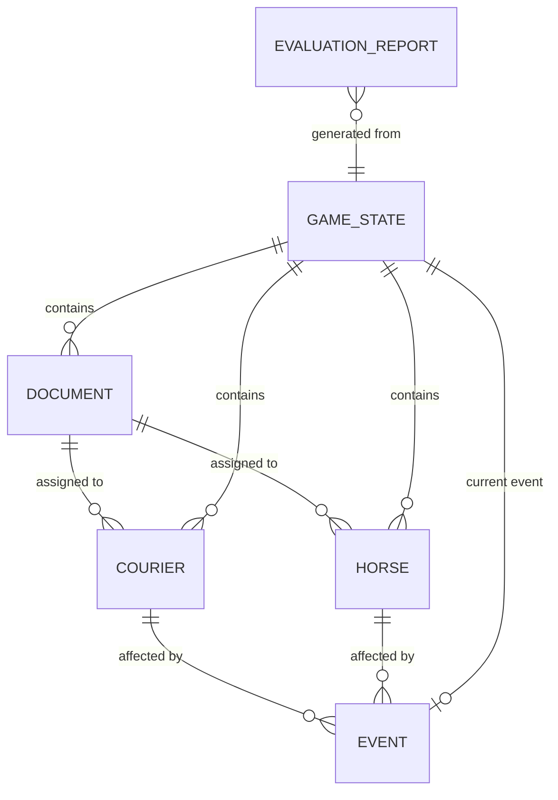

## 1. 架构设计



## 2. 技术描述

### 2.1 前端技术栈
- **框架**：React 18 + TypeScript 5
- **构建工具**：Vite 5
- **路由**：react-router-dom 6
- **状态管理**：zustand 4
- **HTTP客户端**：axios 1
- **样式方案**：CSS Modules + CSS Variables（自定义明代风格主题）
- **性能优化**：React.memo、useMemo、useCallback、虚拟滚动（react-window）

### 2.2 后端技术栈
- **Web框架**：FastAPI 0.109
- **ASGI服务器**：uvicorn 0.27
- **数据验证**：pydantic 2
- **事件系统**：自定义事件引擎
- **评分系统**：自定义考评计算模块

### 2.3 项目初始化
使用 Vite React TypeScript 模板初始化项目，然后添加后端目录结构。

## 3. 路由定义

| 路由路径 | 页面/组件 | 用途说明 |
|---------|----------|----------|
| `/` | 主游戏页面 | 包含完整的驿站管理界面 |
| `/evaluation` | 考评报告页面 | 显示《驿递考成录》评分详情 |

## 4. API 定义

### 4.1 TypeScript 类型定义

```typescript
// 文书类型
type DocumentType = 'official' | 'military' | 'secret';
type UrgencyLevel = 'urgent' | 'normal' | 'gentle';
type DocumentStatus = 'pending' | 'delivering' | 'delivered' | 'failed';

interface Document {
  id: string;
  type: DocumentType;
  urgency: UrgencyLevel;
  destination: string;
  content: string;
  remainingDays: number;
  distance: number;
  status: DocumentStatus;
  createdAt: string;
  assignedCourierId?: string;
  assignedHorseId?: string;
}

// 驿卒
interface Courier {
  id: string;
  name: string;
  stamina: number; // 体力 0-100
  experience: number; // 经验 0-100
  status: 'idle' | 'delivering' | 'resting' | 'injured';
  avatar: string;
}

// 驿马
interface Horse {
  id: string;
  name: string;
  endurance: number; // 耐力 0-100
  speed: number; // 速度 1-10
  status: 'idle' | 'delivering' | 'resting' | 'sick' | 'dead';
  color: string;
}

// 事件
interface GameEvent {
  id: string;
  title: string;
  description: string;
  type: 'horse' | 'courier' | 'weather' | 'bandit' | 'official';
  options: EventOption[];
  createdAt: string;
}

interface EventOption {
  id: string;
  text: string;
  effect: EventEffect;
}

interface EventEffect {
  courierChange?: { courierId: string; staminaChange?: number; status?: Courier['status'] }[];
  horseChange?: { horseId: string; enduranceChange?: number; status?: Horse['status'] }[];
  scoreChange?: number;
  documentDelay?: number;
  message: string;
}

// 考评报告
interface EvaluationReport {
  period: number; // 第X旬
  totalScore: number;
  grade: 'excellent' | 'good' | 'average' | 'poor';
  documentDeliveryRate: number;
  onTimeRate: number;
  horseLossRate: number;
  eventHandlingScore: number;
  details: string;
  createdAt: string;
}

// 游戏状态
interface GameState {
  currentDay: number;
  currentPeriod: number;
  periodProgress: number;
  score: number;
  documents: Document[];
  couriers: Courier[];
  horses: Horse[];
  currentEvent: GameEvent | null;
  notifications: string[];
  isPaused: boolean;
}
```

### 4.2 API 接口列表

| 方法 | 路径 | 请求体 | 响应 | 说明 |
|-----|------|--------|------|------|
| GET | `/api/game/state` | - | `GameState` | 获取当前游戏状态 |
| POST | `/api/game/next-day` | - | `GameState` | 推进到下一天 |
| POST | `/api/documents/generate` | - | `Document[]` | 生成新文书 |
| POST | `/api/documents/assign` | `{documentId, courierId, horseId}` | `{success, document}` | 指派递送 |
| POST | `/api/documents/complete` | `{documentId, success}` | `{success, score, message}` | 完成/失败递送 |
| GET | `/api/events/random` | - | `GameEvent \| null` | 触发随机事件 |
| POST | `/api/events/resolve` | `{eventId, optionId}` | `{effect, newState}` | 处理事件选项 |
| POST | `/api/resources/rest` | `{type, id}` | `{success, message}` | 安排休息恢复 |
| POST | `/api/evaluation/calculate` | - | `EvaluationReport` | 计算旬考评 |

## 5. 后端架构



## 6. 数据模型

### 6.1 实体关系图



### 6.2 核心数据结构（Python Pydantic）

```python
from pydantic import BaseModel, Field
from datetime import datetime
from enum import Enum
from typing import Optional, List

class DocumentType(str, Enum):
    OFFICIAL = "official"
    MILITARY = "military"
    SECRET = "secret"

class UrgencyLevel(str, Enum):
    URGENT = "urgent"
    NORMAL = "normal"
    GENTLE = "gentle"

class DocumentStatus(str, Enum):
    PENDING = "pending"
    DELIVERING = "delivering"
    DELIVERED = "delivered"
    FAILED = "failed"

class CourierStatus(str, Enum):
    IDLE = "idle"
    DELIVERING = "delivering"
    RESTING = "resting"
    INJURED = "injured"

class HorseStatus(str, Enum):
    IDLE = "idle"
    DELIVERING = "delivering"
    RESTING = "resting"
    SICK = "sick"
    DEAD = "dead"

class Document(BaseModel):
    id: str
    type: DocumentType
    urgency: UrgencyLevel
    destination: str
    content: str
    remaining_days: int
    distance: int
    status: DocumentStatus
    created_at: datetime
    assigned_courier_id: Optional[str] = None
    assigned_horse_id: Optional[str] = None

class Courier(BaseModel):
    id: str
    name: str
    stamina: int = Field(ge=0, le=100)
    experience: int = Field(ge=0, le=100)
    status: CourierStatus
    avatar: str

class Horse(BaseModel):
    id: str
    name: str
    endurance: int = Field(ge=0, le=100)
    speed: int = Field(ge=1, le=10)
    status: HorseStatus
    color: str

class EventOption(BaseModel):
    id: str
    text: str
    effect: dict

class GameEvent(BaseModel):
    id: str
    title: str
    description: str
    type: str
    options: List[EventOption]
    created_at: datetime

class EvaluationReport(BaseModel):
    period: int
    total_score: int
    grade: str
    document_delivery_rate: float
    on_time_rate: float
    horse_loss_rate: float
    event_handling_score: int
    details: str
    created_at: datetime

class GameState(BaseModel):
    current_day: int
    current_period: int
    period_progress: float
    score: int
    documents: List[Document]
    couriers: List[Courier]
    horses: List[Horse]
    current_event: Optional[GameEvent] = None
    notifications: List[str]
    is_paused: bool = False
```

### 6.3 初始数据

游戏开始时的初始数据：
- 驿卒：4名（体力80-100，经验20-60）
- 驿马：6匹（耐力70-100，速度3-8）
- 初始积分：100分
- 初始日期：万历三年 一月 一日
- 每旬：10天
