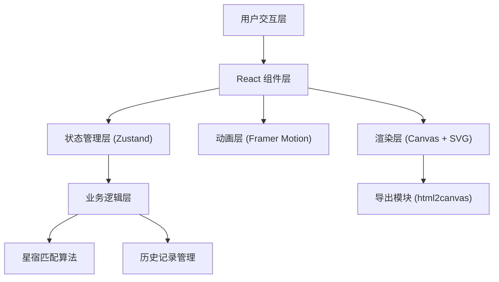

## 1. 架构设计



## 2. 技术选型

- **前端框架**：React 18 + TypeScript
- **构建工具**：Vite 5
- **状态管理**：Zustand 4
- **动画库**：Framer Motion 11
- **样式方案**：CSS Modules + CSS Variables
- **图片导出**：html2canvas
- **开发规范**：ESLint + Prettier

## 3. 目录结构

```
src/
├── main.tsx              # React 入口文件
├── App.tsx               # 主布局组件
├── store/
│   └── starStore.ts      # Zustand 状态管理
├── components/
│   ├── StarCanvas.tsx    # 宣纸画布组件
│   ├── StarToolbar.tsx   # 星点工具面板
│   ├── StarInterpretation.tsx  # 星宿解读面板
│   └── StarStoryModal.tsx       # 星点典故弹窗
├── utils/
│   ├── constellation.ts  # 星宿匹配算法与数据
│   ├── canvasExport.ts   # 画布导出工具
│   └── geometry.ts       # 几何计算工具
├── types/
│   └── index.ts          # TypeScript 类型定义
├── styles/
│   ├── variables.css     # CSS 变量定义
│   └── globals.css       # 全局样式
└── assets/
    └── paper-texture.png # 宣纸纹理图片
```

## 4. 数据模型

### 4.1 核心类型定义

```typescript
interface Star {
  id: string;
  x: number;
  y: number;
  brightness: number;
  name?: string;
  story?: string;
}

interface Connection {
  id: string;
  from: string;
  to: string;
}

interface Constellation {
  id: string;
  name: string;
  pattern: number[][]; // 特征点模式
  interpretation: string;
  stars: string[];
}

interface HistoryState {
  stars: Star[];
  connections: Connection[];
}

interface StarStore {
  stars: Star[];
  connections: Connection[];
  currentConstellation: Constellation | null;
  history: HistoryState[];
  historyIndex: number;
  canvasTransform: { scale: number; rotation: number; offsetX: number; offsetY: number };
  
  // Actions
  addStar: (x: number, y: number) => void;
  updateStar: (id: string, x: number, y: number) => void;
  deleteStar: (id: string) => void;
  addConnection: (from: string, to: string) => void;
  removeConnection: (id: string) => void;
  clearAll: () => void;
  undo: () => void;
  redo: () => void;
  updateTransform: (transform: Partial<CanvasTransform>) => void;
  matchConstellation: () => void;
}
```

## 5. 核心算法

### 5.1 最近星点连线算法
- 每次添加/移动星点后，计算与其他星点的欧氏距离
- 距离在阈值内的星点自动建立连线
- 使用最小生成树算法避免重复连线

### 5.2 星宿模式匹配
- 预设28星宿及常见星座的特征点分布模式
- 使用归一化坐标的形状匹配算法（Procrustes analysis）
- 匹配度超过阈值时返回对应星宿名称与解读

### 5.3 历史记录管理
- 每次状态变更前保存快照
- 支持最多50步撤销/重做
- 使用深拷贝确保状态不可变性

## 6. 性能优化

- 使用 React.memo 优化星点组件重渲染
- Canvas 分层渲染：背景层、连线层、星点层
- 防抖处理星点移动时的连线计算
- requestAnimationFrame 确保60fps动画流畅度
- 虚拟滚动优化大量星点场景

## 7. 导出功能

- 使用 html2canvas 捕获画布区域
- 保留宣纸纹理与墨迹效果
- 支持2x/3x高清导出
- 导出格式：PNG，自动添加落款水印
