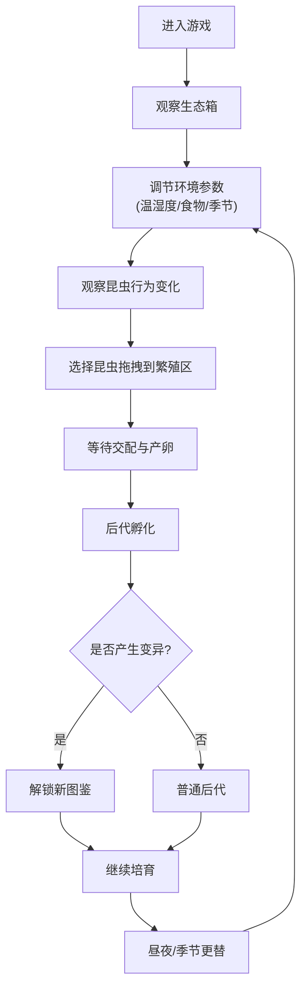

## 1. 产品概述

虫语迷踪是一款模拟昆虫饲养与进化的休闲养成游戏。玩家扮演昆虫学家，在玻璃生态箱中观察、培育和繁殖各类昆虫，通过环境调控促使昆虫变异进化，解锁完整的昆虫图鉴。

- 核心玩法：生态箱模拟经营 + 昆虫收集养成 + 遗传变异系统
- 目标用户：喜欢生物模拟、收集养成类游戏的休闲玩家
- 产品价值：通过博物学手绘风格和科学严谨的昆虫系统，带来兼具趣味性和知识性的游戏体验

## 2. 核心功能

### 2.1 用户角色

| 角色 | 注册方式 | 核心权限 |
|------|----------|----------|
| 昆虫学家 | 无需注册，本地存档 | 昆虫培育、环境调控、繁殖交配、图鉴收集 |

### 2.2 功能模块

1. **生态箱主界面**：3D俯视图展示昆虫、植物和环境
2. **昆虫状态面板**：每只昆虫的详细属性和行为状态
3. **控制面板**：食物投放、温湿度调节、季节切换
4. **繁殖系统**：拖拽昆虫到繁殖区进行交配，产生杂交后代
5. **变异进化系统**：环境因素影响昆虫基因，产生新颜色和形态
6. **图鉴系统**：记录已发现的昆虫品种和变异形态
7. **昼夜季节系统**：实时昼夜更替和季节变化，影响生态

### 2.3 页面详情

| 页面名称 | 模块名称 | 功能描述 |
|----------|----------|----------|
| 游戏主界面 | 生态箱3D视图 | 展示昆虫移动、植物分布、环境变化，支持拖拽操作 |
| 游戏主界面 | 左侧昆虫面板 | 列表展示所有昆虫的品种、变异度、当前行为 |
| 游戏主界面 | 右下角控制面板 | 食物投放按钮、温湿度滑块、季节切换按钮 |
| 游戏主界面 | 繁殖区 | 高亮显示区域，支持拖拽昆虫进入交配 |
| 图鉴弹窗 | 昆虫图鉴 | 网格展示已解锁/未解锁的昆虫品种和变异形态 |

## 3. 核心流程

玩家进入游戏后，首先观察生态箱中的初始昆虫。通过控制面板投放食物、调节温湿度，观察昆虫的行为变化。选择两只昆虫拖拽到繁殖区进行交配，等待后代孵化。根据环境条件的不同，后代可能产生变异，解锁新的图鉴条目。随着昼夜和季节的更替，调整环境参数以维持昆虫的活跃度和健康状态。

## 4. 用户界面设计

### 4.1 设计风格

**博物学手绘风**，整体采用暖色调配色：
- 主背景：羊皮纸黄 #f5e6c8
- 文字色：虫壳黑 #2c2c2c
- 强调色1：翠绿 #4a8c3f（植物、健康状态）
- 强调色2：甲虫蓝 #2980b9（选中、交互元素）

**视觉元素**：
- 手绘风格的昆虫插图，带有细腻的纹理和阴影
- 羊皮纸质感的背景，带有轻微的做旧效果
- 复古印刷体标题字体，衬线字体正文
- 精细的边框装饰，模拟博物学笔记风格

**交互反馈**：
- 昆虫移动动画保持60fps流畅
- 翅膀扇动、爬行等动画使用framer-motion实现
- 拖拽操作带有惯性和吸附效果
- 状态变化使用柔和的过渡动画

### 4.2 页面设计概述

| 页面名称 | 模块名称 | UI元素 |
|----------|----------|--------|
| 游戏主界面 | 生态箱3D视图 | 玻璃容器边框、土壤层、植物点缀、昆虫精灵、昼夜光影效果 |
| 游戏主界面 | 左侧昆虫面板 | 羊皮纸背景卡片、昆虫头像、属性标签、状态指示器 |
| 游戏主界面 | 控制面板 | 木质纹理按钮、滑块控件、季节图标、食物种类选择 |
| 图鉴弹窗 | 昆虫图鉴 | 网格布局、手绘边框、未解锁显示剪影、已解锁显示彩色插图 |

### 4.3 响应性

- 桌面端优先设计，生态箱区域自适应窗口大小
- 控制面板和昆虫面板保持固定宽度，内部内容可滚动
- 拖拽操作支持鼠标和触摸设备
- 最低支持1280x720分辨率

### 4.4 3D场景指导

- **视角**：固定3D俯视图，轻微透视角度，模拟真实观察生态箱的视角
- **光照**：昼夜循环光照系统，白天温暖明亮，夜晚柔和月光
- **环境**：玻璃生态箱带有反光和折射效果，内部有土壤、植物、枯叶等装饰
- **动画**：昆虫使用2D精灵在3D空间中移动，翅膀扇动和爬行动画使用帧动画实现
- **后期处理**：轻微的景深效果，突出显示选中的昆虫
