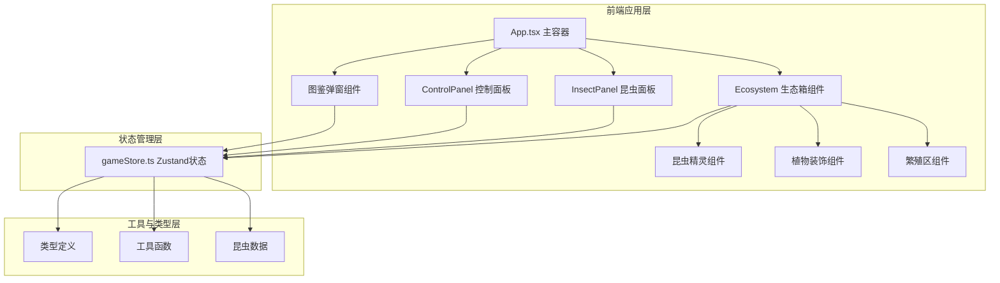

## 1. 架构设计



## 2. 技术描述

- **前端框架**：React 18 + TypeScript
- **构建工具**：Vite 5 + @vitejs/plugin-react
- **状态管理**：Zustand 4
- **动画库**：framer-motion 11
- **样式方案**：CSS Modules + CSS Variables
- **3D效果**：CSS 3D Transform + Perspective（轻量级伪3D，避免引入three.js过重依赖）

**核心技术选型理由**：
1. 使用CSS 3D Transform实现伪3D俯视图，性能更优，符合60fps动画要求
2. framer-motion提供流畅的昆虫爬行和翅膀扇动动画
3. Zustand轻量级状态管理，适合游戏状态的快速更新
4. 纯前端实现，无需后端，使用localStorage存档

## 3. 目录结构

```
src/
├── main.tsx              # 应用入口
├── App.tsx               # 主游戏容器
├── store/
│   └── gameStore.ts      # Zustand游戏状态管理
├── components/
│   ├── Ecosystem.tsx     # 3D生态箱组件
│   ├── InsectSprite.tsx  # 昆虫精灵组件
│   ├── InsectPanel.tsx   # 左侧昆虫状态面板
│   ├── ControlPanel.tsx  # 右下角控制面板
│   ├── Compendium.tsx    # 昆虫图鉴弹窗
│   └── Plant.tsx         # 植物装饰组件
├── types/
│   └── index.ts          # TypeScript类型定义
├── data/
│   └── insects.ts        # 昆虫基础数据和变异表
├── utils/
│   ├── genetics.ts       # 遗传变异算法
│   └── animation.ts      # 动画工具函数
└── styles/
    └── variables.css     # CSS变量（颜色、尺寸等）
```

## 4. 数据模型

### 4.1 核心类型定义

```typescript
// 昆虫品种
type InsectSpecies = 'beetle' | 'butterfly' | 'ant';

// 季节
type Season = 'spring' | 'summer' | 'autumn' | 'winter';

// 时间段
type TimeOfDay = 'day' | 'night';

// 昆虫行为
type InsectBehavior = 'idle' | 'walking' | 'eating' | 'mating' | 'flying' | 'resting';

// 颜色变异
type ColorVariant = 'default' | 'gold' | 'blue' | 'green' | 'purple' | 'red' | 'albino' | 'melanistic';

// 形态变异
type MorphVariant = 'default' | 'giant' | 'dwarf' | 'long_wing' | 'short_wing' | 'horned';

// 基因
interface Genes {
  color: ColorVariant;
  morph: MorphVariant;
  mutationRate: number;
}

// 昆虫实例
interface Insect {
  id: string;
  species: InsectSpecies;
  name: string;
  genes: Genes;
  generation: number;
  health: number;
  hunger: number;
  energy: number;
  behavior: InsectBehavior;
  position: { x: number; y: number };
  targetPosition?: { x: number; y: number };
  isSelected: boolean;
  isDragging: boolean;
  birthTime: number;
  parentIds?: [string, string];
}

// 环境状态
interface Environment {
  temperature: number;  // 0-100
  humidity: number;     // 0-100
  season: Season;
  timeOfDay: TimeOfDay;
  dayProgress: number;  // 0-1
  foodAmount: number;   // 0-100
}

// 图鉴条目
interface CompendiumEntry {
  species: InsectSpecies;
  color: ColorVariant;
  morph: MorphVariant;
  unlocked: boolean;
  unlockedAt?: number;
  discoveredBy?: string;
}

// 游戏状态
interface GameState {
  insects: Insect[];
  environment: Environment;
  compendium: CompendiumEntry[];
  selectedInsectId: string | null;
  breedingZoneInsectIds: string[];
  isPaused: boolean;
  gameSpeed: number;
  
  // Actions
  addInsect: (insect: Omit<Insect, 'id'>) => void;
  removeInsect: (id: string) => void;
  updateInsect: (id: string, updates: Partial<Insect>) => void;
  setTemperature: (value: number) => void;
  setHumidity: (value: number) => void;
  setSeason: (season: Season) => void;
  addFood: (amount: number) => void;
  selectInsect: (id: string | null) => void;
  addToBreedingZone: (id: string) => void;
  removeFromBreedingZone: (id: string) => void;
  breedInsects: (parent1Id: string, parent2Id: string) => void;
  unlockCompendiumEntry: (species: InsectSpecies, color: ColorVariant, morph: MorphVariant) => void;
  tick: (deltaTime: number) => void;
  togglePause: () => void;
  setGameSpeed: (speed: number) => void;
}
```

### 4.2 状态管理设计

使用Zustand创建单一store，包含：
- 昆虫数组：每只昆虫的完整状态
- 环境状态：温湿度、季节、时间、食物量
- 图鉴状态：已解锁的昆虫品种和变异
- UI状态：选中的昆虫、繁殖区昆虫

## 5. 核心算法

### 5.1 遗传变异算法

```typescript
// 基因遗传规则：
// 1. 颜色基因：父母各有50%概率传递，30%概率随机突变
// 2. 形态基因：父母各有50%概率传递，20%概率随机突变
// 3. 突变率基因：取父母平均值±10%随机波动
// 4. 环境影响：温湿度偏离最佳值时，突变率翻倍
// 5. 杂交优势：不同品种交配时，突变率额外+50%
```

### 5.2 昆虫行为AI

```typescript
// 行为状态机：
// - idle: 随机决定下一个行为
// - walking: 向随机目标移动，到达后idle
// - eating: 食物>0且hunger<50时触发，hunger恢复后idle
// - resting: energy<30或夜间时触发，energy恢复后idle
// - flying: 蝴蝶特有行为，随机飞行
// - mating: 在繁殖区且有配偶时触发，完成后产生后代
```

### 5.3 昼夜季节系统

```typescript
// 时间流逝：
// - 游戏内1天 = 真实60秒（可通过游戏速度调整）
// - 白天：06:00-18:00，活跃度+50%
// - 夜晚：18:00-06:00，活跃度-50%，能量消耗减少
// - 季节每7天更替一次
// - 季节影响：
//   春季：突变率+20%，食物消耗+10%
//   夏季：活跃度+30%，最佳温度提高
//   秋季：食物产出+50%，活跃度-10%
//   冬季：活跃度-40%，能量消耗减少
```

## 6. 性能优化

1. **动画优化**：使用framer-motion的transform和opacity属性，避免触发重排
2. **状态更新**：Zustand使用immer-like更新，减少不必要的重渲染
3. **批量更新**：游戏tick使用requestAnimationFrame，每帧批量更新所有昆虫状态
4. **虚拟列表**：昆虫面板数量多时使用虚拟滚动
5. **CSS优化**：使用will-change和transform3d开启硬件加速
6. **防抖节流**：滑块控件使用节流，避免频繁状态更新
