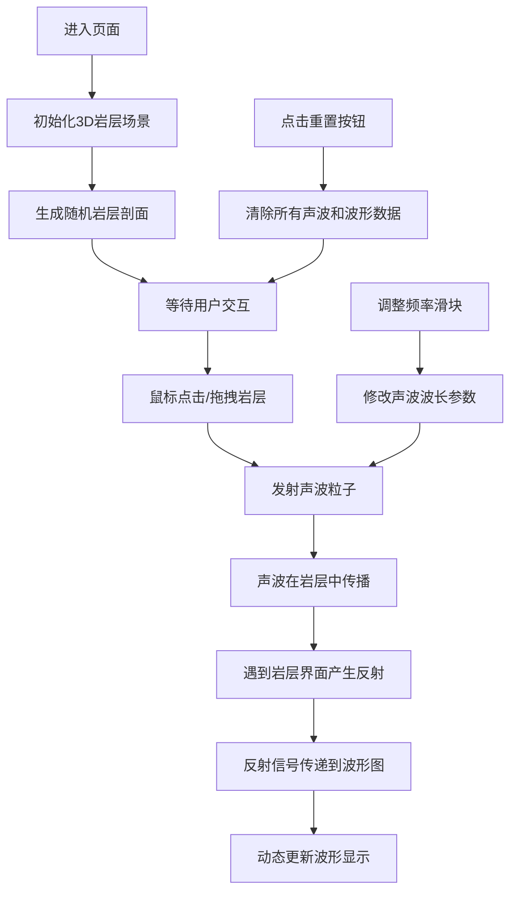

## 1. 产品概述

"岩层音痕"是一个3D交互可视化地质勘探模拟项目，让用户体验地质学家的工作，通过声波探测了解地下岩层结构。
- 核心价值：以直观、互动的方式展示声波在不同密度岩层中的传播与反射原理
- 目标用户：对地质学、物理学感兴趣的学生和爱好者

## 2. 核心功能

### 2.1 用户角色
| 角色 | 注册方式 | 核心权限 |
|------|---------|---------|
| 普通用户 | 无需注册 | 体验完整的3D交互勘探功能 |

### 2.2 功能模块
1. **3D岩层剖面场景**：多层不同颜色和密度的岩层展示
2. **声波发射系统**：点击/拖拽激发声波，可视化传播与反射
3. **动态波形图**：右侧实时显示反射信号波形
4. **频率控制**：滑块调整声波波长，观察波形变化
5. **重置功能**：一键清除所有声波和波形数据

### 2.3 页面详情
| 页面名称 | 模块名称 | 功能描述 |
|---------|---------|---------|
| 主页面 | 3D岩层场景 | 多层平面几何体构成岩层剖面，每层随机颜色、透明度和密度 |
| 主页面 | 声波发射 | 鼠标点击/拖拽岩层时在点击位置发射声波粒子 |
| 主页面 | 反射计算 | 声波遇到不同岩层界面时根据密度差计算反射强度 |
| 主页面 | 波形图面板 | Canvas 2D绘制动态波形，实时更新反射信号 |
| 主页面 | 控制面板 | 频率滑块、重置按钮、帧率显示 |

## 3. 核心流程

## 4. 用户界面设计

### 4.1 设计风格
- **主色调**：地质色谱，深褐#4a3c31、砂岩黄#c6a87c、石灰岩灰#a09888
- **强调色**：荧光绿#39ff14（声波粒子）、深地幔红#3d1c02（背景）
- **按钮风格**：圆角矩形，半透明背景，hover时透明度提升
- **字体**：无衬线现代字体，标题粗体，数据显示等宽字体
- **布局风格**：中央大区域3D场景，右侧竖向波形面板，左下角控制面板

### 4.2 页面设计概述
| 页面名称 | 模块名称 | UI元素 |
|---------|---------|--------|
| 主页面 | 3D岩层场景 | 多层半透明平面，随机颜色纹理，点击震动动画，60fps流畅渲染 |
| 主页面 | 波形图面板 | 深底色，荧光绿波形曲线，网格参考线，实时数据流动 |
| 主页面 | 控制面板 | 频率滑块（标签+数值显示）、重置按钮、FPS统计 |

### 4.3 响应式
- 桌面端优先，大分辨率显示效果最佳
- 右侧波形图固定宽度，3D场景自适应剩余空间
- 控制面板固定在左下角，不随场景滚动

### 4.4 3D场景指引
- **环境**：深地幔红#3d1c02背景，营造地下探测氛围
- **光照**：环境光+方向光，突出岩层层次感，半透明效果
- **相机**：PerspectiveCamera，初始角度略微俯视岩层剖面
- **交互**：OrbitControls支持旋转、缩放查看岩层结构
- **动画**：声波粒子扩散动画，岩层点击震动动画，波形流动动画
- **后处理**：轻微辉光效果增强声波粒子视觉
- **性能**：控制粒子数量，使用BufferGeometry，保持60fps
