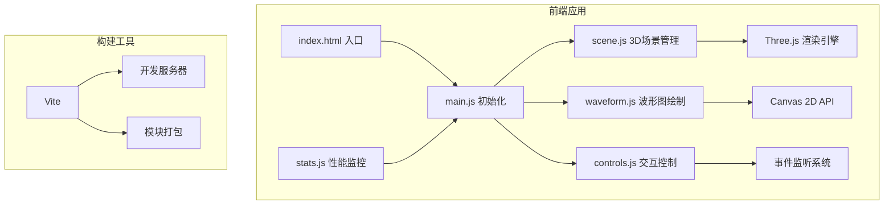

## 1. 架构设计



## 2. 技术描述
- **前端框架**：原生JavaScript (ES6+) + Three.js
- **构建工具**：Vite@5
- **3D引擎**：three@0.160.0
- **辅助库**：stats-js@1.0.0（性能监控）
- **2D绘图**：原生Canvas 2D API
- **交互控制**：Three.js内置OrbitControls
- **状态管理**：原生JavaScript模块变量

## 3. 项目文件结构

```
auto242/
├── package.json          # 项目配置和依赖
├── vite.config.js        # Vite构建配置
├── index.html            # 入口HTML
└── src/
    ├── main.js           # 主入口，初始化场景和动画循环
    ├── scene.js          # 3D场景、岩层、声波逻辑
    ├── waveform.js       # 波形图Canvas绘制
    └── controls.js       # UI控制（滑块、按钮）
```

## 4. 核心模块职责

### 4.1 scene.js - 3D场景模块
- 创建岩层剖面（多层PlaneGeometry，随机颜色/透明度/密度）
- 管理声波粒子系统（BufferGeometry + PointsMaterial）
- 声波传播物理逻辑（位置更新、边界检测）
- 反射计算（密度差→反射强度）
- 岩层点击震动动画

### 4.2 waveform.js - 波形图模块
- Canvas 2D初始化和尺寸管理
- 波形数据缓冲区（环形队列）
- 动态波形绘制（曲线、网格、标签）
- 接收反射信号数据并更新显示

### 4.3 controls.js - 交互控制模块
- 频率滑块UI创建和事件绑定
- 重置按钮逻辑
- 声波波长参数同步
- 鼠标交互事件转发（点击/拖拽→发射声波）

### 4.4 main.js - 主入口
- Three.js场景/相机/渲染器初始化
- OrbitControls设置
- stats.js性能监控集成
- 动画循环（requestAnimationFrame）
- 窗口resize处理

## 5. 关键数据结构

### 岩层数据
```javascript
{
  y: number,           // 层位置
  height: number,      // 层厚度
  color: THREE.Color,  // 颜色
  opacity: number,     // 透明度
  density: number,     // 密度（影响反射）
  mesh: THREE.Mesh     // 网格对象
}
```

### 声波粒子
```javascript
{
  position: THREE.Vector3,  // 当前位置
  direction: THREE.Vector3, // 传播方向
  velocity: number,         // 传播速度
  frequency: number,        // 频率/波长
  amplitude: number,        // 振幅（衰减）
  life: number,             // 生命周期
  birthTime: number         // 创建时间
}
```

### 波形数据
```javascript
{
  time: number,      // 时间戳
  amplitude: number, // 信号振幅
  layerId: number    // 来源岩层
}
```
