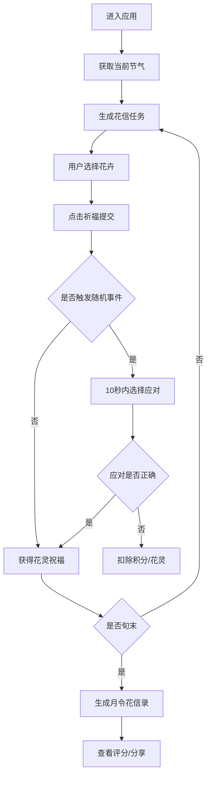

## 1. 产品概述
月令花信是一款模拟古代花朝节祭祀文化的全栈web应用，用户扮演宋代司花之神，根据二十四节气变化布置花市、安排花神祭典。
- 核心价值：通过游戏化方式传承中国传统节气与花文化，提供沉浸式的宋代美学体验
- 目标用户：对中国传统文化、节气文化、古风游戏感兴趣的玩家

## 2. 核心功能

### 2.1 用户角色
| 角色 | 注册方式 | 核心权限 |
|------|----------|----------|
| 司花之神（玩家） | 无需注册，本地存储 | 布置花市、选择花卉、处理事件、查看评分 |

### 2.2 功能模块
1. **主页面**：花市场景（花卉动画）、花牌面板、节气信息面板、事件通知区域
2. **花牌选择系统**：当月花卉列表、花卉选择交互、祈福提交
3. **随机事件系统**：天气突变、花农偷懒、花仙求助等事件，限时选择应对
4. **评分报告系统**：每旬生成《月令花信录》，水墨风格展示评分
5. **花灵收集系统**：收集花灵解锁特效、进度追踪

### 2.3 页面详情
| 页面名称 | 模块名称 | 功能描述 |
|---------|----------|----------|
| 主页面 | 花市场景 | framer-motion粒子动画，花卉绽放、花瓣飘落，节气变化形态颜色 |
| 主页面 | 花牌面板 | 左侧展示当月可选花卉，选中高亮，祈福按钮提交 |
| 主页面 | 节气信息面板 | 右侧显示当前节气、时辰、花灵收集进度条 |
| 主页面 | 事件通知区域 | 右上角弹出事件，10秒限时选择应对选项 |
| 主页面 | 月令花信录 | 水墨风格评分卡片，展示总分、评价、收集率，支持截图分享 |

## 3. 核心流程
用户进入应用 → 查看当前节气和花信任务 → 从花牌面板选择正确花卉 → 点击祈福提交 → 获得花灵祝福/处理随机事件 → 每旬结束生成评分报告

## 4. 用户界面设计

### 4.1 设计风格
- 主色调：宣纸米白#f5f0e6（背景）、朱砂红#c0392b（花卉主色）、石青#4a7c59（辅助色）、藤黄#f1c40f（点缀）、墨黑#2c2c2c（文字边框）
- 按钮风格：圆角矩形，微弱晕染动画，悬停时颜色加深并带水墨晕染效果
- 字体：采用宋代书法风格字体，标题使用书法衬线字体，正文使用优雅宋体
- 布局：桌面端三栏布局（左花牌、中花市、右信息），移动端上下堆叠布局
- 装饰元素：水墨边框、印章元素、卷轴风格卡片

### 4.2 页面设计概述
| 页面名称 | 模块名称 | UI元素 |
|---------|----------|--------|
| 主页面 | 花市场景 | 花卉绽放动画、花瓣飘落粒子效果、节气变换颜色过渡 |
| 主页面 | 花牌面板 | 卡片式花卉列表、选中高亮边框、祈福按钮晕染动效 |
| 主页面 | 节气信息面板 | 卷轴风格卡片、进度条水墨填充、时辰显示 |
| 主页面 | 事件通知 | 弹跳动画弹出框、倒计时进度条、选项按钮 |
| 主页面 | 月令花信录 | 水墨风格长卷、印章评分、毛笔字体标题 |

### 4.3 响应式
- 桌面端（≥1024px）：三栏布局，左花牌25%、中花市50%、右信息25%
- 平板端（768-1023px）：两栏布局，花牌+花市70%、信息30%
- 移动端（<768px）：垂直堆叠布局，上信息、中花市、下花牌，支持拖拽选择
- 触控优化：增大点击区域，支持拖拽花牌到花市区域完成选择

### 4.4 动画与性能
- 花卉绽放：framer-motion的spring动画，缩放+透明度渐变
- 花瓣飘落：粒子系统，Canvas或CSS动画，稳定60fps
- 事件弹出：bounce弹跳动画，10秒倒计时进度条
- 水墨晕染：CSS radial-gradient动画，按钮hover效果
- 性能优化：使用will-change、GPU加速、requestAnimationFrame
