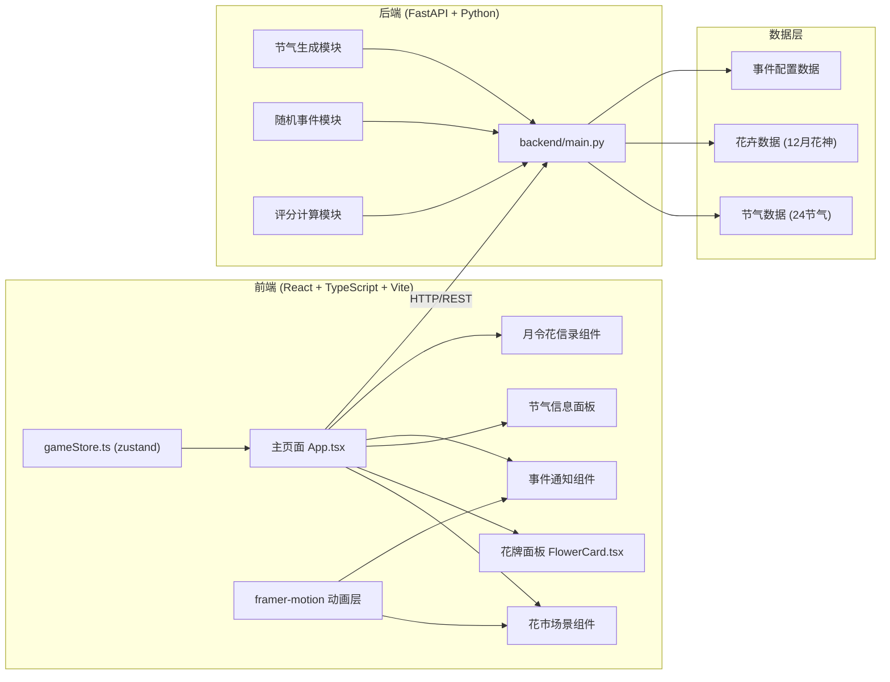
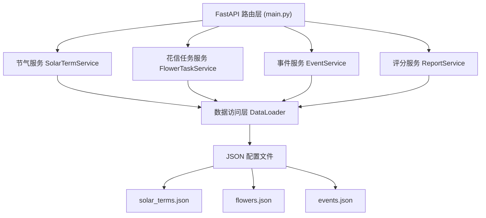
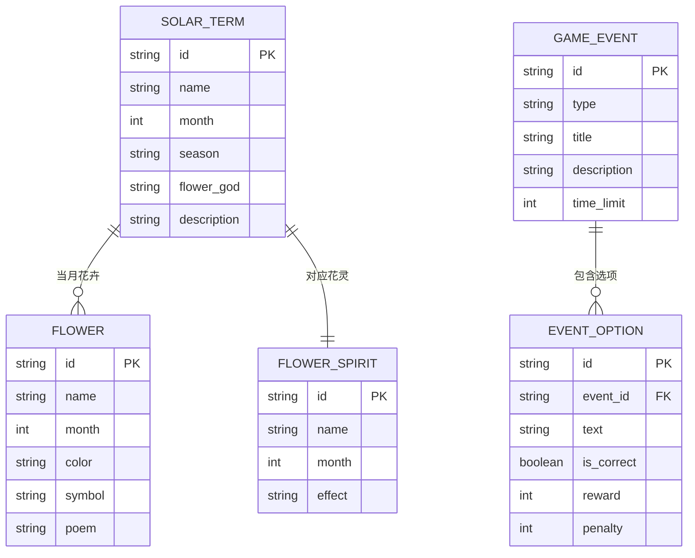

## 1. 架构设计



## 2. 技术描述
- **前端**: React 18 + TypeScript 5 + Vite 5 + framer-motion + zustand
- **初始化工具**: vite-init
- **状态管理**: zustand (store/gameStore.ts)
- **动画库**: framer-motion (花卉绽放、粒子动画、事件弹跳动效)
- **后端**: FastAPI (Python 3.10+)，处理节气生成、事件逻辑、评分计算
- **样式方案**: CSS-in-JS + CSS Variables (宋代美学配色系统)
- **数据格式**: 前端本地存储使用 localStorage，后端使用 JSON 配置数据

## 3. 项目结构

```
.
├── package.json
├── vite.config.ts
├── tsconfig.json
├── index.html
├── src/
│   ├── main.tsx          # 根组件挂载
│   ├── App.tsx           # 主页面（三栏布局）
│   ├── store/
│   │   └── gameStore.ts  # zustand状态管理
│   ├── components/
│   │   ├── FlowerCard.tsx        # 花牌组件
│   │   ├── FlowerMarket.tsx      # 花市场景（粒子动画）
│   │   ├── SolarTermPanel.tsx    # 节气信息面板
│   │   ├── EventNotification.tsx # 事件通知
│   │   └── MonthlyReport.tsx     # 月令花信录
│   ├── types/
│   │   └── index.ts      # TypeScript类型定义
│   └── utils/
│       ├── animations.ts # 动画配置
│       └── api.ts        # API请求封装
└── backend/
    ├── main.py           # FastAPI应用入口
    ├── data/
    │   ├── solar_terms.json  # 24节气数据
    │   ├── flowers.json      # 花卉数据
    │   └── events.json       # 事件配置
    └── requirements.txt  # Python依赖
```

## 4. API 定义

### 4.1 TypeScript 类型定义

```typescript
// 节气信息
interface SolarTerm {
  id: string;
  name: string;
  date: string;
  month: number;
  season: string;
  flowerGod: string;
  description: string;
}

// 花卉信息
interface Flower {
  id: string;
  name: string;
  month: number;
  color: string;
  symbol: string;
  poem: string;
  isCorrect: boolean;
}

// 花灵
interface FlowerSpirit {
  id: string;
  name: string;
  month: number;
  collected: boolean;
  effect: string;
}

// 随机事件
interface GameEvent {
  id: string;
  type: 'weather' | 'farmer' | 'fairy';
  title: string;
  description: string;
  options: EventOption[];
  timeLimit: number; // 秒
}

interface EventOption {
  id: string;
  text: string;
  isCorrect: boolean;
  reward: number;
  penalty: number;
}

// 花信任务
interface FlowerTask {
  id: string;
  solarTerm: SolarTerm;
  correctFlowerId: string;
  availableFlowers: Flower[];
  deadline: number; // 时间戳
}

// 评分报告
interface MonthlyReport {
  period: string;
  totalScore: number;
  completionRate: number;
  eventHandling: string;
  spiritCollectionRate: number;
  evaluation: string;
}

// 游戏状态
interface GameState {
  score: number;
  currentTask: FlowerTask | null;
  currentEvent: GameEvent | null;
  collectedSpirits: FlowerSpirit[];
  taskHistory: Array<{ taskId: string; success: boolean }>;
  eventHistory: Array<{ eventId: string; handled: boolean; success: boolean }>;
  showReport: boolean;
  latestReport: MonthlyReport | null;
}
```

### 4.2 API 接口

| 方法 | 路径 | 用途 | 请求参数 | 响应 |
|------|------|------|----------|------|
| GET | `/api/solar-term/current` | 获取当前节气 | - | `{ solarTerm: SolarTerm }` |
| POST | `/api/flower-task/generate` | 生成花信任务 | `{ solarTermId: string }` | `{ task: FlowerTask }` |
| POST | `/api/flower-task/submit` | 提交花卉选择 | `{ taskId: string; flowerId: string }` | `{ success: boolean; reward: number; spirit?: FlowerSpirit }` |
| GET | `/api/event/random` | 获取随机事件 | - | `{ event: GameEvent }` |
| POST | `/api/event/handle` | 处理事件 | `{ eventId: string; optionId: string }` | `{ success: boolean; reward: number; message: string }` |
| POST | `/api/report/generate` | 生成月令花信录 | `{ period: string; taskHistory: any[]; eventHistory: any[] }` | `{ report: MonthlyReport }` |

## 5. 后端架构



### 5.1 后端模块说明

1. **SolarTermService**: 节气计算，根据真实日期确定当前节气
2. **FlowerTaskService**: 生成花信任务，匹配当月花卉，设置正确答案
3. **EventService**: 随机事件生成、答案判定、奖惩计算
4. **ReportService**: 评分算法，计算完成率、事件处理评价、花灵收集率
5. **DataLoader**: 统一加载JSON配置数据

## 6. 数据模型

### 6.1 ER图



### 6.2 初始数据说明

- **solar_terms.json**: 24节气数据，包含名称、日期、月份、对应花神
- **flowers.json**: 12个月代表花卉，每月3-5种可选，1种为正确答案
- **events.json**: 随机事件配置，包含天气突变、花农偷懒、花仙求助三类
