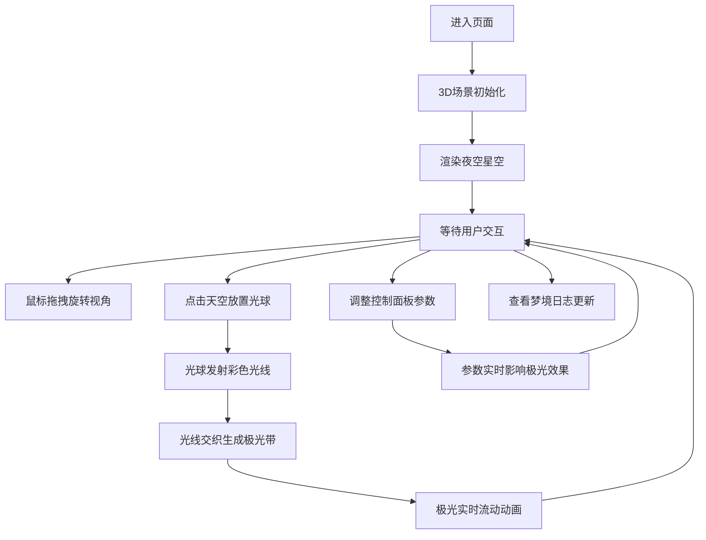

## 1. 产品概述

极光织梦是一个沉浸式3D交互可视化艺术项目，让用户化身为极光织梦者，在深邃的三维夜空中通过点击和拖拽实时编织流动的极光帷幕。

- 核心目的：提供一个富有诗意和创造力的3D交互体验，让用户通过简单的操作创造独一无二的极光艺术
- 目标用户：对数字艺术、3D可视化和创意交互感兴趣的用户
- 产品价值：将抽象的自然奇观转化为可操控的艺术创作工具，融合视觉美感与交互乐趣

## 2. 核心功能

### 2.1 用户角色
| 角色 | 注册方式 | 核心权限 |
|------|----------|----------|
| 织梦者 | 无需注册，直接体验 | 放置光球、调整参数、编织极光、查看梦境日志 |

### 2.2 功能模块
1. **3D天空场景**：全屏夜空背景，支持鼠标拖拽旋转视角，星光点缀
2. **织梦光球系统**：点击天空放置光球，每个光球发射彩色光线，支持移动和删除
3. **极光帷幕生成**：根据光球位置动态生成弯曲的极光网格，光线交织形成流动光带
4. **控制面板**：极光颜色色带选择、波动速度滑块、光球添加/删除按钮
5. **梦境日志面板**：实时显示极光颜色数量、光球总数、随机诗意描述

### 2.3 页面详情
| 页面名称 | 模块名称 | 功能描述 |
|----------|----------|----------|
| 主场景页 | 3D天空场景 | Three.js渲染的三维夜空，支持鼠标拖拽视角，点击交互 |
| 主场景页 | 织梦光球 | 点击放置发光球体，发射彩色光线，支持拖拽移动 |
| 主场景页 | 极光帷幕 | 动态生成弯曲极光网格，随光球位置和参数实时变化 |
| 主场景页 | 控制面板 | 左下角tweakpane面板，颜色选择、速度滑块、操作按钮 |
| 主场景页 | 梦境日志 | 右下角面板，显示统计数据和诗意描述 |

## 3. 核心流程

用户进入页面后，首先看到深邃的夜空场景，通过鼠标拖拽可以环顾四周。点击天空任意位置放置织梦光球，光球会自动发射彩色光线，与其他光球的光线交织形成流动的极光带。用户可以通过左下角的控制面板调整极光的颜色、波动速度等参数，实时看到极光效果的变化。右下角的梦境日志会记录当前的创作状态。

## 4. 用户界面设计

### 4.1 设计风格
- **主色调**：夜空深蓝 `#0a0e27` 作为背景主色
- **极光色系**：极光绿 `#00ff84`、极光粉 `#ff69b4`、极光紫 `#8a2be2` 作为核心交互色
- **整体风格**：梦幻、流动、华丽、沉浸式，追求视觉的诗意和动态美感
- **光照效果**：自发光材质配合辉光效果，营造极光的通透感和发光感
- **动效设计**：流畅的波动动画，光线流动、颜色渐变、呼吸灯效果

### 4.2 页面设计概述
| 页面名称 | 模块名称 | UI元素 |
|----------|----------|--------|
| 主场景页 | 3D天空场景 | 全屏canvas、深蓝渐变背景、闪烁星星、远景光晕 |
| 主场景页 | 织梦光球 | 发光球体、光线拖尾、脉动动画、选中高亮 |
| 主场景页 | 极光帷幕 | 半透明弯曲网格、渐变色彩、流动波纹、顶点动画 |
| 主场景页 | 控制面板 | 半透明深色面板、色带选择器、滑块控件、圆角按钮 |
| 主场景页 | 梦境日志 | 玻璃态面板、优雅字体、动态文字、柔和阴影 |

### 4.3 响应式
- 桌面端优先设计，全屏沉浸式体验
- 控制面板和日志面板采用固定定位，不随场景滚动
- 画布自适应窗口大小，保持正确的宽高比

### 4.4 3D场景指导
- **环境氛围**：深邃夜空，远处有淡淡星光闪烁，营造宇宙空间感
- **光照设置**：主要依靠材质自发光和点光源，避免使用过强的环境光
- **相机设置**：透视相机，初始视角略带仰视，支持OrbitControls轨道控制
- **构图元素**：光球作为视觉焦点，极光带作为流动的视觉引导
- **交互动画**：光球放置时有缩放动画，删除时有淡出效果，极光持续流动
- **后期处理**：可加入Bloom泛光效果增强发光感，FXAA抗锯齿
- **性能预算**：限制光球数量（建议10个以内），使用实例化渲染优化

## 5. 性能要求
- 帧率稳定保持60fps
- 极光网格顶点数量控制在合理范围
- 动画循环使用requestAnimationFrame
- 材质和几何体复用，避免频繁创建销毁
