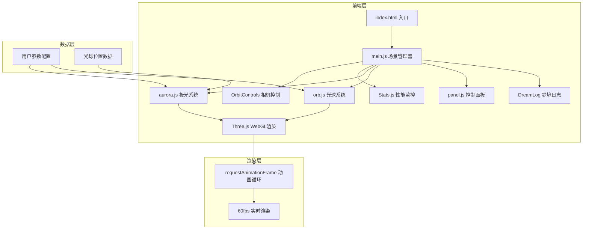

## 1. 架构设计



## 2. 技术描述

- **前端框架**：原生JavaScript (ES6+)，不使用框架，追求性能最优
- **3D引擎**：Three.js r160+，用于WebGL 3D渲染
- **开发构建**：Vite 5.x，快速开发和热更新
- **控制面板**：Tweakpane 4.x，现代化参数调节面板
- **性能监控**：stats.js，实时帧率显示
- **交互控制**：Three.js OrbitControls，相机轨道控制
- **色彩方案**：
  - 夜空深蓝：`#0a0e27`
  - 极光绿：`#00ff84`
  - 极光粉：`#ff69b4`
  - 极光紫：`#8a2be2`

## 3. 目录结构

```
auto246/
├── package.json          # 项目配置和依赖
├── vite.config.js        # Vite构建配置
├── index.html            # HTML入口文件
├── README.md             # 项目说明文档
└── src/
    ├── main.js           # 主入口：场景初始化、控制器、动画循环
    ├── aurora.js         # 极光系统：弯曲网格生成、颜色渐变、动画
    ├── orb.js            # 光球类：放置、移动、删除、光线发射
    ├── panel.js          # 控制面板：Tweakpane绑定、参数管理
    └── dreamlog.js       # 梦境日志：统计数据、诗意描述
```

## 4. 核心模块设计

### 4.1 main.js - 场景主控制器

**职责**：初始化Three.js场景、相机、渲染器，协调各个模块，驱动动画循环

**核心函数**：
- `init()` - 初始化场景、相机、灯光、控制器
- `createStarfield()` - 创建星空背景
- `onWindowResize()` - 窗口大小变化处理
- `onCanvasClick()` - 画布点击放置光球
- `animate()` - 动画主循环
- `updateAurora()` - 更新极光网格
- `updateOrbs()` - 更新光球动画

### 4.2 aurora.js - 极光系统

**职责**：根据光球位置动态生成极光网格，处理颜色渐变和流动动画

**核心函数**：
- `generateAuroraMesh(orbs)` - 根据光球位置生成弯曲网格
- `updateVertices(time)` - 顶点动画，实现流动效果
- `updateColors(colorPalette)` - 根据色带更新颜色
- `setWaveSpeed(speed)` - 设置波动速度
- `setDensity(density)` - 设置极光疏密程度

**实现要点**：
- 使用`PlaneGeometry`或自定义`BufferGeometry`创建网格
- 顶点着色器中实现Simplex噪声波动
- 片元着色器实现渐变透明和发光效果
- 根据光球距离计算各点的颜色混合权重

### 4.3 orb.js - 光球系统

**职责**：管理织梦光球的创建、移动、删除，以及光线发射

**核心函数**：
- `createOrb(position, color)` - 创建新光球
- `removeOrb(orb)` - 删除指定光球
- `getOrbAtPosition(raycaster)` - 射线检测选中光球
- `updateAll(time)` - 更新所有光球的脉动和光线
- `emitRays()` - 发射光线连接其他光球

**实现要点**：
- 光球使用`MeshBasicMaterial`配合自发光
- 添加点光源`PointLight`照亮周围
- 光线使用`Line`几何体，随时间抖动
- 支持拖拽移动光球

### 4.4 panel.js - 控制面板

**职责**：使用Tweakpane创建控制面板，管理用户参数

**参数配置**：
```javascript
{
  colors: {
    palette: 'aurora', // 色带选择
    customColor1: '#00ff84',
    customColor2: '#ff69b4',
    customColor3: '#8a2be2'
  },
  animation: {
    waveSpeed: 1.0,    // 波动速度 0.1-3.0
    density: 0.6,      // 疏密程度 0.1-1.0
    rayIntensity: 0.8  // 光线强度 0.1-1.0
  },
  actions: {
    addOrb: () => {},  // 添加随机光球
    clearAll: () => {} // 清除所有光球
  }
}
```

### 4.5 dreamlog.js - 梦境日志

**职责**：显示统计数据和随机诗意描述

**显示内容**：
- 当前光球总数
- 当前使用的极光颜色数量
- 随机生成的诗意描述（极光主题）

## 5. 性能优化策略

### 5.1 渲染优化
- 限制最大光球数量（10个）
- 极光网格分段数动态调整（不超过50x20）
- 使用`BufferGeometry`而非`Geometry`
- 开启`frustumCulled`视锥体剔除
- 合理设置`pixelRatio`（不超过2）

### 5.2 材质优化
- 复用材质和几何体
- 使用`AdditiveBlending`实现发光效果
- 透明材质控制在合理数量
- 自定义着色器简化计算

### 5.3 动画优化
- 避免在动画循环中创建新对象
- 使用对象池管理临时变量
- 着色器中实现大部分动画计算
- 合理使用`requestAnimationFrame`

## 6. 交互设计

### 6.1 鼠标交互
- **左键拖拽**：旋转相机视角
- **右键拖拽**：平移相机
- **滚轮**：缩放视角
- **左键点击天空**：放置新光球
- **左键点击光球**：选中光球
- **拖拽光球**：移动光球位置
- **双击光球**：删除光球

### 6.2 快捷键
- `Delete/Backspace`：删除选中的光球
- `Space`：添加随机光球
- `R`：重置场景
- `H`：显示/隐藏控制面板

## 7. 依赖配置

**package.json 核心依赖**：
```json
{
  "dependencies": {
    "three": "^0.160.0",
    "tweakpane": "^4.0.3",
    "stats.js": "^0.17.0"
  },
  "devDependencies": {
    "vite": "^5.0.0"
  },
  "scripts": {
    "dev": "vite",
    "build": "vite build",
    "preview": "vite preview"
  }
}
```
