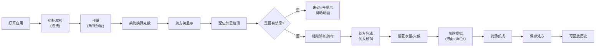

## 1. 产品概述

古代太医院药局中草药辨识与炮制全流程模拟系统，解决传统中医药学徒在药材辨识、剂量换算、配伍禁忌及火候控制上缺乏可反复试错的交互练习环境的问题。

- 面向中医药教育领域，为初学者提供沉浸式的药房操作训练
- 通过游戏化交互降低学习门槛，提高药材辨识与处方配伍的熟练度

## 2. 核心 Features

### 2.1 用户角色

| 角色 | 注册方式 | 核心权限 |
|------|----------|----------|
| 学徒用户 | 无需注册，直接使用 | 药材辨识、称量配伍、煎熬模拟、查看历史处方 |

### 2.2 功能模块

1. **药柜管理区**：八斗药柜CSS绘制、抽屉开合动画、药材详情面板、拖拽功能
2. **称量与配伍区**：铜秤称量、两钱分厘换算、药方笺显示、配伍禁忌检测
3. **煎熬模拟区**：砂锅煎煮、火候控制、液面动画、汤色变化、药渣沉淀
4. **处方记录区**：电子药方存储、历史处方查看、煎熬动画回放

### 2.3 页面详情

| 页面名称 | 模块名称 | 功能描述 |
|---------|---------|----------|
| 主操作台 | 药柜子模块 | 八斗药柜展示，抽屉开合动画，药材详情弹出，拖拽至称量盘 |
| 主操作台 | 称量子模块 | 铜秤动画，单位输入（两/钱/分/厘），实时克数换算 |
| 主操作台 | 药方笺子模块 | 宣纸样式，药材列表，累计剂量，配伍禁忌×号提示 |
| 主操作台 | 砂锅子模块 | 水量设置，武火/文火切换，液面下降动画，汤色渐变 |
| 主操作台 | 历史记录子模块 | 处方列表展示，1.5倍速回放煎熬动画 |

## 3. 核心流程

用户打开应用 → 从药柜拖拽药材至秤盘 → 输入剂量（两钱分厘）→ 系统换算并显示在药方笺 → 配伍禁忌实时检测 → 确认处方后倒入砂锅 → 设置水量和火候 → 煎熬模拟（液面↓、汤色深、药渣沉）→ 完成提示倒药碗 → 处方自动保存 → 可查看历史并回放

## 4. 用户界面设计

### 4.1 设计风格

- **主色调**：土黄宣纸#e8d5b0（背景）、朱红#b22222、赭石#6b4e3a、古铜#b87333、瓷青#5a7a5a
- **药柜木色**：#5d3a1a，八斗布局，抽屉红纸墨书药名
- **字体**：毛笔行书（药方笺）、宋体（常规文本）
- **动画**：抽屉开合0.3s slide、秤杆摆动0.6s频率、禁忌抖动0.4s、煎熬60fps平滑渐变
- **质感**：宣纸纹理、木质纹理、铜质光泽、砂锅质感

### 4.2 页面设计概述

| 页面名称 | 模块名称 | UI元素 |
|---------|---------|--------|
| 主操作台 | 药柜子模块 | 木色药柜#5d3a1a、八斗布局、红纸标签、滑动动画、详情面板 |
| 主操作台 | 称量子模块 | 圆形铜秤盘#b87333、石质秤砣#4a2a1a、十刻度秤杆、摆动动画 |
| 主操作台 | 药方笺子模块 | 宣纸色#f5deb3、毛笔行书、朱砂×#cc0000、抖动动画 |
| 主操作台 | 砂锅子模块 | 深灰砂锅#4a4a3a、5px锅沿、液面渐变#f0d080→#5c3a1a、颗粒沉淀 |
| 主操作台 | 药碗子模块 | 青瓷碗#5a7a5a、直径40px |

### 4.3 响应式设计

- **桌面端**（≥768px）：左（药柜）、中（称量/药方）、右（砂锅）三栏布局
- **移动端**（<768px）：单栏纵向滚动，药柜改为可折叠手风琴面板
- **触摸优化**：拖拽区域加大，按钮最小44×44px

### 4.4 动画性能要求

- 煎熬模拟帧率≥45fps，使用requestAnimationFrame
- 配伍禁忌检测响应<100ms
- 回放动画流畅无卡顿，1.5倍速播放
