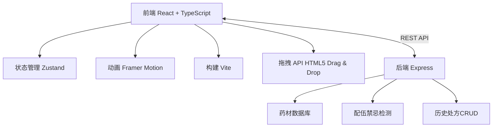
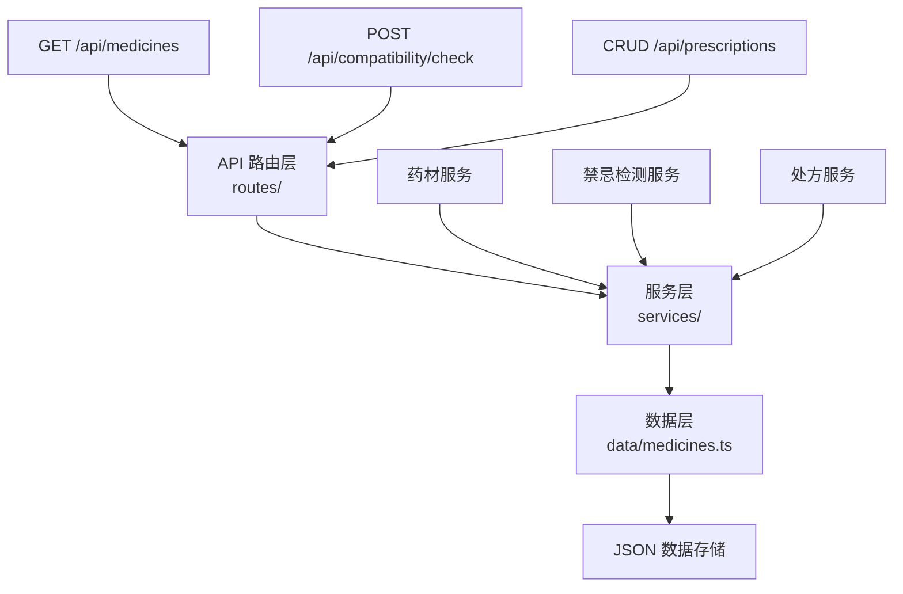
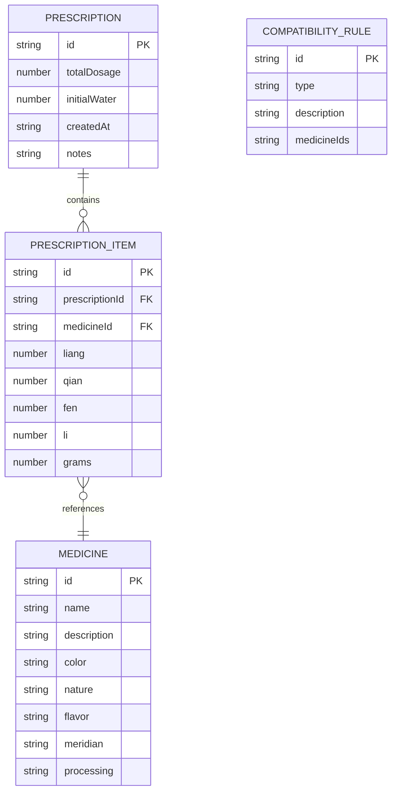

## 1. 架构设计



## 2. 技术描述

- **前端**：React 18 + TypeScript + Vite 5 + Zustand 4 + Framer Motion 11
- **后端**：Express 4 + CORS + body-parser
- **样式**：CSS Modules + CSS Variables（主题色系统）
- **动画**：Framer Motion（抽屉/过渡）+ CSS Keyframes（秤杆摆动/抖动）+ requestAnimationFrame（煎熬模拟）
- **数据存储**：内存存储（开发阶段），JSON文件持久化

## 3. 目录结构

```
d:\Solocoder\VersionFast\tasks\auto25\
├── package.json
├── vite.config.js
├── tsconfig.json
├── index.html
├── src\
│   ├── App.tsx
│   ├── main.tsx
│   ├── components\
│   │   ├── MedicineCabinet.tsx
│   │   ├── WeighingScale.tsx
│   │   ├── FormulaNote.tsx
│   │   ├── DecoctionPot.tsx
│   │   ├── MedicineBowl.tsx
│   │   └── HistoryPanel.tsx
│   ├── store\
│   │   └── useStore.ts
│   ├── types\
│   │   └── index.ts
│   ├── utils\
│   │   ├── conversion.ts
│   │   └── compatibility.ts
│   └── services\
│       └── api.ts
└── server\
    ├── index.ts
    ├── data\
    │   └── medicines.ts
    └── routes\
        ├── medicines.ts
        ├── compatibility.ts
        └── prescriptions.ts
```

## 4. API 定义

```typescript
// 药材类型
interface Medicine {
  id: string;
  name: string;
  description: string;
  color: string;
  nature: string;
  flavor: string;
  meridian: string;
  processing: '生' | '炙' | '煅';
}

// 处方药材项
interface PrescriptionItem {
  medicine: Medicine;
  dosage: {
    liang: number;
    qian: number;
    fen: number;
    li: number;
    grams: number;
  };
  hasConflict: boolean;
  conflictInfo?: string;
}

// 处方记录
interface Prescription {
  id: string;
  items: PrescriptionItem[];
  totalDosage: number;
  decoctionParams: {
    initialWater: number;
    mode: 'standard';
  };
  createdAt: string;
  notes?: string;
}

// 配伍禁忌检测请求
interface CompatibilityCheckRequest {
  medicineIds: string[];
}

// 配伍禁忌检测响应
interface CompatibilityCheckResponse {
  conflicts: Array<{
    medicineIds: string[];
    type: '十八反' | '十九畏';
    description: string;
  }>;
}
```

### API 路由

| 方法 | 路由 | 用途 |
|------|------|------|
| GET | /api/medicines | 获取所有药材列表 |
| GET | /api/medicines/:id | 获取单个药材详情 |
| POST | /api/compatibility/check | 检测配伍禁忌 |
| POST | /api/prescriptions | 保存处方 |
| GET | /api/prescriptions | 获取历史处方列表 |
| GET | /api/prescriptions/:id | 获取单个处方详情 |

## 5. 服务器架构



## 6. 数据模型

### 6.1 ER 图



### 6.2 常量数据定义

```typescript
// 十八反
const EIGHTEEN_INCOMPATIBILITIES = [
  { herbs: ['甘草', '大戟', '芫花', '甘遂', '海藻'], description: '藻戟遂芫俱战草' },
  { herbs: ['乌头', '半夏', '瓜蒌', '贝母', '白蔹', '白及'], description: '半蒌贝蔹及攻乌' },
  { herbs: ['藜芦', '人参', '丹参', '玄参', '沙参', '细辛', '芍药'], description: '诸参辛芍叛藜芦' },
];

// 十九畏
const NINETEEN_MUTUAL_FEAR = [
  { herbs: ['硫黄', '朴硝'], description: '硫黄畏朴硝' },
  { herbs: ['水银', '砒霜'], description: '水银畏砒霜' },
  { herbs: ['狼毒', '密陀僧'], description: '狼毒畏密陀僧' },
  { herbs: ['巴豆', '牵牛'], description: '巴豆畏牵牛' },
  { herbs: ['丁香', '郁金'], description: '丁香畏郁金' },
  { herbs: ['牙硝', '三棱'], description: '牙硝畏三棱' },
  { herbs: ['川乌', '犀角'], description: '川乌畏犀角' },
  { herbs: ['草乌', '犀角'], description: '草乌畏犀角' },
  { herbs: ['肉桂', '赤石脂'], description: '肉桂畏赤石脂' },
  { herbs: ['人参', '五灵脂'], description: '人参畏五灵脂' },
];

// 剂量换算常量
const DOSAGE_CONVERSION = {
  LIANG_TO_GRAMS: 37.5,   // 1两 = 37.5g
  QIAN_TO_GRAMS: 3.75,    // 1钱 = 3.75g
  FEN_TO_GRAMS: 0.375,    // 1分 = 0.375g
  LI_TO_GRAMS: 0.0375,    // 1厘 = 0.0375g
};
```
