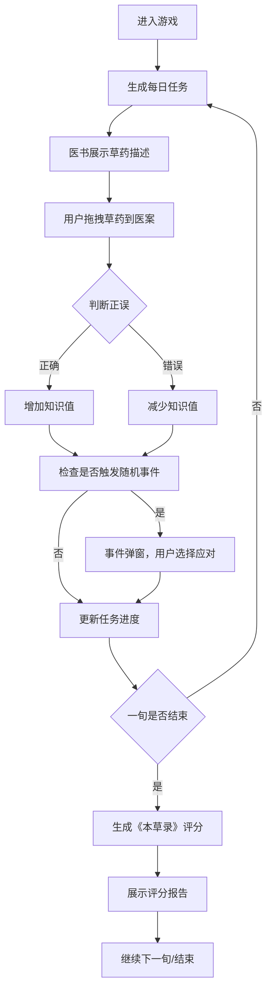

## 1. 产品概述

"药童辨草"是一款模拟唐代药童日常工作的教育娱乐类Web应用。用户扮演一位唐代药童，在药圃中根据医书描述采集和鉴定草药，调制方剂应对随机"时疫"事件。

- 主要目的：通过游戏化方式学习中医药知识，体验古代药童的工作日常
- 解决问题：传统中医药知识学习枯燥，通过互动游戏提升学习趣味性
- 目标用户：对中医药文化感兴趣的年轻群体、学生、游戏爱好者
- 产品价值：寓教于乐，传承中医药文化，提升用户对中草药的认知

## 2. 核心功能

### 2.1 用户角色

| 角色 | 注册方式 | 核心权限 |
|------|----------|----------|
| 药童（用户） | 无需注册，直接进入 | 采集草药、调制方剂、应对事件、查看评分 |

### 2.2 功能模块

1. **药圃场景**：草药随机散布，支持拖拽交互
2. **医书描述面板**：展示当前任务的草药特征描述
3. **医案区域**：拖拽放置正确草药的目标区域
4. **随机事件系统**：药草短缺、药童中毒、药方被虫蛀等事件
5. **评分系统**：每旬生成《本草录》评分报告
6. **知识成长系统**：根据正确/错误采集增减药草知识值

### 2.3 页面详情

| 页面名称 | 模块名称 | 功能描述 |
|-----------|-------------|---------------------|
| 主游戏界面 | 药圃画布 | 中央区域随机散布草药，支持拖拽 |
| 主游戏界面 | 医案区域 | 左侧区域，接收拖拽的草药 |
| 主游戏界面 | 医书面板 | 左上角，展示草药气味、形态、功效描述 |
| 主游戏界面 | 事件按钮 | 右下角，触发随机事件 |
| 主游戏界面 | 状态提示 | 右下角，显示当前状态和进度 |
| 评分弹窗 | 《本草录》 | 每旬结束时展示采集准确率、方剂完成度、事件处理评分 |
| 事件弹窗 | 随机事件 | 展示事件详情和应对选项 |

## 3. 核心流程

用户进入游戏后，系统生成每日草药任务。用户根据医书描述从药圃拖拽草药到医案区域，正确则增加知识值，错误则减少。过程中随机触发事件需要应对。每旬（10天）结束后生成《本草录》评分报告。

## 4. 用户界面设计

### 4.1 设计风格

- **主色调**：
  - 药草绿 #3a7d44（主色）
  - 宣纸白 #efe6d5（背景色）
  - 朱砂红 #b33939（强调色）
  - 墨黑 #2d2d2d（文字色）
- **按钮样式**：圆角矩形，仿木质边框，悬停时有印章效果
- **字体**：采用古风书法字体作为标题，宋体作为正文，体现唐代风格
- **布局风格**：不对称布局，中央药圃画布为主视觉焦点，医书、医案分列两侧
- **图标风格**：采用线描风格的中草药、药碾、医书等图标
- **动效**：拖拽时有药草香气粒子动画，正确时有绿色光晕，错误时有红色水墨晕染效果

### 4.2 页面设计概述

| 页面名称 | 模块名称 | UI元素 |
|-----------|-------------|-------------|
| 主游戏界面 | 药圃画布 | 宣纸纹理背景，草药随机排列，拖拽时粒子跟随 |
| 主游戏界面 | 医书面板 | 卷轴样式展开，仿古书页纹理，竖排文字 |
| 主游戏界面 | 医案区域 | 木质边框，放置槽位，正确时草药入位动画 |
| 主游戏界面 | 事件按钮 | 圆形朱砂印章样式，脉冲动画提示 |
| 评分弹窗 | 《本草录》 | 古籍卷轴样式展开，毛笔书法字体，印章落款 |
| 事件弹窗 | 随机事件 | 仿古告示样式，墨染边框，选项按钮 |

### 4.3 响应性

- 桌面端优先设计，支持1280px及以上分辨率
- 平板端自适应缩放，保持核心交互区域可操作
- 移动端简化布局，核心功能保留
- 触摸设备支持触屏拖拽操作

### 4.4 动效与交互

- **草药拖拽**：使用framer-motion实现拖拽跟随，拖拽时产生绿色粒子（药香效果）
- **正确反馈**：草药落入医案时有缩放+旋转动画，伴随绿色光晕扩散
- **错误反馈**：草药弹回原位，红色水墨晕染效果，轻微震动
- **事件触发**：卷轴展开动画，选项按钮有悬停放大效果
- **旬度结算**：卷轴从上至下展开，评分数字递增动画
- **粒子系统**：60fps流畅动画，单帧粒子数量控制在30个以内
