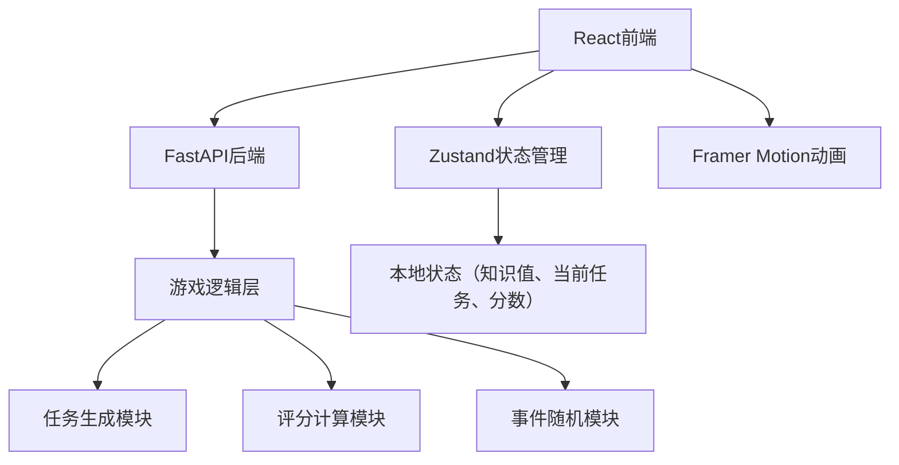
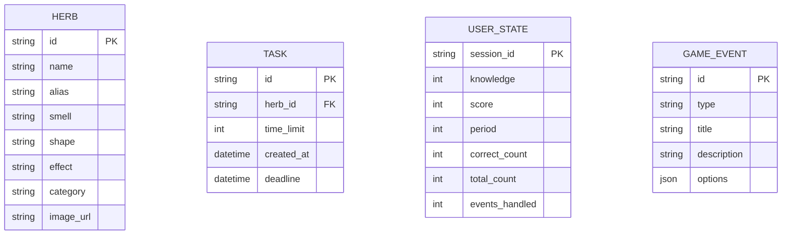

## 1. 架构设计



## 2. 技术描述

- **前端**：React@18 + TypeScript@5 + Vite@5 + Zustand@4 + Axios@1 + Framer Motion@11
- **后端**：FastAPI@0.100+ + Python@3.10+ + Uvicorn@0.23+
- **构建工具**：Vite@5 + @vitejs/plugin-react@4
- **状态管理**：Zustand（前端状态管理）
- **HTTP客户端**：Axios
- **动画库**：Framer Motion
- **开发端口**：前端5173，后端8000
- **跨域处理**：FastAPI配置CORS中间件

## 3. 前端文件结构

```
src/
├── App.tsx              # 主入口和路由
├── main.tsx             # React入口
├── index.css            # 全局样式和主题变量
├── types/
│   └── index.ts         # 类型定义
├── store/
│   └── useGameStore.ts  # Zustand状态管理
├── components/
│   ├── Board.tsx        # 药圃场景和拖拽交互
│   ├── HerbCard.tsx     # 草药卡片组件
│   ├── MedicalBook.tsx  # 医书描述面板
│   ├── MedicalCase.tsx  # 医案区域
│   ├── EventPanel.tsx   # 随机事件弹窗
│   ├── ScoreBoard.tsx   # 评分和等级展示
│   ├── HerbParticle.tsx # 粒子动画组件
│   └── StatusBar.tsx    # 状态栏
├── utils/
│   ├── api.ts           # API请求封装
│   └── herbs.ts         # 草药数据配置
└── hooks/
    └── useDrag.ts       # 拖拽自定义Hook
```

## 4. 后端文件结构

```
backend/
├── app.py               # FastAPI主入口
├── requirements.txt     # Python依赖
├── models/
│   └── schemas.py       # Pydantic数据模型
├── services/
│   ├── task_generator.py    # 任务生成服务
│   ├── scoring_service.py   # 评分计算服务
│   └── event_service.py     # 随机事件服务
└── data/
    └── herbs.json       # 草药数据库
```

## 5. 路由定义

| 路由 | 用途 |
|-------|---------|
| / | 游戏主界面 |
| /api/generate_task | POST，生成新任务 |
| /api/submit_answer | POST，提交答案并验证 |
| /api/get_score | GET，获取当前评分 |
| /api/trigger_event | POST，触发随机事件 |
| /api/resolve_event | POST，处理事件并返回结果 |
| /api/end_period | POST，结束旬度并生成报告 |

## 6. API 类型定义

```typescript
// 草药类型
interface Herb {
  id: string;
  name: string;
  alias: string;
  smell: string;
  shape: string;
  effect: string;
  image: string;
  category: string;
}

// 任务类型
interface Task {
  id: string;
  herbId: string;
  description: {
    smell: string;
    shape: string;
    effect: string;
  };
  timeLimit: number;
  deadline: number;
}

// 提交答案
interface SubmitAnswerRequest {
  taskId: string;
  herbId: string;
}

interface SubmitAnswerResponse {
  correct: boolean;
  knowledgeChange: number;
  currentKnowledge: number;
  correctHerb?: Herb;
}

// 事件类型
interface GameEvent {
  id: string;
  type: 'shortage' | 'poison' | 'bookworm' | 'plague';
  title: string;
  description: string;
  options: EventOption[];
}

interface EventOption {
  id: string;
  text: string;
  effect: {
    knowledge?: number;
    score?: number;
    timeBonus?: number;
  };
}

// 评分类型
interface ScoreReport {
  period: number;
  accuracy: number;
  completionRate: number;
  eventHandling: number;
  totalScore: number;
  grade: '下工' | '中工' | '上工' | '神医';
  comment: string;
}
```

## 7. 数据模型

### 7.1 草药数据模型



### 7.2 初始数据

草药数据库包含常见中草药：
- 解表药：麻黄、桂枝、薄荷、菊花
- 清热药：金银花、连翘、板蓝根、黄连
- 补益药：人参、黄芪、当归、枸杞
- 止咳药：杏仁、桔梗、川贝、枇杷叶
- 理气药：陈皮、木香、香附、乌药
