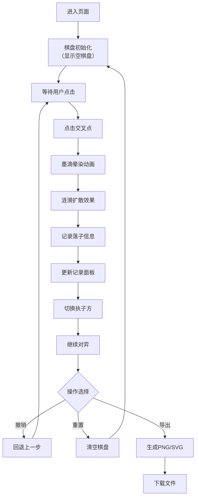

## 1. 产品概述

"墨韵棋谱"是一款具有中国传统水墨艺术风格的交互式围棋对弈页面，让用户在虚拟棋盘上体验古代棋士落子的雅致意境。通过精美的水墨动画效果，将传统围棋与现代Web技术完美融合。

- **核心价值**：为围棋爱好者和艺术爱好者提供兼具功能性与审美体验的对弈工具
- **目标用户**：围棋爱好者、传统文化爱好者、设计师
- **市场定位**：高品质文化艺术类Web应用，展现传统与现代的完美结合

## 2. 核心功能

### 2.1 用户角色

| 角色 | 注册方式 | 核心权限 |
|------|----------|----------|
| 访客用户 | 无需注册 | 完整使用所有对弈、记录、导出功能 |

### 2.2 功能模块

1. **主棋盘区域**：19x19标准围棋棋盘，点击落子，水墨动画效果
2. **落子记录面板**：左侧显示最近10步的落子坐标和手数
3. **棋谱导出面板**：右侧提供棋谱导出为图片或SVG格式功能
4. **游戏控制**：支持撤销、重置等基础操作

### 2.3 页面详情

| 页面名称 | 模块名称 | 功能描述 |
|----------|----------|----------|
| 主页面 | 棋盘组件 | 19x19网格绘制、点击落子交互、墨滴晕染动画、涟漪扩散效果 |
| 主页面 | 记录面板 | 滚动列表展示落子历史、坐标显示、手数标记、点击跳转 |
| 主页面 | 导出面板 | 导出为PNG图片、导出为SVG矢量图、文件名自定义 |
| 主页面 | 控制区域 | 撤销上一步、重置棋盘、黑白轮流提示 |

## 3. 核心流程

### 3.1 落子流程
用户进入页面后，默认执黑先行。点击棋盘任意交叉点即可落子，棋子以墨滴晕染方式呈现，周围浮现水墨涟漪并逐渐消散。落子后自动记录到手数列表，右侧面板实时更新。可随时撤销上一步或重置整个棋局。对弈过程中或结束后，可将当前棋谱导出为图片或SVG格式保存。

## 4. 用户界面设计

### 4.1 设计风格

- **设计理念**：水墨丹青，古朴雅致，传承东方美学
- **主色调**：
  - 宣纸白 `#f5f0e6` - 背景主色，营造宣纸质感
  - 墨黑 `#2c2c2c` - 黑子及文字主色
  - 朱砂红 `#c0392b` - 白子边框、重点标记、交互提示
  - 深灰 `#5a5a5a` - 棋盘线条
- **字体**：采用具有书法韵味的字体，标题使用衬线字体增强古风，正文使用清晰易读的字体
- **布局**：三栏式布局，中央棋盘为主视觉焦点，左右两侧面板为辅助功能区
- **质感**：添加纸张纹理、墨迹晕染、毛笔笔触等细节元素
- **动效**：所有动画采用缓动曲线，模拟水墨自然晕染的韵律感

### 4.2 页面设计概述

| 页面名称 | 模块名称 | UI元素 |
|----------|----------|--------|
| 主页面 | 顶部标题区 | "墨韵棋谱"书法风格标题，朱砂红印章装饰，淡墨分隔线 |
| 主页面 | 棋盘区域 | 19x19网格、星位标记、墨滴落子动画、涟漪扩散效果 |
| 主页面 | 左侧记录面板 | 半透明宣纸质感背景、滚动列表、手数序号、坐标文字 |
| 主页面 | 右侧导出面板 | 宣纸质感卡片、导出按钮（水墨风格）、格式选择 |
| 主页面 | 底部控制区 | 撤销按钮、重置按钮、当前执子方提示 |

### 4.3 响应式设计

- **桌面端**：三栏式布局，棋盘占据最大空间，左右面板宽度固定
- **平板端**：左右面板可折叠为抽屉式，棋盘自适应屏幕宽度
- **移动端**：单栏布局，棋盘优先展示，功能面板移至底部或侧边抽屉
- **触摸优化**：落子区域适当扩大，确保移动端点击精准

## 5. 动画设计规范

### 5.1 落子动画
- 墨滴晕染效果：从中心点向外扩散，透明度由0渐变为1，大小略作弹性缩放
- 使用framer-motion的spring物理动画，模拟自然落体的质感

### 5.2 涟漪动画
- 3-4圈同心圆环，从落子点向外扩散
- 圆环透明度由高渐低，线条由粗变细
- 各圆环依次延迟触发，形成水波荡漾的层次感

### 5.3 交互反馈
- 鼠标悬停交叉点时，显示半透明棋子预览
- 按钮hover效果：朱砂红渐变色，轻微上浮
- 记录项点击：高亮对应棋盘位置
