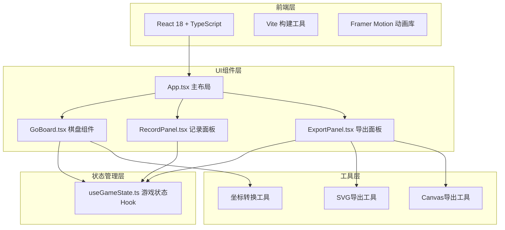

## 1. 架构设计



## 2. 技术描述

- **前端框架**：React 18 + TypeScript
- **构建工具**：Vite 5.x
- **动画库**：framer-motion 11.x
- **样式方案**：CSS Modules + CSS Variables
- **初始化方式**：使用vite-init创建react-ts模板

## 3. 核心数据结构

### 3.1 落子记录类型
```typescript
interface Move {
  id: number;          // 手数
  x: number;           // 横坐标 (0-18)
  y: number;           // 纵坐标 (0-18)
  color: 'black' | 'white';  // 棋子颜色
  timestamp: number;   // 落子时间戳
}

interface GameState {
  moves: Move[];       // 落子历史
  currentMove: number; // 当前手数
  board: ('black' | 'white' | null)[][];  // 19x19棋盘状态
  isUndoing: boolean;  // 是否正在撤销
}
```

### 3.2 坐标表示
- 棋盘坐标：x轴(0-18)从左到右，y轴(0-18)从上到下
- 显示坐标：列用A-T（跳过I），行用1-19（从下到上）

## 4. 项目文件结构

```
auto252/
├── package.json
├── tsconfig.json
├── vite.config.ts
├── index.html
└── src/
    ├── main.tsx              # React入口
    ├── App.tsx               # 主组件，三栏布局
    ├── components/
    │   ├── GoBoard.tsx       # 棋盘组件（19x19网格、落子、动画）
    │   ├── RecordPanel.tsx   # 落子记录面板
    │   └── ExportPanel.tsx   # 导出功能面板
    ├── hooks/
    │   └── useGameState.ts   # 游戏状态管理Hook
    ├── types/
    │   └── index.ts          # TypeScript类型定义
    ├── utils/
    │   ├── coordinate.ts     # 坐标转换工具
    │   ├── exportImage.ts    # 图片导出工具
    │   └── exportSvg.ts      # SVG导出工具
    └── styles/
        ├── variables.css     # CSS变量定义
        └── global.css        # 全局样式
```

## 5. 组件职责划分

### 5.1 GoBoard.tsx（棋盘组件）
- 绘制19x19网格线条和星位
- 处理点击落子事件
- 使用framer-motion实现墨滴晕染动画
- 实现涟漪扩散效果（多层AnimatePresence）
- 渲染当前棋盘上所有棋子
- 响应式适配容器大小

### 5.2 RecordPanel.tsx（记录面板）
- 显示最近10步落子记录
- 滚动列表展示全部历史
- 显示手数、坐标（如：黑1 = Q16）
- 点击记录项可高亮棋盘对应位置
- 显示当前执子方

### 5.3 ExportPanel.tsx（导出面板）
- 导出为PNG图片（使用Canvas API）
- 导出为SVG矢量图（直接生成SVG）
- 自定义文件名
- 导出质量选项

### 5.4 useGameState.ts（状态Hook）
- 管理19x19棋盘状态
- 维护落子历史记录
- 处理落子逻辑（包括基本禁入点判断）
- 撤销功能（恢复上一步状态）
- 重置功能（清空棋盘）
- 计算当前执子方

## 6. 性能优化策略

### 6.1 渲染优化
- 使用React.memo优化棋子组件，避免不必要重渲染
- 棋盘网格使用SVG static渲染，不随状态更新
- 涟漪动画使用transform属性，触发GPU加速

### 6.2 动画性能
- 所有动画使用framer-motion的transform和opacity属性
- 避免在动画过程中触发layout
- 使用will-change提前提示浏览器优化
- 限制同时存在的涟漪数量，自动清理已完成动画

### 6.3 内存管理
- 涟漪组件使用AnimatePresence，动画结束后自动卸载
- 棋盘状态使用扁平化数组，避免深层比较
- 导出功能使用Blob和URL.createObjectURL，及时释放内存

### 6.4 帧率保证
- 所有动画持续时间控制在300-800ms
- 使用requestAnimationFrame同步动画帧
- 避免在动画回调中执行复杂计算

## 7. 无障碍与兼容性

- 棋盘交叉点添加aria-label
- 键盘导航支持（Tab切换，Enter落子）
- 颜色对比度符合WCAG标准
- 支持 prefers-reduced-motion 媒体查询
- 降级方案：不支持SVG时使用Canvas渲染
