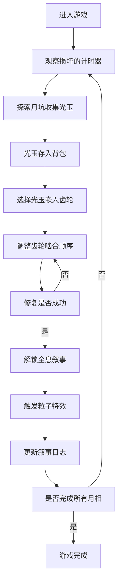

## 1. 产品概述

"蚀月编年史"是一款融合模拟经营与叙事元素的3D网页游戏，玩家扮演月面基地的时间管理员，通过收集光玉碎片修复古代月相计时器，逐步解锁失落月球文明的秘密。

- 核心目标：修复月相计时器，完整还原月球文明的叙事故事
- 目标用户：休闲游戏玩家、叙事向游戏爱好者、3D交互体验追求者

## 2. 核心特性

### 2.1 功能模块

1. **3D计时器场景**：可旋转缩放的月相计时器，包含多层齿轮组和月相显示装置
2. **光玉收集系统**：月坑中随机生成的光玉碎片，点击收集并存入背包
3. **齿轮修复系统**：将光玉嵌入齿轮槽位，调整齿轮啮合顺序以恢复月相周期
4. **全息叙事系统**：修复成功后触发飘浮的全息文字卡片，展示月球文明故事
5. **粒子特效系统**：光玉收集、月相修复时的光影流动特效

### 2.2 页面详情

| 页面名称 | 模块名称 | 功能描述 |
|----------|----------|----------|
| 主游戏界面 | 3D计时器场景 | 中央展示可交互的3D月相计时器，支持鼠标旋转、缩放视角 |
| 主游戏界面 | 光玉背包面板 | 左下角显示已收集的光玉数量和种类，支持拖拽嵌入齿轮 |
| 主游戏界面 | 叙事日志面板 | 右下角展示已解锁的叙事卡片列表，点击查看详情 |
| 主游戏界面 | 月相指示器 | 顶部显示当前月相修复进度和周期状态 |

## 3. 核心流程

玩家进入游戏后，观察月相计时器的损坏状态，在月坑场景中寻找并收集光玉碎片。收集足够的光玉后，将其嵌入计时器的齿轮槽位，通过调整齿轮啮合顺序完成月相周期修复。每成功修复一轮月相，解锁一段全息叙事并触发粒子特效。重复此过程直至完整解锁所有月球文明故事。

## 4. 用户界面设计

### 4.1 设计风格

- **主色调**：
  - 月灰 `#c0c0c0` - 金属结构主色
  - 深空蓝 `#1a1a2e` - 背景主色
  - 光玉白 `#f0e68c` - 交互高亮色
  - 裂痕黑 `#2f2f2f` - 结构阴影色
- **视觉风格**：金属质感与柔和光晕结合，冷光月球科技风
- **字体**：采用 Orbitron 作为展示字体，搭配 Roboto 作为正文字体
- **动效**：TWEEN.js 实现齿轮缓动动画，CSS 过渡实现面板滑动

### 4.2 界面布局

| 区域 | 位置 | 主要元素 |
|------|------|----------|
| 3D场景 | 中央全屏 | 月相计时器、月坑地形、光玉碎片、粒子特效 |
| 光玉背包 | 左下角 | 光玉图标网格、数量显示、拖拽区域 |
| 叙事日志 | 右下角 | 卡片列表、滚动条、展开详情按钮 |
| 月相进度 | 顶部中央 | 月相图标、进度条、当前周期提示 |
| 操作提示 | 底部中央 | 鼠标操作指引、当前状态提示 |

### 4.3 3D场景指引

- **环境**：深空背景，月面环形山地形，微弱星空
- **光照**：环境光 + 方向光模拟太阳光，自发光材质用于光玉和计时器辉光
- **相机**：PerspectiveCamera，初始距离 15，俯仰角 45°
- **交互**：OrbitControls 实现旋转、缩放、自动旋转
- **性能**：齿轮动画帧率稳定 60fps，粒子系统使用 BufferGeometry 优化

### 4.4 响应式设计

- 桌面端优先，1920×1080 为基准分辨率
- 面板支持最小化，小屏幕下自动调整布局
- 触屏设备支持双指缩放、单指旋转
