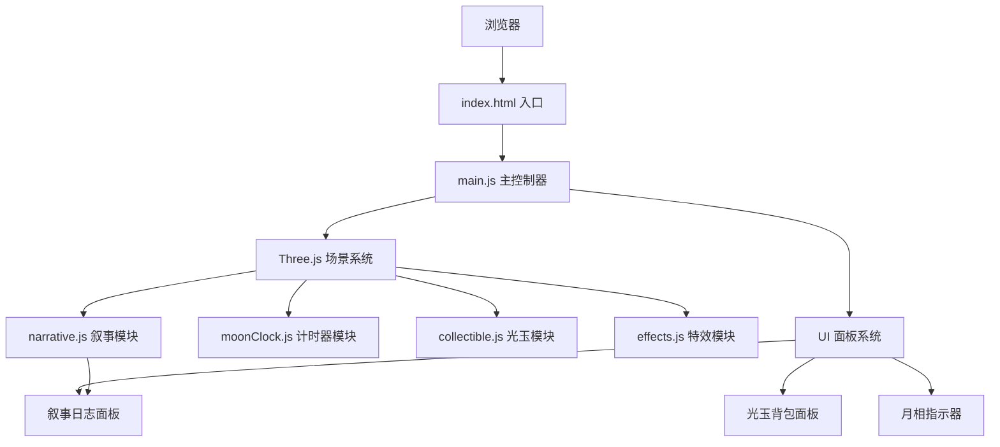

## 1. 架构设计



## 2. 技术栈描述

- **前端框架**：原生 JavaScript (ES6+)
- **3D引擎**：Three.js @0.160.0
- **相机控制**：three/addons/controls/OrbitControls.js
- **动画库**：@tweenjs/tween.js @23.1.1
- **构建工具**：Vite @5.0.0
- **音效**：Web Audio API (原生)
- **样式**：原生 CSS3 (CSS Variables + Flexbox + Grid)

## 3. 文件结构定义

| 文件路径 | 用途 |
|----------|------|
| `package.json` | 项目依赖配置和启动脚本 |
| `vite.config.js` | Vite 构建配置 |
| `index.html` | 入口HTML，挂载Canvas和UI面板 |
| `src/main.js` | 初始化场景、相机、渲染器，调度各模块 |
| `src/moonClock.js` | 月相计时器类，管理齿轮组、啮合逻辑、月相周期 |
| `src/collectible.js` | 光玉碎片类，管理生成、收集、背包数据 |
| `src/narrative.js` | 叙事系统，管理全息卡片、日志数据 |
| `src/effects.js` | 粒子特效系统，光玉收集、月面辉光等 |
| `src/style.css` | 全局样式，UI面板样式 |

## 4. 核心类定义

### 4.1 MoonClock (moonClock.js)

| 方法/属性 | 类型 | 描述 |
|-----------|------|------|
| `gears` | Array | 齿轮对象数组 |
| `currentPhase` | Number | 当前月相阶段 (0-7) |
| `targetPhase` | Number | 目标月相阶段 |
| `createGear(radius, teeth, depth, position)` | Method | 创建单个齿轮 |
| `embedOrb(gearIndex, orbType)` | Method | 向齿轮嵌入光玉 |
| `adjustGearOrder(newOrder)` | Method | 调整齿轮啮合顺序 |
| `checkPhaseAlignment()` | Method | 检查月相对齐状态 |
| `rotateGears(delta)` | Method | 每帧更新齿轮旋转 |
| `onRepairComplete(callback)` | Event | 修复完成回调 |

### 4.2 CollectibleManager (collectible.js)

| 方法/属性 | 类型 | 描述 |
|-----------|------|------|
| `inventory` | Object | 背包数据 {type: count} |
| `orbs` | Array | 场景中可收集的光玉 |
| `spawnOrb(position, type)` | Method | 生成单个光玉 |
| `collectOrb(orbMesh)` | Method | 收集光玉并存入背包 |
| `getOrbCount(type)` | Method | 获取指定类型光玉数量 |
| `useOrb(type)` | Method | 消耗一个光玉 |
| `spawnWave(count)` | Method | 生成一波光玉 |

### 4.3 NarrativeSystem (narrative.js)

| 方法/属性 | 类型 | 描述 |
|-----------|------|------|
| `stories` | Array | 所有叙事数据 |
| `unlockedStories` | Array | 已解锁叙事索引 |
| `showHologram(storyId)` | Method | 显示全息卡片 |
| `hideHologram()` | Method | 隐藏全息卡片 |
| `unlockStory(phase)` | Method | 解锁指定月相的叙事 |
| `updateLogPanel()` | Method | 更新叙事日志面板 |

### 4.4 EffectSystem (effects.js)

| 方法/属性 | 类型 | 描述 |
|-----------|------|------|
| `particles` | Object | 各类型粒子系统 |
| `createCollectEffect(position)` | Method | 光玉收集特效 |
| `createMoonGlow(intensity)` | Method | 月面辉光特效 |
| `createPhaseFlow(phase)` | Method | 月相流动特效 |
| `update(delta)` | Method | 每帧更新所有粒子 |

## 5. 性能优化策略

### 5.1 渲染优化
- 使用 `BufferGeometry` 替代 `Geometry`
- 复用几何体和材质实例
- 粒子系统使用 `Points` 批量渲染
- 齿轮使用 `InstancedMesh` 优化相同几何体

### 5.2 动画优化
- TWEEN 动画限制最大同时进行数
- 使用 `requestAnimationFrame` 同步渲染循环
- 齿轮旋转使用矩阵预计算
- 离屏对象设置 `visible = false`

### 5.3 内存管理
- 移除场景时调用 `dispose()` 释放几何体和材质
- 粒子对象池复用
- 事件监听器及时清理

## 6. 数据模型

### 6.1 光玉类型
```javascript
const ORB_TYPES = {
  FULL_MOON:    { id: 'full',    color: 0xf0e68c, name: '满月光玉' },
  HALF_MOON:    { id: 'half',    color: 0xc0c0c0, name: '半月光玉' },
  CRESCENT:     { id: 'crescent',color: 0x88ccff, name: '新月光玉' },
  ECLIPSE:      { id: 'eclipse', color: 0x663399, name: '蚀月光玉' }
};
```

### 6.2 月相周期
```javascript
const MOON_PHASES = [
  { id: 0, name: '新月',   requiredOrbs: ['crescent'] },
  { id: 1, name: '蛾眉月', requiredOrbs: ['crescent', 'half'] },
  { id: 2, name: '上弦月', requiredOrbs: ['half'] },
  { id: 3, name: '盈凸月', requiredOrbs: ['half', 'full'] },
  { id: 4, name: '满月',   requiredOrbs: ['full'] },
  { id: 5, name: '亏凸月', requiredOrbs: ['full', 'half'] },
  { id: 6, name: '下弦月', requiredOrbs: ['half'] },
  { id: 7, name: '残月',   requiredOrbs: ['half', 'crescent'] }
];
```

### 6.3 叙事数据
```javascript
const NARRATIVES = [
  {
    phase: 0,
    title: '第一章：月之沉睡',
    content: '当第一颗星辰点亮宇宙，月球便已在此守望...',
    hologramText: '「时间始于月相的第一次呼吸」'
  },
  // ... 更多章节
];
```
