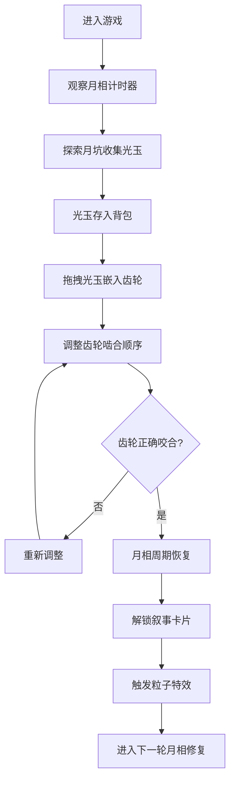

## 1. 产品概述

「蚀月编年史」是一款融合模拟经营与叙事元素的3D网页游戏，玩家扮演月面基地的时间管理员，通过收集光玉碎片、修复古代月相计时器来逐步揭开月球文明的神秘面纱。游戏将精密的机械交互与深邃的科幻叙事相结合，为玩家带来沉浸式的月球探索体验。

## 2. 核心功能

### 2.1 用户角色

| 角色 | 注册方式 | 核心权限 |
|------|----------|----------|
| 时间管理员 | 无需注册，直接进入游戏 | 收集光玉、修复计时器、查看叙事、调整视角 |

### 2.2 功能模块

1. **3D计时器场景**：可旋转缩放的月相计时器，包含齿轮系统、光玉插槽、粒子特效
2. **光玉背包系统**：展示已收集的光玉数量和种类，支持拖拽嵌入齿轮
3. **叙事日志系统**：展示已解锁的全息文字卡片，记录月球文明历史
4. **控制面板**：重置齿轮状态、加速齿轮转动
5. **收集系统**：月坑中随机生成光玉碎片，点击收集

### 2.3 页面详情

| 页面名称 | 模块名称 | 功能描述 |
|----------|----------|----------|
| 主游戏页面 | 3D计时器场景 | 中央展示可交互的月相计时器，支持鼠标旋转、滚轮缩放，齿轮转动带动月相变化 |
| 主游戏页面 | 光玉背包面板 | 左下角显示已收集的光玉，按种类分类，显示数量，可拖拽嵌入齿轮插槽 |
| 主游戏页面 | 叙事日志面板 | 右下角显示已解锁的叙事卡片，滚动浏览，点击展开详情 |
| 主游戏页面 | 控制面板 | 顶部重置按钮、加速按钮，控制游戏状态 |
| 主游戏页面 | 月面环境 | 背景展示月球表面、陨石坑、星空，营造太空氛围 |

## 3. 核心流程

玩家进入游戏后，首先观察损坏的月相计时器。通过探索月坑中的光玉碎片并收集，将光玉拖拽嵌入齿轮插槽。调整齿轮的啮合顺序，当所有齿轮正确咬合时，月相周期恢复，解锁一段月球文明叙事，同时触发月面光影流动的粒子特效。

## 4. 用户界面设计

### 4.1 设计风格

- **主色调**：深空蓝 `#1a1f3a`（背景）、月面灰 `#dcdcdc`（主体）
- **强调色**：光玉金 `#ffd700`（光玉、高亮）、粒子银 `#c0c0c0`（粒子、边框）
- **按钮风格**：半透明玻璃态，深空蓝底色，光玉金边框，圆角8px
- **字体**：标题使用 Orbitron（科幻字体），正文使用 Noto Sans SC（清晰易读）
- **布局风格**：中央3D场景为主，左右下角面板悬浮，采用玻璃态设计，半透明背景带模糊效果
- **图标风格**：线性简约风格，光玉金色描边，与整体科技感一致

### 4.2 页面设计概述

| 页面名称 | 模块名称 | UI元素 |
|----------|----------|---------|
| 主游戏页面 | 3D计时器场景 | 月面灰齿轮结构、光玉金插槽、深空蓝背景、星空粒子、陨石坑地形、月相投影 |
| 主游戏页面 | 光玉背包面板 | 玻璃态卡片、光玉图标、数量标签、拖拽提示、分类标签 |
| 主游戏页面 | 叙事日志面板 | 全息文字卡片、滚动列表、时间线标记、卡片展开动画 |
| 主游戏页面 | 控制面板 | 顶部悬浮按钮、重置图标、加速图标、悬停光效 |

### 4.3 响应式设计

- **桌面优先**：主要面向桌面浏览器，1920×1080为最佳分辨率
- **移动适配**：在平板设备上保持完整功能，手机端简化面板布局
- **触控优化**：支持触摸拖拽、双指缩放，手势操作流畅

### 4.4 3D场景设计

- **环境与氛围**：深空背景，点缀闪烁星空，月球表面布满陨石坑，冷光照射营造神秘科技感
- **光照设置**：主光源为冷白色平行光模拟太阳光，环境光为淡蓝色，齿轮边缘有金属高光
- **相机设置**：透视相机，初始距离适中，可360°旋转观察，滚轮缩放，限制最小/最大距离
- **构图与焦点**：计时器位于场景中心，月坑分布在周围，光玉碎片在坑中发光吸引注意
- **交互与动画**：齿轮转动平滑，光玉嵌入时有吸附动画，粒子特效沿月面流动
- **后期处理**：轻微泛光效果（Bloom）增强光玉和粒子的发光感，色彩校正突出冷色调
- **性能预算**：保持60fps，齿轮面数控制在合理范围，粒子数量动态调整

## 5. 视觉与动效

### 5.1 齿轮动画
- 齿轮转动时有金属碰撞音效
- 正确咬合时发出清脆的锁定声
- 错误调整时有轻微震动反馈

### 5.2 粒子特效
- 月相修复时，银色粒子从齿轮中心向四周扩散
- 沿月面流动形成光影波纹
- 光玉收集时有金色粒子汇聚效果

### 5.3 UI动效
- 叙事卡片以全息投影方式浮现，带有扫描线效果
- 背包面板展开/收起有平滑滑动动画
- 按钮悬停时有光玉金色光晕扩散效果
