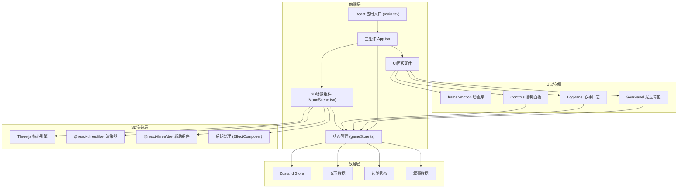
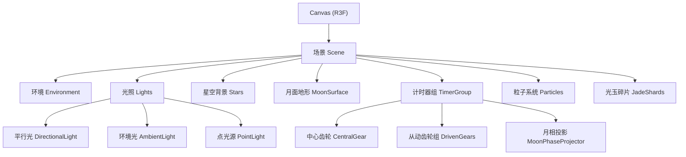

## 1. 架构设计



## 2. 技术栈说明

| 技术 | 版本 | 用途 |
|------|------|------|
| React | ^18.2.0 | 前端框架，组件化开发 |
| React DOM | ^18.2.0 | DOM渲染 |
| TypeScript | ^5.3.0 | 类型安全，strict模式 |
| Three.js | ^0.160.0 | 3D图形渲染引擎 |
| @react-three/fiber | ^8.15.0 | React Three.js 渲染器 |
| @react-three/drei | ^9.92.0 | Three.js 辅助组件库 |
| framer-motion | ^10.16.0 | UI动画库 |
| zustand | ^4.4.0 | 轻量级状态管理 |
| Vite | ^5.0.0 | 构建工具与开发服务器 |
| @vitejs/plugin-react | ^4.2.0 | Vite React 插件 |

## 3. 目录结构

```
auto256/
├── package.json
├── tsconfig.json
├── vite.config.js
├── index.html
└── src/
    ├── main.tsx              # React应用入口
    ├── App.tsx               # 主组件，组合所有模块
    ├── store/
    │   └── gameStore.ts      # Zustand 状态管理
    ├── components/
    │   ├── MoonScene.tsx     # 3D场景组件
    │   ├── GearPanel.tsx     # 光玉背包面板
    │   ├── LogPanel.tsx      # 叙事日志面板
    │   └── Controls.tsx      # 顶部控制面板
    ├── types/
    │   └── index.ts          # TypeScript 类型定义
    ├── data/
    │   ├── gears.ts          # 齿轮配置数据
    │   ├── lightJades.ts     # 光玉数据
    │   └── narratives.ts     # 叙事文本数据
    └── utils/
        └── audio.ts          # 音效工具函数
```

## 4. 数据模型定义

### 4.1 TypeScript 类型

```typescript
// 光玉类型
type LightJadeType = 'newMoon' | 'crescent' | 'firstQuarter' | 'gibbous' | 'fullMoon';

interface LightJade {
  id: string;
  type: LightJadeType;
  name: string;
  color: string;
  collected: boolean;
  embedded: boolean;
}

// 齿轮状态
interface Gear {
  id: number;
  name: string;
  position: [number, number, number];
  rotation: number;
  targetRotation: number;
  teeth: number;
  hasJade: boolean;
  jadeType: LightJadeType | null;
  isCorrect: boolean;
}

// 叙事卡片
interface Narrative {
  id: number;
  title: string;
  content: string;
  unlocked: boolean;
  moonPhase: number;
}

// 游戏状态
interface GameState {
  // 光玉
  lightJades: LightJade[];
  collectedCount: Record<LightJadeType, number>;
  
  // 齿轮
  gears: Gear[];
  currentGearIndex: number;
  isSpinning: boolean;
  speedMultiplier: number;
  
  // 叙事
  narratives: Narrative[];
  currentPhase: number;
  
  // 交互
  selectedJade: LightJadeType | null;
  isDragging: boolean;
  
  // 特效
  showParticles: boolean;
  particlePosition: [number, number, number] | null;
  
  // Actions
  collectJade: (type: LightJadeType) => void;
  embedJade: (gearId: number, jadeType: LightJadeType) => void;
  rotateGear: (gearId: number, direction: 1 | -1) => void;
  checkAlignment: () => boolean;
  unlockNarrative: () => void;
  resetGears: () => void;
  setSpeed: (multiplier: number) => void;
  triggerParticles: (position: [number, number, number]) => void;
  setSelectedJade: (type: LightJadeType | null) => void;
}
```

### 4.2 游戏配置数据

```typescript
// 齿轮初始配置
const initialGears: Gear[] = [
  { id: 1, name: '新月轮', position: [0, 2, 0], rotation: 0, targetRotation: 0, teeth: 24, hasJade: false, jadeType: null, isCorrect: false },
  { id: 2, name: '弦月轮', position: [-2.5, 0.5, 0], rotation: 0, targetRotation: 90, teeth: 36, hasJade: false, jadeType: null, isCorrect: false },
  { id: 3, name: '上弦轮', position: [2.5, 0.5, 0], rotation: 0, targetRotation: 180, teeth: 36, hasJade: false, jadeType: null, isCorrect: false },
  { id: 4, name: '盈凸轮', position: [-1.5, -2, 0], rotation: 0, targetRotation: 270, teeth: 48, hasJade: false, jadeType: null, isCorrect: false },
  { id: 5, name: '满月轮', position: [1.5, -2, 0], rotation: 0, targetRotation: 0, teeth: 48, hasJade: false, jadeType: null, isCorrect: false },
];

// 光玉配置
const lightJadeConfig: Record<LightJadeType, { name: string; color: string }> = {
  newMoon: { name: '朔月光玉', color: '#4a4a6a' },
  crescent: { name: '蛾眉光玉', color: '#c9b037' },
  firstQuarter: { name: '上弦光玉', color: '#d4af37' },
  gibbous: { name: '盈凸光玉', color: '#e6c200' },
  fullMoon: { name: '满月光玉', color: '#ffd700' },
};

// 叙事文本
const narrativesData: Omit<Narrative, 'unlocked'>[] = [
  {
    id: 1,
    title: '第一章：月面来客',
    content: '公元2147年，人类在月球南极艾特肯盆地发现了非自然结构。那是一座被陨石半埋的古老装置，表面刻着与月相周期完全吻合的符文...',
    moonPhase: 0,
  },
  {
    id: 2,
    title: '第二章：时间的守护者',
    content: '「月相计时器」——这是古代月球文明留下的遗产。他们并非来自地球，而是在月球诞生之初便在此定居，守护着太阳系的时间节律...',
    moonPhase: 1,
  },
  {
    id: 3,
    title: '第三章：光玉的秘密',
    content: '光玉并非普通矿石，而是月球文明将时间凝聚成的晶体。每一颗都承载着一段历史，当五颗光玉齐聚，时间之门便会开启...',
    moonPhase: 2,
  },
  {
    id: 4,
    title: '第四章：蚀月之劫',
    content: '三万年前，一场陨石雨摧毁了月球文明。他们在最后一刻启动了计时器的保护机制，将文明的记忆封存在叙事之中，等待着继承者...',
    moonPhase: 3,
  },
  {
    id: 5,
    title: '第五章：编年史',
    content: '当月相完整循环，蚀月编年史的最后一页被翻开。你，成为了新的时间管理员。月球文明并未消亡，它在时间的长河中等待着与你相遇...',
    moonPhase: 4,
  },
];
```

## 5. 状态管理设计

使用 Zustand 管理全局状态，分为四个核心模块：

1. **光玉模块**：管理收集、嵌入、数量统计
2. **齿轮模块**：管理旋转、咬合检测、加速控制
3. **叙事模块**：管理解锁状态、当前进度
4. **交互模块**：管理拖拽、选中、特效触发

## 6. 3D渲染架构



### 6.1 性能优化策略

- 齿轮使用低多边形模型，合理控制面数
- 粒子系统使用 BufferGeometry，动态更新位置
- 后期处理只在必要时启用 Bloom 效果
- 使用 React.memo 避免不必要的重渲染
- 使用 useFrame 的第二个参数（优先级）控制更新频率
- 音频使用 Web Audio API，预加载音效资源

## 7. 核心交互流程

### 7.1 光玉收集流程
1. 月坑中随机生成发光的光玉碎片
2. 玩家点击碎片，触发收集动画
3. 调用 `collectJade` action 更新状态
4. 背包中对应光玉数量+1
5. 播放收集音效和粒子特效

### 7.2 齿轮修复流程
1. 玩家从背包拖拽光玉到齿轮插槽
2. 调用 `embedJade` action 嵌入光玉
3. 玩家点击齿轮旋转调整角度
4. 调用 `rotateGear` action 更新旋转角度
5. 所有齿轮嵌入光玉后自动调用 `checkAlignment`
6. 咬合正确则触发 `unlockNarrative` 和粒子特效

### 7.3 叙事解锁流程
1. 检测到齿轮正确咬合
2. 标记当前叙事卡片为已解锁
3. 显示全息卡片动画
4. 更新 `currentPhase` 进入下一轮
5. 重置齿轮状态，生成新月相目标
