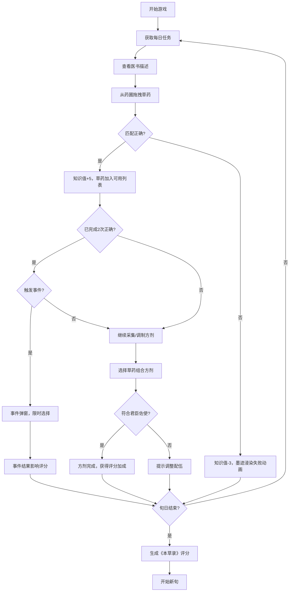

## 1. 产品概述

"药童辨草"是一款模拟古代中医药文化的教育类Web游戏，用户扮演唐代药童，在药圃中根据《本草》医书描述采集和鉴定草药，并调制方剂应对随机"时疫"事件。

- **主要用途**：寓教于乐地传播中医药知识，让用户在游戏中了解草药形态、气味、功效及方剂配伍原则
- **目标用户**：对中医药文化感兴趣的普通用户、学生群体
- **核心价值**：通过沉浸式游戏体验传承中华优秀传统文化，普及本草知识

## 2. 核心功能

### 2.1 用户角色
| 角色 | 注册方式 | 核心权限 |
|------|----------|----------|
| 药童 | 无需注册，本地会话 | 采集草药、调制方剂、处理随机事件、查看评分 |

### 2.2 功能模块
1. **主界面**：药圃展示区、任务描述面板、方剂面板、道具栏、知识值/评分显示
2. **草药采集系统**：拖拽交互、实时反馈动画、知识值增减
3. **方剂调制系统**：君臣佐使配伍规则、药材组合验证
4. **随机事件系统**：事件弹窗、限时选择、影响评分
5. **评分系统**：《本草录》旬度评分、多维度评价

### 2.3 页面详情
| 页面名称 | 模块名称 | 功能描述 |
|----------|----------|----------|
| 主游戏界面 | 任务描述面板 | 显示当前草药任务的气味、形态、功效描述，倒计时显示 |
| 主游戏界面 | 药圃展示区 | 6种草药卡片展示，支持拖拽到医案区匹配任务 |
| 主游戏界面 | 方剂面板 | 展示已正确采集的草药，支持组合成方剂 |
| 主游戏界面 | 道具栏 | 火炉、药碾等道具图标，视觉装饰+交互提示 |
| 主游戏界面 | 状态栏 | 知识值、当前旬日、准确率显示 |
| 事件弹窗 | 事件内容区 | 展示随机事件描述和选项，限时选择 |
| 旬度结算界面 | 本草录评分 | 展示采集准确率、方剂完成度、事件处理评分及综合评价 |

## 3. 核心流程

用户进入游戏后，系统每日生成草药任务，用户根据医书描述从药圃拖拽正确草药到医案，正确则增加知识值，错误则减少。每2次正确任务后有概率触发随机事件，需快速选择应对。用户可将正确采集的草药按君臣佐使规则组合成方剂。每旬（10天）结束后，系统生成《本草录》综合评分。

## 4. 用户界面设计

### 4.1 设计风格
- **主色调**：土黄#d4a351（主背景装饰）、松绿#2d5a3d（草药主题）、朱砂红#c0392b（强调/错误）、纸白#f5f0e6（基底）
- **字体**：标题使用书法风格字体（如"ZCOOL XiaoWei"），正文使用清晰易读的宋体/衬线字体
- **按钮风格**：圆角矩形，木刻纹理边框，悬停有墨晕扩散效果
- **布局风格**：三栏式古典布局，中央药圃为主，两侧卷轴式面板
- **视觉元素**：宣纸纹理背景、墨迹晕染动画、毛笔书法装饰、印章元素

### 4.2 页面设计概述
| 页面名称 | 模块名称 | UI元素 |
|----------|----------|--------|
| 主游戏界面 | 任务描述面板 | 卷轴样式背景，毛笔字体标题，古朴描述文本，倒计时沙漏图标 |
| 主游戏界面 | 药圃展示区 | 2×3网格布局，草药卡片带精美植物插画，拖拽时有悬浮阴影，正确匹配墨绿晕染，错误朱砂晕染 |
| 主游戏界面 | 方剂面板 | 竹简样式背景，君臣佐使四个位置槽位，药材拖拽组合 |
| 主游戏界面 | 道具栏 | 古朴图标：火炉🔥、药碾⚙️、捣药罐🥣，悬停显示用途说明 |
| 事件弹窗 | 事件内容区 | 卷轴展开动画，朱砂印章标记"急"字，选项按钮带时间条倒计时 |
| 旬度结算界面 | 本草录评分 | 古籍书页样式，书法标题，朱砂评分印章，多维度雷达图 |

### 4.3 响应式
- 桌面端为主要设计目标（1280px及以上）
- 平板端（768-1279px）：保持三栏布局，适当缩小间距和字体
- 移动端（<768px）：改为上下堆叠布局，药圃改为单列，面板可折叠展开
- 触摸优化：增大拖拽热区，支持触摸拖拽

### 4.4 动画与交互
- **拖拽交互**：草药卡片拖拽时轻微放大1.05倍，阴影加深，释放时有弹性回弹
- **成功反馈**：翠绿色墨晕从中心向外扩散，伴随轻微的"钤印"音效提示
- **失败反馈**：朱砂红色墨晕扩散，卡片轻微抖动
- **事件弹窗**：卷轴从上向下展开动画，选项悬停有墨染效果
- **页面转场**：新任务时淡入淡出，旬度结算时古籍翻页效果
- **知识值变化**：数字跳动动画，上升时绿色箭头，下降时红色箭头
