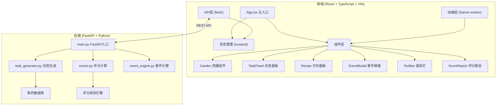
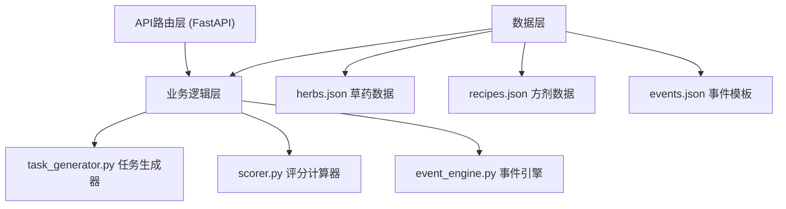
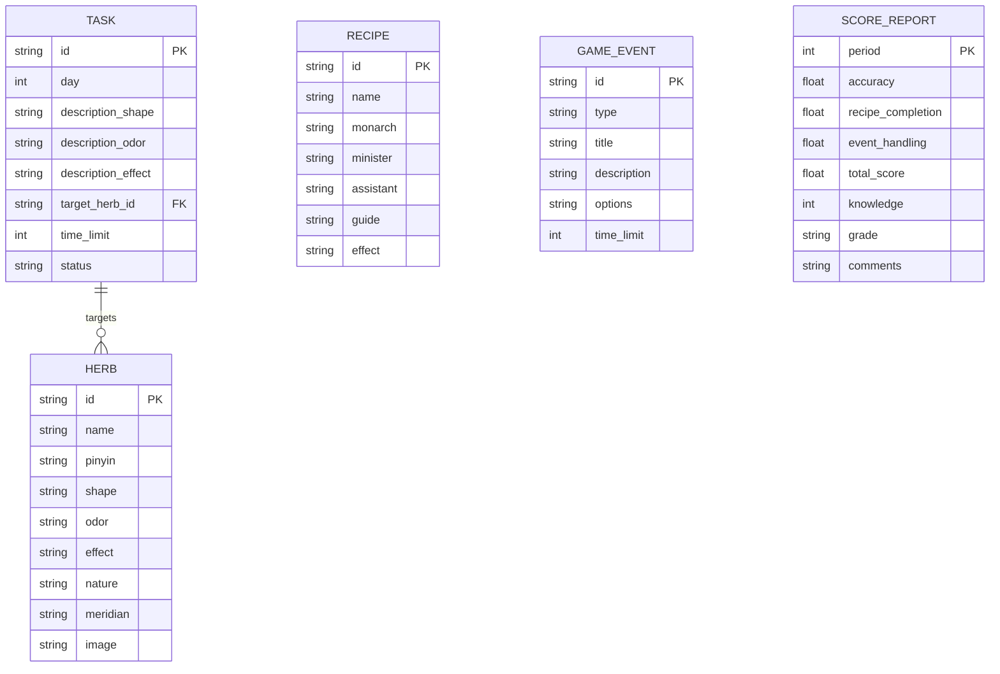

## 1. 架构设计

系统采用前后端分离架构，前端负责交互展示和游戏逻辑，后端负责任务生成、评分计算和事件逻辑。



## 2. 技术描述

- **前端框架**：React 18 + TypeScript 5 + Vite 5
- **状态管理**：zustand 4（轻量、简洁的状态管理）
- **样式方案**：Tailwind CSS 3 + CSS变量
- **动画库**：framer-motion 11（流畅的拖拽和墨染动画）
- **拖拽实现**：原生HTML5 Drag & Drop API + framer-motion手势增强
- **后端框架**：FastAPI 0.110 + Python 3.11
- **ASGI服务器**：uvicorn 0.29
- **构建工具**：Vite 5
- **包管理器**：npm

## 3. 路由定义

| 路由 | 用途 |
|------|------|
| / | 主游戏界面（唯一页面，通过状态切换不同视图） |

> 说明：本应用为单页游戏应用，所有功能在同一页面通过组件状态切换实现，无需多页面路由。

## 4. API 定义

### 4.1 类型定义

```typescript
// 草药类型
interface Herb {
  id: string;
  name: string;
  pinyin: string;
  shape: string;      // 形态描述
  odor: string;       // 气味描述
  effect: string;     // 功效描述
  nature: string;     // 性味（寒热温凉平）
  meridian: string[]; // 归经
  image: string;      // 草药图示
}

// 任务类型
interface Task {
  id: string;
  day: number;
  description: {
    shape: string;
    odor: string;
    effect: string;
  };
  targetHerbId: string;
  timeLimit: number;  // 秒
  status: 'pending' | 'active' | 'completed' | 'failed';
}

// 方剂类型
interface Recipe {
  id: string;
  name: string;
  monarch: string[];   // 君药
  minister: string[];  // 臣药
  assistant: string[]; // 佐药
  guide: string[];     // 使药
  effect: string;
}

// 事件类型
interface GameEvent {
  id: string;
  type: 'plague' | 'pest' | 'poison' | 'worm';
  title: string;
  description: string;
  options: {
    id: string;
    text: string;
    scoreEffect: number;
    knowledgeEffect: number;
  }[];
  timeLimit: number;
}

// 评分类型
interface ScoreReport {
  period: number;           // 旬期
  accuracy: number;         // 采集准确率 0-100
  recipeCompletion: number; // 方剂完成度 0-100
  eventHandling: number;    // 事件处理 0-100
  totalScore: number;       // 总分 0-100
  knowledge: number;        // 当前知识值
  grade: '甲' | '乙' | '丙' | '丁';
  comments: string;
}
```

### 4.2 接口定义

| 方法 | 路径 | 请求 | 响应 |
|------|------|------|------|
| GET | /api/daily-tasks | `{ day: number }` | `{ tasks: Task[], herbs: Herb[] }` |
| POST | /api/submit | `{ taskId: string, herbId: string }` | `{ correct: boolean, knowledge: number, message: string }` |
| POST | /api/submit-recipe | `{ recipe: Recipe }` | `{ valid: boolean, score: number, message: string }` |
| GET | /api/events | `{ triggerCount: number }` | `{ event: GameEvent \| null }` |
| POST | /api/handle-event | `{ eventId: string, optionId: string }` | `{ scoreEffect: number, knowledgeEffect: number, message: string }` |
| GET | /api/score | `{ period: number }` | `ScoreReport` |

## 5. 服务器架构图



## 6. 数据模型

### 6.1 数据模型定义



### 6.2 数据初始化

草药数据存储于 `backend/data/herbs.json`，包含6种基础草药及其详细属性：

```json
[
  {
    "id": "chaihu",
    "name": "柴胡",
    "pinyin": "chái hú",
    "shape": "茎直立，叶互生，呈线状披针形，根呈圆锥形",
    "odor": "气微香，味微苦",
    "effect": "和解表里，疏肝升阳",
    "nature": "微寒",
    "meridian": ["肝", "胆"],
    "image": "🌿"
  }
]
```

方剂数据存储于 `backend/data/recipes.json`，包含经典方剂的君臣佐使配伍规则。

事件模板存储于 `backend/data/events.json`，包含各类随机事件及其选项。
