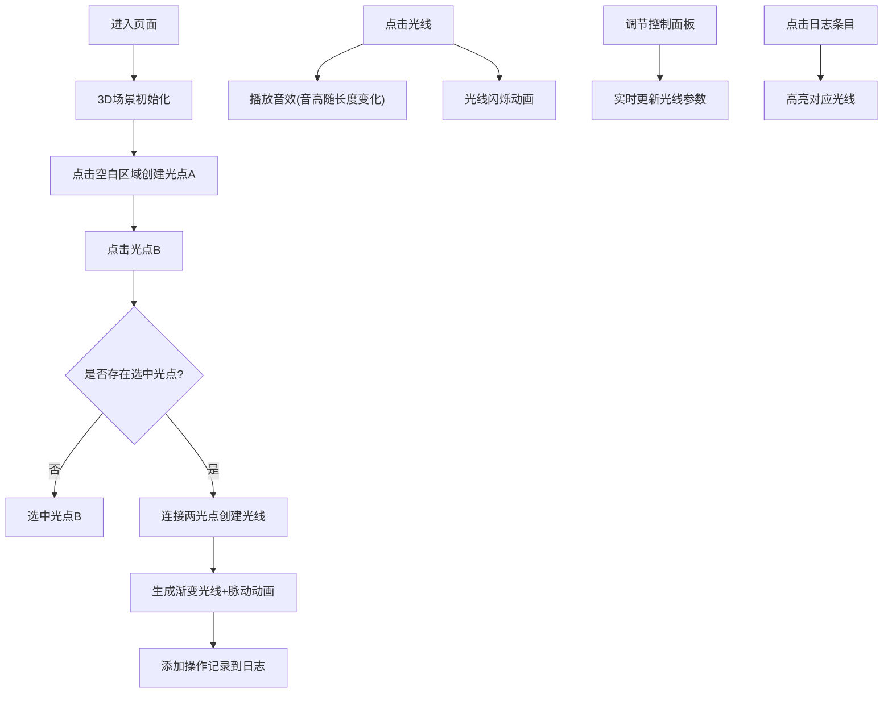

## 1. 产品概述

"光音织锦"是一个沉浸式3D交互可视化项目，让用户化身为光的编织者，在三维空间中通过拖拽和连接光点来编织动态的光线网络。每条光线带有渐变色和脉动动画，点击光线可触发随光线属性变化的音效。

- **主要目标**：提供一个具有艺术美感和交互乐趣的创作体验，结合视觉与听觉的双重感官享受
- **目标用户**：艺术爱好者、交互设计爱好者、创意工作者
- **核心价值**：通过简单的交互创造复杂美丽的光线艺术作品，探索视觉与声音的联动关系

## 2. 核心功能

### 2.1 功能模块

1. **3D场景交互**：光点创建、光线连接、网络编织
2. **视觉呈现**：渐变色光线、脉动呼吸动画、辉光粒子效果
3. **音效系统**：光线点击触发Web Audio音效，音高随光线长度变化
4. **控制面板**：光线参数调节、颜色选择、清空功能
5. **事件日志**：操作记录、历史回溯、光线高亮

### 2.2 页面详情

| 页面名称 | 模块名称 | 功能描述 |
|-----------|-------------|---------------------|
| 主页面 | 3D场景区域 | 中心区域展示三维空间，支持鼠标交互创建光点和连接光线 |
| 主页面 | 左侧控制面板 | 光线宽度滑块、脉动速度滑块、彩虹色带选择器、清空按钮 |
| 主页面 | 右侧事件日志 | 最近10条操作记录，倒序显示，点击高亮对应光线 |

## 3. 核心流程

用户进入页面后看到空的3D场景，通过鼠标点击创建光点，再点击另一个光点即可连接光线。点击光线触发音效和闪烁动画。可通过左侧面板调节参数，右侧面板查看操作历史。

## 4. 用户界面设计

### 4.1 设计风格

- **主题**：霓虹赛博朋克风格，营造未来感和科技感
- **主色调**：深灰背景 `#1a1a2e`，光点高亮 `#e94560`
- **光线渐变色**：从 `#0f3460` 到 `#16c79a`
- **字体**：采用科技感无衬线字体，标题使用 Orbitron 或类似风格
- **布局**：三栏布局，中间3D场景，左右两侧悬浮面板
- **动效**：光线脉动呼吸、点击闪烁、日志淡入、参数平滑过渡

### 4.2 页面设计概述

| 页面名称 | 模块名称 | UI元素 |
|-----------|-------------|-------------|
| 主页面 | 3D场景区域 | 深灰渐变背景、可旋转视角、光点带辉光效果、光线带渐变和脉动 |
| 主页面 | 左侧控制面板 | 半透明深色玻璃态面板、滑块带霓虹发光效果、彩虹色带可点击选色 |
| 主页面 | 右侧事件日志 | 半透明深色玻璃态面板、日志条目淡入动画、悬停高亮、点击选中效果 |

### 4.3 响应性

- **桌面端优先**：三栏布局充分利用大屏空间
- **交互优化**：鼠标悬停反馈、点击状态清晰、拖拽流畅
- **性能保障**：50条光线保持60fps，粒子数量≤500

### 4.4 3D场景指导

- **环境**：深灰背景，轻微雾效增强空间感
- **光照**：环境光+点光源组合，突出光线的霓虹发光效果
- **相机**：透视相机，可通过鼠标拖拽旋转视角，滚轮缩放
- **交互**：点击创建光点，点击光点连线，点击光线触发音效
- **后处理**：辉光效果增强霓虹感，适当的抗锯齿
- **性能**：使用 BufferGeometry，合理的粒子数量控制
