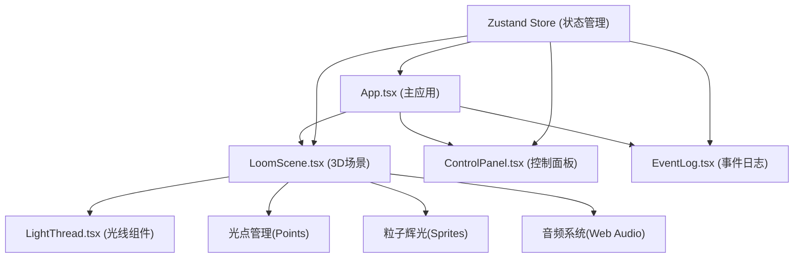

## 1. 架构设计



## 2. 技术描述

- **前端框架**：React 18 + TypeScript
- **构建工具**：Vite
- **3D渲染**：Three.js
- **React Three**：@react-three/fiber (场景管理)、@react-three/drei (辅助组件)
- **状态管理**：Zustand
- **样式方案**：Tailwind CSS
- **音频处理**：原生 Web Audio API

## 3. 目录结构

```
src/
├── main.tsx              # 应用入口
├── App.tsx               # 主应用组件，组装场景和面板
├── store/
│   └── useLoomStore.ts   # Zustand状态管理
├── scene/
│   ├── LoomScene.tsx     # 3D场景主组件，光线生成逻辑
│   └── LightThread.tsx   # 单条光线组件，外观和动画
├── ui/
│   ├── ControlPanel.tsx  # 左侧控制面板
│   └── EventLog.tsx      # 右侧事件日志
├── hooks/
│   └── useAudio.ts       # 音频Hook
├── types/
│   └── index.ts          # 类型定义
└── utils/
    └── colorUtils.ts     # 颜色工具函数
```

## 4. 数据模型

### 4.1 核心类型定义

```typescript
// 光点
interface LightPoint {
  id: string;
  position: [number, number, number];
  color: string;
}

// 光线
interface LightThread {
  id: string;
  startPointId: string;
  endPointId: string;
  startColor: string;
  endColor: string;
  length: number;
  createdAt: number;
}

// 事件日志
interface LogEntry {
  id: string;
  type: 'create_point' | 'connect_thread' | 'play_sound';
  message: string;
  threadId?: string;
  timestamp: number;
}

// 应用状态
interface LoomState {
  points: LightPoint[];
  threads: LightThread[];
  selectedPointId: string | null;
  highlightedThreadId: string | null;
  logs: LogEntry[];
  
  // 设置参数
  threadWidth: number;
  pulseSpeed: number;
  defaultColor: string;
  
  // 操作方法
  addPoint: (position: [number, number, number]) => void;
  connectPoints: (startId: string, endId: string) => void;
  selectPoint: (id: string | null) => void;
  highlightThread: (id: string | null) => void;
  addLog: (entry: Omit<LogEntry, 'id' | 'timestamp'>) => void;
  setThreadWidth: (width: number) => void;
  setPulseSpeed: (speed: number) => void;
  setDefaultColor: (color: string) => void;
  clearAll: () => void;
}
```

## 5. 性能优化策略

### 5.1 几何体优化
- 使用 `BufferGeometry` 而非 `Geometry`
- 光线使用 `LineGeometry` 配合 `LineMaterial`
- 粒子系统使用 `Points` 配合 `BufferGeometry`

### 5.2 渲染优化
- 光线数量 ≤ 50 时保持 60fps
- 粒子总数 ≤ 500
- 材质复用，避免频繁创建
- 动画使用 `useFrame` 统一更新

### 5.3 内存管理
- 组件卸载时清理几何体和材质
- 事件监听及时移除
- Web Audio 资源正确释放

## 6. 核心功能实现要点

### 6.1 光线渐变色
- 使用 `LineBasicMaterial` 的 `vertexColors` 属性
- 在几何体顶点上设置不同颜色实现渐变
- 颜色根据两端光点位置插值计算

### 6.2 脉动动画
- 使用 `useFrame` 在每一帧更新材质透明度
- 应用正弦函数实现呼吸效果
- 脉动速度通过 store 中的参数控制

### 6.3 音效生成
- Web Audio API 创建 `OscillatorNode`
- 音高频率与光线长度成正比
- 添加 `GainNode` 控制音量包络

### 6.4 光点辉光
- 使用 `Sprite` 配合渐变透明贴图
- 或使用 `Points` 配合 `PointsMaterial` 的 `sizeAttenuation`
- 每个光点周围生成少量粒子增强效果
