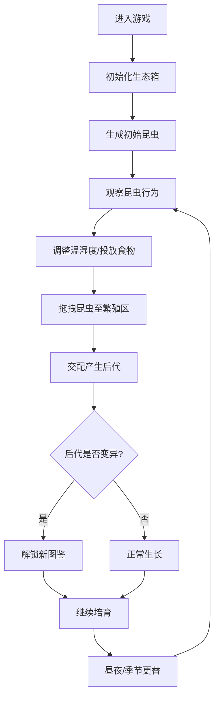

## 1. 产品概述

"虫语迷踪"是一款模拟昆虫饲养与进化的3D互动游戏。玩家扮演昆虫学家，在玻璃生态箱中观察、培育不同种类的昆虫，通过环境调控促使昆虫变异进化，收集新品种并解锁图鉴。

- 核心目标：培育和收集稀有昆虫品种，完成图鉴收集
- 目标用户：喜欢模拟经营、收集养成类游戏的玩家
- 产品价值：提供沉浸式的昆虫观察体验，结合遗传学与生态模拟的趣味性

## 2. 核心功能

### 2.1 功能模块

1. **生态箱场景**：3D俯视视角玻璃生态箱，包含泥土、植物、昆虫栖息地
2. **昆虫系统**：甲虫、蝴蝶、蚂蚁三大类，支持拖拽交互和繁殖交配
3. **变异进化**：基于温湿度、食物类型的概率变异系统，产生颜色和形态变化
4. **环境系统**：昼夜更替、四季变化，影响昆虫活跃度和食物需求
5. **控制面板**：温湿度调节、食物投放、季节切换
6. **图鉴系统**：记录发现的昆虫品种，解锁新品种

### 2.2 页面详情

| 页面名称 | 模块名称 | 功能描述 |
|---------|---------|----------|
| 主游戏页 | 3D生态箱 | 中央展示3D俯视生态箱，可通过OrbitControls旋转缩放 |
| 主游戏页 | 昆虫状态面板 | 左侧显示每只昆虫的品种、变异度、当前行为 |
| 主游戏页 | 控制面板 | 右下角温湿度滑块、食物投放按钮、季节切换按钮 |
| 主游戏页 | 图鉴弹窗 | 展示已解锁/未解锁的昆虫品种 |

## 3. 核心流程

## 4. 用户界面设计

### 4.1 设计风格

- **主色调**：羊皮纸黄#f5e6c8（背景）、虫壳黑#2c2c2c（文字边框）、翠绿#4a8c3f（植物按钮）、琥珀橙#d48c4b（昆虫高亮）
- **视觉风格**：博物学手绘风，复古精致，带有做旧纹理
- **字体**：使用衬线字体（如Noto Serif SC）模拟古籍印刷感
- **按钮样式**：圆角矩形，带细边框和轻微浮雕效果，悬停时琥珀橙色高亮
- **布局**：左中右三栏布局，中央3D场景为主，两侧半透明面板

### 4.2 页面设计概述

| 页面名称 | 模块名称 | UI元素 |
|---------|---------|--------|
| 主游戏页 | 3D生态箱 | 玻璃边框高光、泥土纹理、程序化植物、昆虫3D模型、繁殖区标记 |
| 主游戏页 | 昆虫状态面板 | 羊皮纸背景、昆虫小图标、品种名称、变异进度条、行为状态标签 |
| 主游戏页 | 控制面板 | 带刻度的滑块、食物按钮（带下落动画）、季节按钮（春夏秋冬图标） |
| 主游戏页 | 图鉴弹窗 | 网格布局的昆虫卡片、已解锁显示彩色图、未解锁显示剪影 |

### 4.3 响应式

- 桌面端优先设计，支持1280px以上分辨率
- 面板使用固定宽度，3D场景自适应剩余空间
- 移动端适配：面板改为底部抽屉式，优化触摸拖拽

### 4.4 3D场景设计

- **环境**：室内柔和天光，玻璃箱带有折射和高光效果，底部使用程序化泥土纹理
- **光照**：方向光模拟太阳光（随昼夜变化颜色和强度），环境光提供基础照明
- **相机**：俯视45度角，OrbitControls限制俯仰角，支持缩放和平移
- **交互**：Raycaster实现昆虫拾取，拖拽时有高亮和跟随效果
- **动画**：昆虫爬行/飞行动画，植物轻微摇摆，食物下落物理动画
- **性能**：昆虫数量上限30只，使用instanced mesh优化渲染，帧率监控保持60fps
