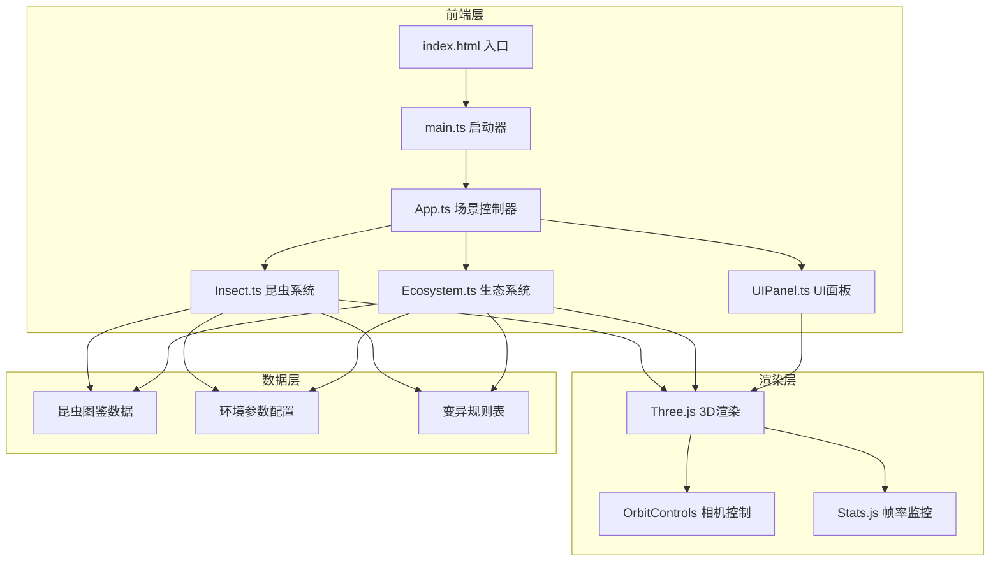

## 1. 架构设计



## 2. 技术描述

- **前端框架**：TypeScript + Vite
- **3D引擎**：Three.js v0.160.0
- **交互控制**：three/addons/controls/OrbitControls.js
- **性能监控**：stats-js
- **构建工具**：Vite v5.0.0
- **语言**：TypeScript v5.3.0

## 3. 核心文件结构

| 文件路径 | 职责说明 |
|---------|---------|
| `/package.json` | 项目依赖和启动脚本配置 |
| `/vite.config.js` | Vite构建配置，Three.js扩展库别名 |
| `/tsconfig.json` | TypeScript编译配置 |
| `/index.html` | 入口HTML，挂载点和全局样式 |
| `/src/main.ts` | 应用入口，初始化App并启动 |
| `/src/App.ts` | 场景组装、游戏循环、事件分发 |
| `/src/insects/Insect.ts` | 昆虫基类、变异逻辑、繁殖系统 |
| `/src/ecosystem/Ecosystem.ts` | 温湿度管理、昼夜更替、季节系统 |
| `/src/ui/UIPanel.ts` | DOM绑定、状态面板、控制面板交互 |

## 4. 数据模型

### 4.1 昆虫数据模型

```typescript
interface InsectData {
  id: string;
  species: 'beetle' | 'butterfly' | 'ant';
  name: string;
  color: { r: number; g: number; b: number };
  mutationLevel: number;
  mutationTraits: string[];
  position: { x: number; y: number; z: number };
  behavior: 'idle' | 'walking' | 'flying' | 'eating' | 'mating';
  health: number;
  hunger: number;
  generation: number;
  parentIds: string[];
}

interface InsectSpecies {
  id: string;
  name: string;
  baseColor: string;
  unlocked: boolean;
  discoveredAt?: Date;
  description: string;
}
```

### 4.2 生态系统数据模型

```typescript
interface EcosystemState {
  temperature: number;      // 0-100
  humidity: number;         // 0-100
  season: 'spring' | 'summer' | 'autumn' | 'winter';
  timeOfDay: number;        // 0-24
  isDay: boolean;
  foodTypes: ('nectar' | 'fruit' | 'leaf' | 'decay')[];
  activeFood: { type: string; position: Vector3 }[];
}
```

## 5. 核心算法

### 5.1 变异概率计算

```
变异概率 = 基础概率(0.1) 
           × 温度影响因子(0.5~1.5) 
           × 湿度影响因子(0.5~1.5) 
           × 食物类型加成(1.0~2.0)
           × 代数加成(1 + 0.1 × generation)
```

### 5.2 昼夜光照计算

```
光照强度 = sin((timeOfDay - 6) × π / 12) × 0.5 + 0.5
光照颜色 = lerp(夜晚蓝(0x1a1a3a), 白天白(0xffffee), 光照强度)
```

### 5.3 昆虫行为状态机

```
idle → walking (随机移动)
walking → eating (检测到食物)
walking → mating (进入繁殖区且有配偶)
eating → idle (食物消耗完毕)
mating → idle (繁殖完成)
```

## 6. 性能优化策略

1. **对象池模式**：昆虫3D模型使用对象池复用，避免频繁创建销毁
2. **LOD技术**：远处昆虫使用简化模型
3. **帧率控制**：使用requestAnimationFrame，Stats.js监控，目标60fps
4. **防抖处理**：滑块调整、季节切换等频繁操作使用防抖
5. **数量限制**：昆虫总数上限30只，超过时自然淘汰
6. **矩阵更新**：统一批量更新昆虫变换矩阵
