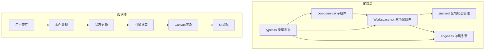

## 1. 架构设计



## 2. 技术栈描述

- **前端框架**：React 18 + TypeScript
- **构建工具**：Vite 5 + @vitejs/plugin-react
- **状态管理**：zustand 4
- **动画库**：framer-motion 11
- **渲染技术**：HTML5 Canvas API（用于笔迹绘制、反刻效果、墨迹扩散模拟）
- **样式方案**：CSS Modules + CSS Variables

### 依赖说明

| 包名 | 版本 | 用途 |
|------|------|------|
| react | ^18.2.0 | UI框架 |
| react-dom | ^18.2.0 | React DOM渲染 |
| typescript | ^5.4.0 | 类型安全 |
| vite | ^5.2.0 | 构建工具 |
| @vitejs/plugin-react | ^4.2.0 | React支持 |
| framer-motion | ^11.0.0 | 动画效果（翻页、过渡） |
| zustand | ^4.5.0 | 全局状态管理 |

## 3. 项目结构与文件调用关系

```
├── package.json
├── vite.config.js
├── tsconfig.json
├── index.html
└── src/
    ├── types.ts              ← 所有组件和引擎共享
    ├── engine.ts             ← 依赖types.ts，被Workspace.tsx调用
    ├── store.ts              ← 依赖types.ts，被所有组件共享
    └── components/
        ├── Workspace.tsx     ← 主场景，依赖types.ts、engine.ts、store.ts
        ├── ManuscriptPanel.tsx ← 文稿面板，依赖store.ts
        ├── ControlPanel.tsx   ← 控制面板，依赖store.ts
        ├── ProgressRing.tsx   ← 进度环，依赖store.ts
        ├── WoodblockCanvas.tsx ← 梨木版画布，依赖engine.ts、store.ts
        ├── PaperCanvas.tsx    ← 拓印画布，依赖engine.ts、store.ts
        └── BookPage.tsx       ← 书页组件，依赖framer-motion
```

**调用关系说明**：
1. `types.ts` 定义所有核心类型，被其他所有文件引用
2. `engine.ts` 包含纯函数计算逻辑，不依赖React，接收参数返回结果
3. `store.ts` 管理全局状态（刻版进度、拓印历史、参数设置）
4. `Workspace.tsx` 作为容器组件，组织所有子组件并协调数据流
5. 子组件通过`store.ts`获取状态，通过`engine.ts`进行计算渲染

## 4. 核心数据流向

```
文稿选择(ManuscriptPanel)
    ↓ (store.setManuscript)
全局状态(store) → 文稿元数据
    ↓ (拖拽事件 → store.setTransform)
梨木版画布(WoodblockCanvas) → 实时位置更新
    ↓ (点击反刻 → engine.mirrorEngrave)
印刷引擎(engine.ts) → 镜像映射 + 凹槽效果
    ↓ (逐笔动画 → store.setProgress)
进度环(ProgressRing) → 刻版进度显示
    ↓ (滑块调节 → store.setInkAmount / store.setPressure)
控制面板(ControlPanel) → 参数实时更新
    ↓ (engine.simulateInkDiffusion)
拓印刷布(PaperCanvas) → 纤维扩散模拟
    ↓ (点击拓印 → engine.generatePage)
书页组件(BookPage) → 生成书页 + 历史记录
    ↓ (拖拽翻页 → framer-motion动画)
用户交互 → 翻阅历史
```

## 5. 数据模型

### 5.1 核心类型定义

```typescript
// 文稿笔体枚举
enum BrushStyle {
  REGULAR = 'regular',      // 楷书
  RUNNING = 'running',      // 行书
  CURSIVE = 'cursive'       // 草书
}

// 笔迹点阵坐标
interface StrokePoint {
  x: number;
  y: number;
  pressure: number;         // 笔压，影响线条粗细
}

// 笔迹贝塞尔曲线
interface BezierStroke {
  start: StrokePoint;
  control: StrokePoint;
  end: StrokePoint;
  thickness: number;
}

// 文稿元数据
interface Manuscript {
  id: string;
  title: string;            // 诗词标题
  content: string;          // 文字内容（约20字）
  style: BrushStyle;
  strokes: BezierStroke[];  // 笔迹数据
  color: string;            // #3a1a0a
}

// 变换参数
interface Transform {
  x: number;
  y: number;
  scale: number;
  rotation: number;         // 角度
}

// 墨量压力参数
interface PrintParams {
  inkAmount: number;        // 0-100
  pressure: number;         // 0.1-1.0
}

// 梨木版刻版状态
interface EngravingState {
  isEngraving: boolean;
  progress: number;         // 0-100
  completedStrokes: number;
  totalStrokes: number;
}

// 书页结构
interface BookPage {
  id: string;
  timestamp: number;
  imageData: ImageData;     // 拓印结果位图
  params: PrintParams;
  manuscriptId: string;
}

// 全局状态
interface AppState {
  manuscripts: Manuscript[];
  currentManuscriptId: string;
  transform: Transform;
  printParams: PrintParams;
  engraving: EngravingState;
  pages: BookPage[];        // 最多5张
  currentPageIndex: number;
}
```

## 6. 关键算法说明

### 6.1 镜像反刻算法
```
输入：原稿笔迹坐标数组 + 木板宽度
输出：镜像后笔迹坐标数组
算法：foreach point in strokes:
         mirroredX = boardWidth - point.x
         return { x: mirroredX, y: point.y }
```

### 6.2 墨迹扩散模拟
```
输入：刻版凹槽位图 + 墨量 + 压力 + 纸张纤维噪声
输出：拓印结果位图
算法：1. 计算扩散半径 radius = (inkAmount / 50) * 3 + (inkAmount > 50 ? (inkAmount-50)/10 : 0)
      2. 噪声强度 noiseIntensity = pressure * 0.8
      3. 以凹槽像素为中心，向四周线性衰减扩散
      4. 使用requestAnimationFrame分批处理，每次5000像素
```

## 7. 性能优化策略

1. **Canvas分层渲染**：梨木版、刻版凹槽、拓印结果分图层绘制，仅重绘变化层
2. **离屏Canvas**：笔迹预渲染到离屏画布，翻页时直接贴图
3. **requestAnimationFrame批量处理**：墨迹扩散像素遍历分批执行
4. **zustand选择器优化**：使用`useStore(state => state.x)`避免不必要重渲染
5. **framer-motion GPU加速**：翻页动画使用transform和opacity属性
