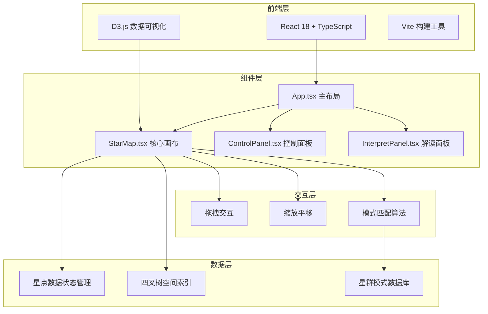

## 1. 架构设计



## 2. 技术描述

- 前端框架：React 18 + TypeScript
- 可视化库：D3.js v7
- 构建工具：Vite 5
- 样式方案：CSS Modules + CSS Variables
- 状态管理：React useState/useReducer
- 性能优化：四叉树空间索引、requestAnimationFrame

## 3. 核心数据结构

```typescript
interface Star {
  id: string;
  x: number;
  y: number;
  radius: number;
  brightness: number;
  createdAt: number;
}

interface Connection {
  source: string;
  target: string;
  distance: number;
  highlighted: boolean;
}

interface ConstellationPattern {
  id: string;
  name: {
    chinese: string;
    greek: string;
  };
  story: {
    chinese: string;
    greek: string;
  };
  stars: number;
  pattern: number[][]; // 相对坐标模式
  tolerance: number;
}

interface RecognizedConstellation {
  patternId: string;
  starIds: string[];
  confidence: number;
}
```

## 4. 项目文件结构

```
auto260/
├── index.html
├── package.json
├── tsconfig.json
├── vite.config.ts
└── src/
    ├── main.tsx
    ├── App.tsx
    ├── components/
    │   ├── StarMap.tsx
    │   ├── ControlPanel.tsx
    │   └── InterpretPanel.tsx
    ├── utils/
    │   ├── quadtree.ts
    │   ├── patternMatching.ts
    │   └── constellationData.ts
    ├── types/
    │   └── index.ts
    └── styles/
        └── global.css
```

## 5. 核心算法

### 5.1 四叉树空间索引
- 用于加速星点邻近搜索
- 优化连线距离计算性能
- 支持100+星点实时处理

### 5.2 星群模式匹配
- 基于相对坐标的模式识别
- 旋转不变性匹配
- 置信度评分机制

### 5.3 动画系统
- D3 transition 缓动动画
- requestAnimationFrame 驱动
- CSS 动画配合实现墨滴效果

## 6. 性能指标

- 100个星点时帧率 ≥ 50fps
- 连线计算时间 < 16ms/帧
- 模式匹配时间 < 8ms/帧
- 内存占用 < 50MB