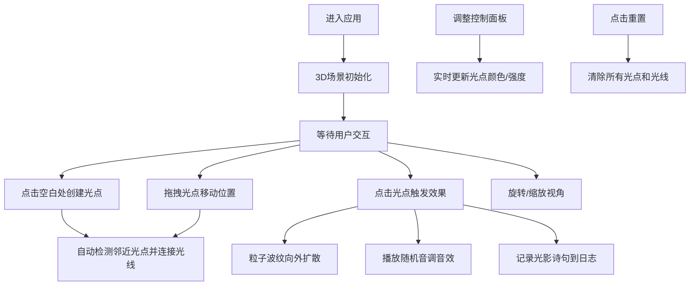

## 1. 产品概述

"流光映影"是一款沉浸式3D交互可视化创意工具，让用户化身光影雕刻师，在三维空间中通过放置和拖拽彩色光点创造动态光影雕塑。每个光点发射彩色光线，交织形成流动的光束网络，创造出如梦似幻的霓虹光宴。

- **核心目标**：提供一个富有创意的数字艺术创作体验，让用户无需专业技能即可创造独特的光影艺术作品
- **目标用户**：数字艺术爱好者、创意工作者、休闲娱乐用户
- **产品价值**：通过直观的3D交互和视听反馈，创造独特的沉浸式艺术创作体验

## 2. 核心特性

### 2.1 功能模块

1. **3D光影场景**：光点创建、拖拽移动、光线连接网络、粒子波纹动画
2. **交互控制系统**：视角旋转、场景缩放、点击交互、拖拽操作
3. **音效系统**：点击光点触发随机音调的Web Audio音效
4. **控制面板**：颜色选择器、发光强度滑块、重置按钮
5. **光影日志**：记录最近5次点击时的随机光影诗句

### 2.2 页面详情

| 页面名称 | 模块名称 | 功能描述 |
|-----------|-------------|---------------------|
| 主页面 | 3D光影场景 | 支持点击创建光点、拖拽移动光点、视角旋转缩放 |
| 主页面 | 控制面板 | 颜色选择、强度调节、重置场景，毛玻璃半透明悬浮效果 |
| 主页面 | 光影日志 | 可折叠收起，显示最近5条随机光影诗句 |

## 3. 核心流程

用户进入应用后，看到深黑色背景带有微弱星点纹理的3D空间。可以通过鼠标拖拽旋转视角、滚轮缩放。点击空白处创建随机颜色和大小的光点，光点之间距离小于阈值时自动用渐变彩色光线连接。点击已有光点会触发粒子波纹扩散动画和随机音效，同时在日志面板添加一条随机诗句。控制面板可以全局调整颜色偏好和发光强度。

## 4. 用户界面设计

### 4.1 设计风格

**霓虹光宴风格**：
- **主背景**：深黑色 `#0a0a0a`，带有微弱星点纹理
- **主色调**：霓虹蓝 `#00d4ff`、霓虹粉 `#ff007f`、霓虹绿 `#39ff14`
- **光线效果**：渐变彩色光线，带有脉动动画
- **UI面板**：半透明毛玻璃背景（backdrop-filter: blur），霓虹边框发光效果
- **字体**：使用现代无衬线字体，文字带有微弱发光效果
- **动效**：平滑过渡、脉冲发光、粒子扩散，所有动画均保持60fps流畅

### 4.2 页面设计概述

| 页面名称 | 模块名称 | UI元素 |
|-----------|-------------|-------------|
| 主页面 | 3D场景 | 全屏Canvas，光点（发光球体）、连接线（渐变发光线条）、粒子波纹、星点背景 |
| 主页面 | 控制面板 | 左下角悬浮，半透明毛玻璃，颜色选择器、强度滑块（0.5-2.0）、重置按钮 |
| 主页面 | 光影日志 | 右下角悬浮，可折叠，滚动显示最近5条诗句，带入场动画 |

### 4.3 响应式设计

- **桌面端**：全屏3D场景，控制面板左下角、日志面板右下角悬浮
- **移动端**：自适应触屏操作，双指旋转缩放，长按拖拽，面板位置适配小屏
- **触摸优化**：支持触摸手势，增大交互热区

### 4.4 3D场景设计

**环境与氛围**：
- 深黑色背景 `#0a0a0a`，添加程序化生成的星点纹理（随机小光点，带微弱闪烁）
- 无固定光源，所有光照来自光点本身的自发光材质
- 氛围雾效（Fog）增强空间深度感

**相机设置**：
- PerspectiveCamera，fov 75度
- 使用OrbitControls实现轨道控制，支持旋转、缩放、平移
- 禁用自动旋转，由用户完全控制视角

**交互与动画**：
- 光点使用MeshStandardMaterial，高emissive自发光值
- 光线使用LineSegments，顶点颜色渐变，透明度脉动
- 粒子波纹使用Points系统，大小和透明度随时间衰减
- 所有动画通过useFrame在rAF中统一更新，确保性能

**后处理效果**：
- Bloom（泛光）效果增强霓虹发光感
- 轻微的Vignette（暗角）聚焦视觉中心

## 5. 性能约束

- 最大光点数量：30个（超过时禁止创建）
- 目标帧率：稳定60fps
- 使用InstancedMesh/BufferGeometry优化渲染性能
- 光线连接计算使用空间网格优化（避免O(n²)全量计算）
- 粒子系统使用对象池复用，避免频繁GC
