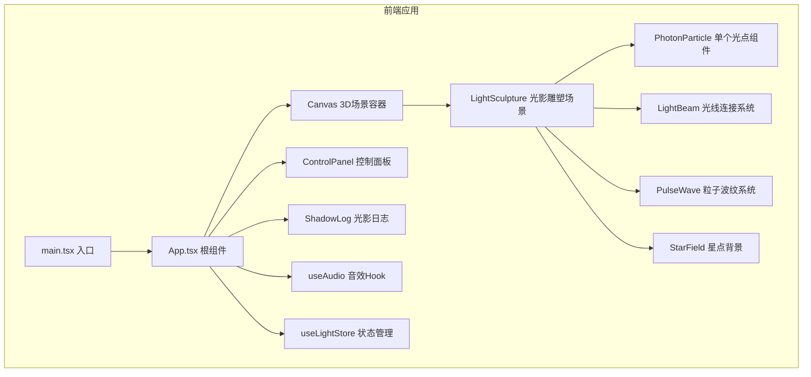

## 1. 架构设计



**层级说明**：
- **入口层**：main.tsx 挂载React应用
- **根组件层**：App.tsx 布局组装，状态注入
- **3D场景层**：react-three-fiber Canvas 管理Three.js渲染循环
- **业务组件层**：LightSculpture 集成所有3D元素和交互逻辑
- **UI组件层**：ControlPanel、ShadowLog 悬浮界面
- **状态管理层**：zustand store 管理全局状态
- **工具层**：自定义Hooks、音效系统、工具函数

## 2. 技术栈描述

- **前端框架**：React 18 + TypeScript 5
- **构建工具**：Vite 5
- **3D渲染**：Three.js 0.160
- **React-Three集成**：@react-three/fiber 8、@react-three/drei 9
- **样式方案**：TailwindCSS 3（UI面板）、内联样式（Three.js材质）
- **状态管理**：Zustand 4（轻量全局状态）
- **音效**：Web Audio API（原生实现，无额外依赖）
- **路径别名**：@/ 映射到 src/

## 3. 目录结构

```
d:\Solocoder\VersionFast\tasks\auto262\
├── public/
│   └── index.html          # 入口HTML
├── src/
│   ├── main.tsx            # 应用入口
│   ├── App.tsx             # 根组件，布局组装
│   ├── scene/
│   │   ├── LightSculpture.tsx    # 3D场景主组件，光点管理
│   │   ├── PhotonParticle.tsx    # 单个光点组件
│   │   ├── LightBeam.tsx         # 光线连接组件
│   │   ├── PulseWave.tsx         # 粒子波纹组件
│   │   └── StarField.tsx         # 星点背景组件
│   ├── ui/
│   │   ├── ControlPanel.tsx      # 控制面板
│   │   └── ShadowLog.tsx         # 光影日志面板
│   ├── store/
│   │   └── useLightStore.ts      # 全局状态管理
│   ├── hooks/
│   │   ├── useAudio.ts           # Web Audio音效Hook
│   │   └── usePoemGenerator.ts   # 随机诗句生成Hook
│   ├── types/
│   │   └── index.ts              # TypeScript类型定义
│   ├── utils/
│   │   └── math.ts               # 数学工具函数
│   └── index.css                 # 全局样式，Tailwind指令
├── package.json
├── tsconfig.json
├── vite.config.ts
└── tailwind.config.js
```

## 4. 核心数据模型

### 4.1 类型定义

```typescript
// src/types/index.ts
export interface PhotonPoint {
  id: string;
  position: [number, number, number];
  color: string;
  size: number;
  createdAt: number;
}

export interface LightBeamData {
  startId: string;
  endId: string;
  startPos: [number, number, number];
  endPos: [number, number, number];
  distance: number;
}

export interface PulseWaveData {
  id: string;
  origin: [number, number, number];
  color: string;
  startTime: number;
  maxRadius: number;
}

export interface LogEntry {
  id: string;
  poem: string;
  color: string;
  timestamp: number;
}

export interface LightState {
  photons: PhotonPoint[];
  globalIntensity: number;
  selectedColor: string;
  logs: LogEntry[];
  connectionThreshold: number;
  maxPhotons: number;
  addPhoton: (position: [number, number, number]) => void;
  updatePhotonPosition: (id: string, position: [number, number, number]) => void;
  removePhoton: (id: string) => void;
  setGlobalIntensity: (intensity: number) => void;
  setSelectedColor: (color: string) => void;
  addLog: (poem: string, color: string) => void;
  reset: () => void;
}
```

## 5. 状态管理设计

使用Zustand创建轻量全局store：

```typescript
// src/store/useLightStore.ts
import { create } from 'zustand';
import { LightState, PhotonPoint, LogEntry } from '@/types';

const POEMS = [
  '光影交织处，星河入梦来',
  '流光舞清影，刹那即永恒',
  '一念花开，光影成海',
  '微光虽渺，万丈成炬',
  '光影流转间，岁月已斑斓',
  // ... 更多诗句
];

const NEON_COLORS = ['#00d4ff', '#ff007f', '#39ff14', '#ffff00', '#ff00ff', '#00ffff'];

export const useLightStore = create<LightState>((set, get) => ({
  photons: [],
  globalIntensity: 1.0,
  selectedColor: '#00d4ff',
  logs: [],
  connectionThreshold: 5,
  maxPhotons: 30,
  
  addPhoton: (position) => {
    const { photons, maxPhotons } = get();
    if (photons.length >= maxPhotons) return;
    const color = NEON_COLORS[Math.floor(Math.random() * NEON_COLORS.length)];
    const size = 0.3 + Math.random() * 0.4;
    const newPhoton: PhotonPoint = {
      id: `photon-${Date.now()}-${Math.random().toString(36).slice(2, 9)}`,
      position,
      color,
      size,
      createdAt: Date.now(),
    };
    set({ photons: [...photons, newPhoton] });
  },
  
  updatePhotonPosition: (id, position) => {
    set({
      photons: get().photons.map(p => 
        p.id === id ? { ...p, position } : p
      ),
    });
  },
  
  removePhoton: (id) => {
    set({ photons: get().photons.filter(p => p.id !== id) });
  },
  
  setGlobalIntensity: (intensity) => {
    set({ globalIntensity: intensity });
  },
  
  setSelectedColor: (color) => {
    set({ selectedColor: color });
  },
  
  addLog: (color) => {
    const poem = POEMS[Math.floor(Math.random() * POEMS.length)];
    const entry: LogEntry = {
      id: `log-${Date.now()}`,
      poem,
      color,
      timestamp: Date.now(),
    };
    const logs = [entry, ...get().logs].slice(0, 5);
    set({ logs });
  },
  
  reset: () => {
    set({ photons: [], logs: [] });
  },
}));
```

## 6. 核心组件设计

### 6.1 LightSculpture.tsx

主场景组件，负责：
- 管理所有光点的创建和更新
- 计算光线连接（空间网格优化O(n)）
- 处理点击创建光点、拖拽移动光点
- 管理粒子波纹的生命周期

### 6.2 PhotonParticle.tsx

单个光点组件：
- 使用SphereGeometry + MeshStandardMaterial（高emissive）
- 外层添加PointLight作为光源
- 支持拖拽（@react-three/drei的Draggable）
- 呼吸缩放动画（useFrame）

### 6.3 LightBeam.tsx

光线连接组件：
- 使用BufferGeometry + LineBasicMaterial（vertexColors）
- 顶点颜色从一个光点颜色渐变到另一个
- 透明度随时间脉动（sin函数）
- 距离越近，光线越粗越亮

### 6.4 PulseWave.tsx

粒子波纹组件：
- 使用Points + BufferGeometry
- 粒子从中心向外扩散
- 大小和透明度随距离衰减
- 使用对象池复用粒子

## 7. 性能优化策略

1. **useFrame统一更新**：所有动画在一个useFrame中更新，避免多个rAF
2. **空间网格优化**：光线连接检测使用空间分块，避免O(n²)
3. **BufferGeometry**：所有几何体使用BufferGeometry，减少内存开销
4. **对象池**：粒子波纹使用对象池复用，避免频繁创建销毁
5. **材质复用**：相同属性的光点复用材质实例
6. **距离剔除**：超出视锥体的光线不渲染
7. **帧率监控**：低性能设备自动降低粒子数量

## 8. 构建配置

### package.json 依赖

```json
{
  "dependencies": {
    "react": "^18.2.0",
    "react-dom": "^18.2.0",
    "three": "^0.160.0",
    "@react-three/fiber": "^8.15.0",
    "@react-three/drei": "^9.92.0",
    "zustand": "^4.4.0"
  },
  "devDependencies": {
    "@types/react": "^18.2.0",
    "@types/react-dom": "^18.2.0",
    "@types/three": "^0.160.0",
    "typescript": "^5.3.0",
    "vite": "^5.0.0",
    "@vitejs/plugin-react": "^4.2.0",
    "tailwindcss": "^3.4.0",
    "postcss": "^8.4.0",
    "autoprefixer": "^10.4.0"
  }
}
```
