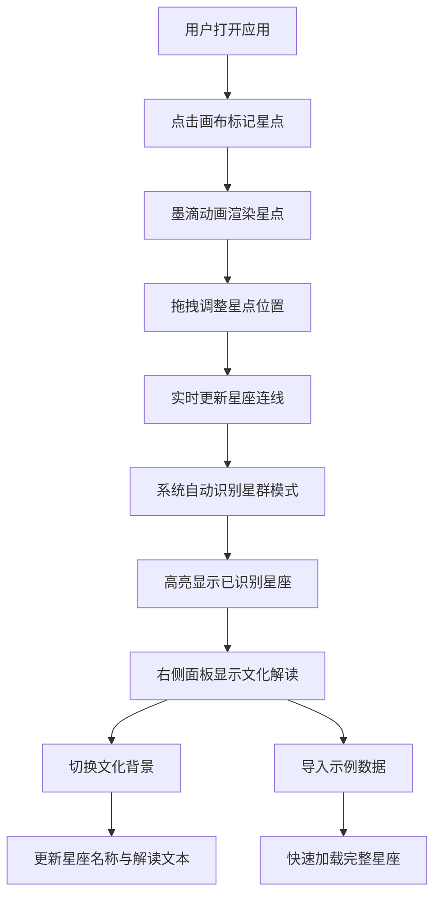

## 1. 产品概述
墨韵星图是一款交互式星座数据可视化应用，让用户化身古代天文学家，在虚拟宣纸上通过拖拽和点击标记星点，实时生成星座连线图，自动识别北斗、猎户等星群模式，并可切换中国星官与希腊神话两种文化背景进行解读。

- 核心价值：将传统天文文化与现代交互技术结合，提供沉浸式的星座探索体验
- 目标用户：天文爱好者、文化研究者、教育工作者及普通大众

## 2. 核心功能

### 2.1 用户角色
无需登录注册，所有用户均可使用全部功能。

### 2.2 功能模块
1. **宣纸画布**：星点标记、拖拽交互、星座连线、墨滴动画效果
2. **工具控制面板**：文化切换、清空画布、导入示例数据
3. **星座解读面板**：星点信息展示、已识别星座文化解读

### 2.3 页面详情
| 页面名称 | 模块名称 | 功能描述 |
|-----------|-------------|---------------------|
| 主页面 | 宣纸画布 | 点击标记星点（带墨滴晕染动画）、拖拽移动星点、点击删除星点、实时连线更新、毛笔笔触风格连线、D3力导向布局、自动识别星群模式并高亮 |
| 主页面 | 左侧工具面板 | 添加星点模式切换、清空所有星点、导入示例星座数据（北斗、猎户）、文化背景切换按钮（中国星官/希腊神话） |
| 主页面 | 右侧解读面板 | 显示当前选中星点信息、已识别星座的文化解读、毛笔字体风格展示、动态内容更新 |

## 3. 核心流程
用户打开应用 → 点击宣纸画布标记星点 → 拖拽调整星点位置 → 系统实时生成连线并识别星群 → 高亮显示识别出的星座（朱砂红） → 右侧面板显示对应文化解读 → 可切换文化背景查看不同解读 → 可导入示例数据快速体验

## 4. 用户界面设计

### 4.1 设计风格
- **设计方向**：水墨丹青、古朴雅致的东方美学
- **主色调**：宣纸白#f5f0e6（背景）、墨黑#2c2c2c（星点/文字）、朱砂红#c0392b（高亮连线）、石青#4a7c59（点缀）
- **字体**：标题使用毛笔风格字体（Ma Shan Zheng），正文使用优雅宋体（Noto Serif SC）
- **布局**：竖向三栏布局，左窄中宽右窄，中央宣纸画布占主要面积
- **动效**：墨滴晕染动画、连线渐变过渡、识别成功时的高亮闪烁

### 4.2 页面设计概述
| 页面名称 | 模块名称 | UI元素 |
|-----------|-------------|-------------|
| 主页面 | 整体布局 | 三栏flex布局、宣纸纹理背景、毛玻璃效果面板、优雅阴影层次 |
| 主页面 | 左侧工具面板 | 宣纸白背景#f5f0e6、竖向排列按钮组、石青色按钮、hover过渡动画、清晰图标 |
| 主页面 | 中央画布 | SVG画布、宣纸纹理背景（CSS渐变+噪点）、墨黑色星点、朱砂红高亮连线、淡墨灰普通连线、毛笔笔触效果 |
| 主页面 | 右侧解读面板 | 宣纸白背景、竖排标题风格、毛笔字体、朱砂红强调色、优雅段落间距 |

### 4.3 响应式设计
- **桌面端**：三栏完整布局，画布自适应剩余空间
- **平板端**：左右面板可折叠，画布占满宽度
- **移动端**：面板改为抽屉式弹出，画布占满屏幕

### 4.4 视觉细节
- 宣纸纹理使用多重CSS径向渐变叠加模拟
- 星点添加outer glow效果模拟星光
- 连线使用path渐变模拟毛笔笔触粗细变化
- 识别出的星座连线添加脉冲动画
- 所有交互元素添加微妙的水墨晕染过渡效果
