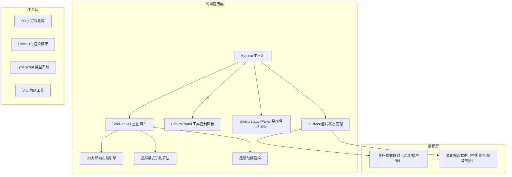

## 1. 架构设计



## 2. 技术描述

- **前端框架**：React 18 + TypeScript 5
- **构建工具**：Vite 5
- **可视化库**：D3.js v7（力导向布局、拖拽交互、动画过渡）
- **状态管理**：Zustand（星点数据、连线数据、文化背景、识别结果）
- **样式方案**：Tailwind CSS 3 + 自定义CSS变量（水墨主题）
- **类型定义**：完整的TypeScript类型系统，包含星点、连线、星座、文化背景等类型
- **依赖包**：react、react-dom、typescript、d3、vite、@types/react、@types/react-dom、@types/d3、@types/three（备用）、tailwindcss、postcss、autoprefixer、zustand

## 3. 目录结构

```
├── index.html                    # 入口HTML
├── package.json                  # 项目配置
├── tsconfig.json                 # TypeScript配置
├── vite.config.ts                # Vite配置（路径别名@指向src）
├── tailwind.config.js            # Tailwind配置（自定义水墨主题色）
├── postcss.config.js             # PostCSS配置
└── src/
    ├── main.tsx                  # React应用入口
    ├── App.tsx                   # 主应用组件（三栏布局）
    ├── components/
    │   ├── StarCanvas.tsx        # 星图画布（D3集成核心组件）
    │   ├── ControlPanel.tsx      # 左侧工具控制面板
    │   └── InterpretationPanel.tsx # 右侧星座解读面板
    ├── store/
    │   └── useStarStore.ts       # Zustand全局状态管理
    ├── data/
    │   ├── constellationPatterns.ts # 星座模式定义（北斗、猎户等）
    │   └── culturalInterpretations.ts # 文化解读数据
    ├── types/
    │   └── index.ts              # TypeScript类型定义
    ├── utils/
    │   ├── patternRecognition.ts # 星群模式识别算法
    │   └── inkEffects.ts         # 墨滴动画效果工具函数
    └── styles/
        └── index.css             # 全局样式（Tailwind指令、自定义CSS变量、宣纸纹理）
```

## 4. 核心数据模型

### 4.1 TypeScript类型定义

```typescript
// 星点类型
interface Star {
  id: string;
  x: number;
  y: number;
  fx?: number | null;  // 拖拽时固定位置
  fy?: number | null;
  radius: number;
  brightness: number;   // 星等/亮度
  isSelected: boolean;
  createdAt: number;
}

// 连线类型
interface ConstellationLine {
  id: string;
  source: string;      // 星点ID
  target: string;      // 星点ID
  isHighlighted: boolean;  // 是否高亮（识别出的星座）
  constellationId?: string; // 所属星座ID
  strokeWidth: number; // 毛笔笔触粗细
}

// 星座模式类型
interface ConstellationPattern {
  id: string;
  name: {
    chinese: string;
    greek: string;
  };
  starCount: number;   // 星点数量
  relativePositions: { x: number; y: number }[]; // 相对位置模式
  tolerance: number;   // 匹配容差
  lines: [number, number][]; // 连线索引
}

// 文化解读类型
interface CulturalInterpretation {
  constellationId: string;
  chinese: {
    name: string;
    origin: string;     // 出处（如史记天官书）
    meaning: string;    // 寓意
    stars: string[];    // 各星官名称
  };
  greek: {
    name: string;
    myth: string;       // 神话故事
    meaning: string;    // 寓意
    stars: string[];    // 各星名称
  };
}

// 文化背景类型
type CulturalBackground = 'chinese' | 'greek';

// 全局状态
interface StarState {
  stars: Star[];
  lines: ConstellationLine[];
  culturalBackground: CulturalBackground;
  identifiedConstellations: string[];
  selectedStarId: string | null;
  addStar: (x: number, y: number) => void;
  removeStar: (id: string) => void;
  updateStarPosition: (id: string, x: number, y: number) => void;
  setStarFixed: (id: string, fx: number | null, fy: number | null) => void;
  selectStar: (id: string | null) => void;
  clearAllStars: () => void;
  loadExampleData: (patternId: string) => void;
  setCulturalBackground: (bg: CulturalBackground) => void;
  identifyConstellations: () => void;
}
```

## 5. 核心算法

### 5.1 星群模式识别算法
- 基于几何形状匹配的星群识别
- 对任意N个星点的子集，计算其相对位置矩阵
- 与预设星座模式进行归一化比较
- 使用旋转不变性和缩放不变性的匹配算法
- 设置匹配阈值（如距离误差<15%），超过阈值则识别成功

### 5.2 D3力导向布局配置
- `forceManyBody`：星点间轻微排斥力，防止重叠
- `forceLink`：星座连线的弹簧拉力，维持形状
- `forceCenter`：画布中心吸引力
- `alphaDecay`：合理的衰减速率，确保动画流畅且快速稳定

### 5.3 墨滴动画效果
- 使用SVG `<circle>` + `<animate>` 实现星点创建时的墨滴晕染
- `stroke-dasharray` + `stroke-dashoffset` 实现连线的毛笔书写动画
- CSS `filter: url(#ink-blur)` 实现墨迹边缘效果

## 6. 性能优化

### 6.1 渲染性能
- D3仅更新变化的星点和连线（enter/update/exit模式）
- 使用React.memo包装子组件，避免不必要重渲染
- 拖拽事件使用requestAnimationFrame节流
- 力导向布局的tick事件中批量更新DOM

### 6.2 识别性能
- 限制同时识别的星点子集大小（最多同时考虑12个星点）
- 使用空间索引（网格划分）减少距离计算量
- 模式匹配计算使用Web Worker（如复杂度较高时）

### 6.3 动画性能
- 优先使用CSS transform和opacity属性
- SVG元素使用CSS `will-change` 提示浏览器优化
- D3过渡动画使用合理的duration（300-500ms）
