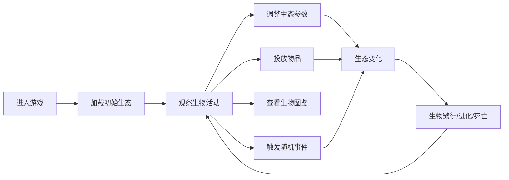

## 1. 产品概述

"蜉蝣幻境"是一款微缩生态系统模拟游戏，玩家在巴掌大的玻璃缸中培育蜉蝣、水黾和萤火虫等小生灵，通过调整生态参数让它们繁衍进化。

- 核心玩法：生态模拟 + 沙盒养成，玩家扮演微缩世界的守护者
- 目标用户：喜欢休闲养成、生态模拟类游戏的玩家
- 产品价值：提供治愈系的微观世界体验，让玩家观察生命循环之美

## 2. 核心功能

### 2.1 用户角色
| 角色 | 注册方式 | 核心权限 |
|------|---------|---------|
| 玩家 | 无需注册 | 完整游戏体验，投放物品、调整参数、观察生态 |

### 2.2 功能模块
1. **玻璃缸主场景**：可缩放平移的水族箱，展示生物活动和生态环境
2. **生态控制面板**：温度、PH值、光照强度调节滑块
3. **物品投放系统**：拖拽投放食物、植物、水质调节剂
4. **生物图鉴系统**：展示已解锁物种信息和进化树
5. **随机事件系统**：暴雨、外来物种入侵等事件弹窗
6. **生物状态系统**：寿命、饥饿值、繁殖条件管理

### 2.3 页面详情
| 页面名称 | 模块名称 | 功能描述 |
|---------|---------|---------|
| 游戏主界面 | 玻璃缸场景 | 展示水族箱环境，支持缩放平移，生物实时动画 |
| 游戏主界面 | 左侧生态面板 | 温度、PH、光照滑块，实时显示参数值 |
| 游戏主界面 | 右侧生物图鉴 | 已解锁物种列表，点击查看详情和进化树 |
| 游戏主界面 | 底部物品栏 | 食物、植物、水质调节剂图标，支持拖拽投放 |
| 事件弹窗 | 随机事件展示 | 显示事件描述、影响范围和应对选项 |

## 3. 核心流程

玩家进入游戏后，观察玻璃缸内的生态系统，通过调整参数、投放物品来维持生态平衡，同时应对随机事件，最终目标是解锁所有物种并建立稳定的生态循环。

## 4. 用户界面设计

### 4.1 设计风格
- **主色调**：水蓝#A0D8EF、草绿#7CB342、泥褐#8D6E63、萤火黄#FFF176
- **风格定位**：柔和水彩风，整体偏暖色调，营造治愈系氛围
- **按钮样式**：圆角半透明玻璃拟态，带微妙阴影
- **字体**：使用圆润可爱的字体，标题用艺术字体，正文用易读字体
- **布局**：水族箱风格，中央为玻璃缸主体，两侧为功能面板
- **图标**：手绘水彩风格图标，与整体风格统一

### 4.2 页面设计概述
| 页面名称 | 模块名称 | UI元素 |
|---------|---------|--------|
| 游戏主界面 | 玻璃缸场景 | 浅蓝渐变水背景，玻璃边框效果，水波纹粒子，气泡动画 |
| 游戏主界面 | 生态面板 | 半透明毛玻璃面板，彩色滑块，实时数值显示 |
| 游戏主界面 | 生物图鉴 | 卡片式布局，物种图标，解锁进度条，进化树线图 |
| 游戏主界面 | 物品栏 | 圆形图标按钮，拖拽时放大效果，投放轨迹动画 |
| 事件弹窗 | 事件卡片 | 水彩边框，图标动画，选项按钮悬停效果 |

### 4.3 响应式
- **桌面端**：三栏布局，左侧面板、中央场景、右侧图鉴
- **平板端**：面板折叠为可展开抽屉
- **移动端**：汉堡菜单收纳所有面板，底部物品栏优化为触摸友好尺寸
- **场景适配**：玻璃缸场景自动缩放适配屏幕尺寸，保持宽高比

### 4.4 游戏场景设计
- **环境氛围**：柔和的水下光影效果，光线透过水面的折射感
- **光照设置**：模拟日光从上方照射，随时间变化色温
- **相机设置**：可缩放（0.5x-2x）、可平移，边界限制在玻璃缸范围内
- **生物动画**：蜉蝣振翅、水黾划水、萤火虫闪烁，帧动画实现
- **交互反馈**：点击生物弹出状态气泡，投放物品有入水波纹效果
