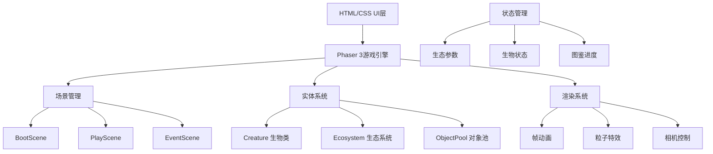

## 1. 架构设计



## 2. 技术选型

- **前端框架**：Phaser 3.70.0（2D游戏引擎）
- **构建工具**：Vite 5.0.0
- **语言**：JavaScript (ES6+)
- **UI层**：原生HTML5 + CSS3
- **动画系统**：Phaser帧动画 + CSS过渡动画
- **性能优化**：对象池模式、脏值检测更新、批量渲染

## 3. 文件结构

| 路径 | 用途 |
|-----|------|
| `index.html` | 入口HTML，包含全屏meta和根div |
| `package.json` | 依赖配置（phaser、vite） |
| `vite.config.js` | Vite配置（base路径、server端口） |
| `src/main.js` | Phaser游戏初始化入口 |
| `src/scenes/BootScene.js` | 资源加载场景 |
| `src/scenes/PlayScene.js` | 核心游戏沙盒逻辑 |
| `src/scenes/EventScene.js` | 随机事件弹窗管理 |
| `src/entities/Creature.js` | 生物基类（状态机、AI） |
| `src/entities/Ecosystem.js` | 生态系统参数管理 |
| `src/utils/ObjectPool.js` | 对象池工具类 |
| `src/style.css` | UI层样式 |

## 4. 核心数据模型

### 4.1 生态系统参数
```javascript
{
  temperature: 22,      // 温度 15-30°C
  ph: 7.0,              // PH值 5.5-8.5
  lightIntensity: 70,   // 光照强度 0-100
  waterQuality: 85,     // 水质 0-100
  oxygenLevel: 75,      // 含氧量 0-100
  foodAmount: 50        // 食物量 0-100
}
```

### 4.2 生物状态
```javascript
{
  id: "creature_001",
  species: "mayfly",    // 物种类型
  x: 400, y: 300,       // 位置
  age: 0,               // 年龄（秒）
  lifespan: 120,        // 寿命（秒）
  hunger: 80,           // 饥饿值 0-100
  health: 100,          // 健康值 0-100
  state: "idle",        // 状态：idle/swim/feed/breed
  velocity: {x: 0, y: 0}
}
```

### 4.3 物种配置
| 物种 | 寿命 | 适宜温度 | 适宜PH | 繁殖条件 |
|-----|-----|---------|-------|---------|
| 蜉蝣 | 60s | 18-26°C | 6.5-7.5 | 饥饿>60, 温度22°C |
| 水黾 | 180s | 20-28°C | 6.0-8.0 | 饥饿>70, 光照>50 |
| 萤火虫 | 240s | 15-25°C | 6.5-7.5 | 饥饿>50, 光照<30 |

## 5. 性能优化策略

### 5.1 对象池模式
- 生物实例复用：死亡后回收到对象池，繁殖时从池中获取
- 粒子特效复用：波纹、气泡等特效对象池管理
- 最大限制：同时存在生物不超过50只

### 5.2 渲染优化
- 静态元素预渲染为纹理
- 离屏生物暂停更新
- 使用Phaser批量渲染（Batch）
- 帧率动态调整

### 5.3 更新优化
- 生物AI按时间片轮转更新
- 生态参数脏值检测更新
- 碰撞检测空间分区

## 6. 随机事件系统

| 事件 | 触发概率 | 影响 | 持续时间 |
|-----|---------|------|---------|
| 暴雨 | 5%/分钟 | 温度-5, PH-0.5 | 30s |
| 外来物种入侵 | 3%/分钟 | 引入新物种竞争 | 永久 |
| 阳光充足 | 8%/分钟 | 光照+30 | 60s |
| 水质恶化 | 4%/分钟 | 水质-20 | 需要调节剂 |
| 繁殖旺季 | 6%/分钟 | 繁殖成功率翻倍 | 45s |

## 7. 响应式适配

### 断点定义
- **桌面**：> 1024px，三栏布局
- **平板**：768-1024px，可折叠面板
- **移动**：< 768px，汉堡菜单

### 场景缩放策略
```javascript
// 保持16:9宽高比，居中显示
const scale = Math.min(
  window.innerWidth / GAME_WIDTH,
  window.innerHeight / GAME_HEIGHT
);
```
