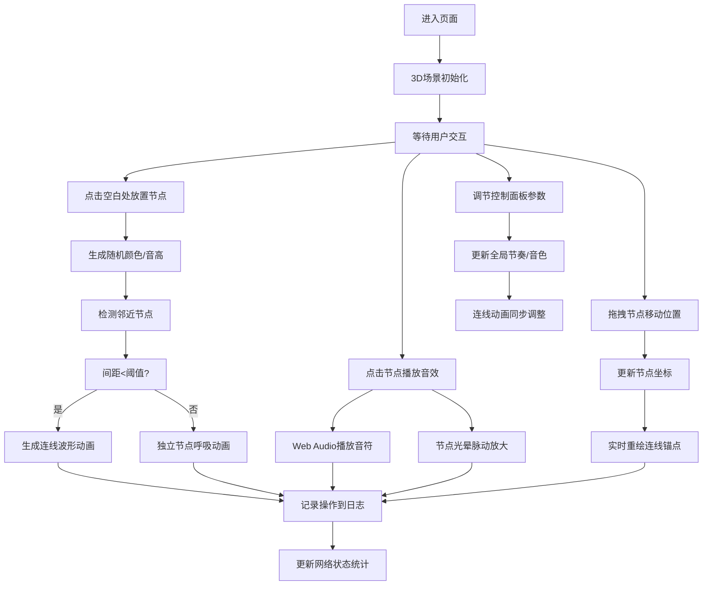

## 1. 产品概述
"音韵织光"是一个沉浸式3D交互可视化项目，用户化身光音织梦者，在三维空间中通过放置和连接声波节点编织动态光音网络。每个节点发出带有颜色和音高的脉动光晕，节点间连线随节奏产生波形动画，点击触发音符，拖拽改变网络拓扑。

- 核心目标：创造一个融合视觉与听觉的艺术创作工具，让用户通过直观的3D交互体验音乐与光影的交织
- 目标用户：音乐爱好者、视觉艺术家、创意工作者、普通用户
- 市场价值：探索视听交互的新形式，提供沉浸式艺术创作体验

## 2. 核心功能

### 2.1 用户角色
| 角色 | 注册方式 | 核心权限 |
|------|----------|----------|
| 访客用户 | 无需注册 | 完整使用所有交互功能，创建、编辑、播放光音网络 |

### 2.2 功能模块
1. **3D场景模块**：Three.js渲染的深空背景，节点放置与拖拽，连线自动生成与波形动画
2. **节点交互模块**：点击播放音效，光晕脉动放大，呼吸动画效果
3. **控制面板模块**：节奏速度调节、音色选择、节点统计、重置功能
4. **日志面板模块**：操作记录显示、网络状态实时更新

### 2.3 页面详情
| 页面名称 | 模块名称 | 功能描述 |
|----------|----------|----------|
| 主页面 | 3D场景 | 渲染深空背景，响应点击放置节点，支持拖拽移动节点，自动生成连线 |
| 主页面 | 节点渲染 | 每个节点具有随机颜色和音高，呼吸动画，点击触发脉动放大和音效 |
| 主页面 | 连线渲染 | 距离小于阈值自动连线，随节奏产生正弦波流动动画 |
| 主页面 | 控制面板 | 左侧展示节奏滑块(0.5-2.0x)、音色下拉(正弦/三角/方波)、节点数量、重置按钮 |
| 主页面 | 日志面板 | 右侧展示最近5次操作记录，当前激活节点数和连线数 |

## 3. 核心流程
用户进入页面后，看到深空背景的3D场景。点击场景空白处放置声波节点，节点自动获得随机颜色和音高。当节点间距小于阈值时自动生成连线，连线随节奏产生流动波形。点击节点播放对应音色的音符，同时节点光晕放大脉动。拖拽节点可改变位置，连线实时重绘。用户可通过左侧控制面板调节节奏、选择音色、查看统计或重置场景。右侧日志面板实时记录所有操作。

## 4. 用户界面设计

### 4.1 设计风格
- **主色调**：深空蓝 #0d1b2a（背景）
- **节点渐变色**：暖橙 #ff9a56 → 冷紫 #8a2be2
- **连线颜色**：半透明白色 rgba(255,255,255,0.4)
- **字体**：采用现代无衬线字体，标题轻盈优雅，正文清晰易读
- **按钮风格**：半透明玻璃质感，圆角设计，悬停时有光晕效果
- **布局风格**：三栏式布局，中间3D场景占主要空间，左右面板悬浮叠加
- **视觉元素**：节点使用发光球体配合光晕效果，连线使用流动波形动画

### 4.2 页面设计概述
| 页面名称 | 模块名称 | UI元素 |
|----------|----------|--------|
| 主页面 | 3D场景 | 深空背景带微弱星点，发光节点球体，波形连线，透视相机，柔和环境光 |
| 主页面 | 控制面板 | 左侧悬浮面板，半透明深色背景，标签+滑块/下拉/按钮组合，数值实时显示 |
| 主页面 | 日志面板 | 右侧悬浮面板，半透明深色背景，操作记录列表，状态统计卡片 |
| 主页面 | 节点 | 球体+发光光晕，渐变色彩，呼吸缩放动画，点击脉动效果 |
| 主页面 | 连线 | 半透明管状，正弦波流动动画，随节奏变化频率 |

### 4.3 响应式
- Desktop-first设计，主场景自适应窗口大小
- 控制面板和日志面板在大屏幕上固定宽度，在小屏幕上自动收折或变为浮动可拖拽面板
- 触摸设备支持双指缩放场景、单指拖拽节点
- 所有交互元素保证最小48x48px可点击区域

### 4.4 3D场景指引
- **环境**：纯深空蓝背景，添加极少量随机星点营造宇宙感
- **光照**：柔和的环境光 + 半球光，节点自身发光材质作为主要视觉光源
- **相机**：PerspectiveCamera，初始位置(0, 0, 8)，支持OrbitControls缩放旋转
- **构图**：节点在XY平面分布，Z轴用于层次深度
- **交互**：点击空白处使用raycaster在XY平面放置节点，拖拽使用Three.js拖拽控件
- **动画**：使用requestAnimationFrame驱动，所有动画通过shader或mesh属性更新实现60fps
- **性能优化**：使用InstancedMesh渲染连线，节点数量控制在合理范围，自动剔除不可见元素
- **后期处理**：轻微Bloom效果增强发光质感，避免过度使用保证性能
