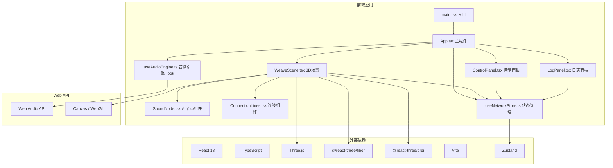

## 1. 架构设计


## 2. 技术描述
- **前端框架**：React 18 + TypeScript 5.x
- **3D渲染**：Three.js 0.160+
- **React Three绑定**：@react-three/fiber 8.x + @react-three/drei 9.x
- **构建工具**：Vite 5.x
- **状态管理**：Zustand 4.x（轻量，无需Provider）
- **音频引擎**：原生Web Audio API
- **样式方案**：CSS Modules / CSS-in-JS（styled-components）
- **动画库**：@react-three/drei动画工具 + 自定义shader动画

## 3. 目录结构
```
src/
├── main.tsx              # 应用入口
├── App.tsx               # 主组件，组装场景和UI面板
├── App.css               # 全局样式
├── vite-env.d.ts         # Vite环境类型
├── scene/
│   ├── WeaveScene.tsx    # 3D场景主组件
│   ├── SoundNode.tsx     # 单个声波节点组件
│   ├── ConnectionLines.tsx # 连线渲染组件
│   └── shaders/          # 自定义shaders（可选）
├── ui/
│   ├── ControlPanel.tsx  # 左侧控制面板
│   ├── LogPanel.tsx      # 右侧日志面板
│   └── PanelStyles.css   # UI面板样式
├── hooks/
│   ├── useAudioEngine.ts # Web Audio引擎Hook
│   └── useNetworkStore.ts # 状态管理Store
├── types/
│   └── index.ts          # 类型定义
└── utils/
    ├── audio.ts          # 音频相关工具
    ├── color.ts          # 颜色生成工具
    └── math.ts           # 数学计算工具
```

## 4. 核心数据类型定义
```typescript
// types/index.ts

export interface Note {
  name: string;      // 音符名称，如 'C#4'
  frequency: number; // 频率 Hz
  octave: number;    // 八度
}

export interface SoundNodeData {
  id: string;
  position: [number, number, number]; // x, y, z
  color: string;     // 十六进制颜色
  note: Note;        // 关联的音符
  isActive: boolean; // 是否激活（点击时）
  pulseIntensity: number; // 脉动强度 0-1
}

export interface ConnectionData {
  id: string;
  fromId: string;
  toId: string;
  distance: number;
  wavePhase: number; // 波形相位
}

export interface NetworkState {
  nodes: SoundNodeData[];
  connections: ConnectionData[];
  tempo: number;     // 节奏速度 0.5-2.0
  waveType: OscillatorType; // 'sine' | 'triangle' | 'square' | 'sawtooth'
  connectionThreshold: number; // 自动连接距离阈值
  logs: LogEntry[];
}

export interface LogEntry {
  id: string;
  timestamp: number;
  message: string;
  type: 'place' | 'connect' | 'play' | 'drag' | 'control';
}

export interface AudioEngineState {
  isInitialized: boolean;
  masterGain: GainNode | null;
  activeOscillators: Map<string, OscillatorNode>;
}
```

## 5. 状态管理设计
使用Zustand创建全局Store，管理节点网络状态、控制面板参数和操作日志。

```typescript
// hooks/useNetworkStore.ts
import { create } from 'zustand';
import { NetworkState, SoundNodeData, ConnectionData, LogEntry, OscillatorType } from '../types';
import { generateRandomNote, generateGradientColor } from '../utils';

interface NetworkStore extends NetworkState {
  addNode: (position: [number, number, number]) => void;
  removeNode: (id: string) => void;
  updateNodePosition: (id: string, position: [number, number, number]) => void;
  activateNode: (id: string) => void;
  deactivateNode: (id: string) => void;
  setTempo: (tempo: number) => void;
  setWaveType: (type: OscillatorType) => void;
  addLog: (message: string, type: LogEntry['type']) => void;
  resetNetwork: () => void;
  recalculateConnections: () => void;
}

export const useNetworkStore = create<NetworkStore>((set, get) => ({
  nodes: [],
  connections: [],
  tempo: 1.0,
  waveType: 'sine',
  connectionThreshold: 2.5,
  logs: [],
  
  addNode: (position) => {
    const note = generateRandomNote();
    const color = generateGradientColor();
    const newNode: SoundNodeData = {
      id: `node-${Date.now()}-${Math.random().toString(36).substr(2, 9)}`,
      position,
      color,
      note,
      isActive: false,
      pulseIntensity: 0,
    };
    set((state) => ({
      nodes: [...state.nodes, newNode],
    }));
    get().addLog(`放置节点 ${note.name}`, 'place');
    get().recalculateConnections();
  },
  
  // ... 其他actions
}));
```

## 6. 音频引擎设计
自定义Hook封装Web Audio API，提供音符播放功能。

```typescript
// hooks/useAudioEngine.ts
import { useCallback, useRef, useEffect } from 'react';
import { Note, OscillatorType } from '../types';

export const useAudioEngine = () => {
  const audioContextRef = useRef<AudioContext | null>(null);
  const masterGainRef = useRef<GainNode | null>(null);
  
  const initAudio = useCallback(() => {
    if (!audioContextRef.current) {
      audioContextRef.current = new (window.AudioContext || (window as any).webkitAudioContext)();
      masterGainRef.current = audioContextRef.current.createGain();
      masterGainRef.current.gain.value = 0.3;
      masterGainRef.current.connect(audioContextRef.current.destination);
    }
    if (audioContextRef.current.state === 'suspended') {
      audioContextRef.current.resume();
    }
  }, []);
  
  const playNote = useCallback((note: Note, waveType: OscillatorType, duration = 0.5) => {
    if (!audioContextRef.current || !masterGainRef.current) return;
    
    const oscillator = audioContextRef.current.createOscillator();
    const gainNode = audioContextRef.current.createGain();
    
    oscillator.type = waveType;
    oscillator.frequency.setValueAtTime(note.frequency, audioContextRef.current.currentTime);
    
    gainNode.gain.setValueAtTime(0, audioContextRef.current.currentTime);
    gainNode.gain.linearRampToValueAtTime(0.5, audioContextRef.current.currentTime + 0.01);
    gainNode.gain.exponentialRampToValueAtTime(0.001, audioContextRef.current.currentTime + duration);
    
    oscillator.connect(gainNode);
    gainNode.connect(masterGainRef.current);
    
    oscillator.start();
    oscillator.stop(audioContextRef.current.currentTime + duration);
  }, []);
  
  return { initAudio, playNote };
};
```

## 7. 性能优化策略
1. **节点渲染优化**：使用React Three Fiber的自动渲染调度，避免不必要的重渲染
2. **连线优化**：使用LineSegments配合BufferGeometry，动态更新position attribute
3. **动画优化**：使用useFrame钩子，在每一帧只更新必要的属性，利用GPU instancing
4. **状态优化**：Zustand自动按需订阅，只有使用的状态变化时才触发重渲染
5. **音频优化**：复用AudioContext，及时清理已播放的oscillator
6. **内存管理**：节点移除时清理相关的几何体和材质，避免内存泄漏

## 8. 关键实现要点
1. **Raycaster点击检测**：使用Three.js Raycaster将屏幕点击坐标转换为3D空间坐标
2. **节点拖拽**：使用@react-three/drei的Draggable组件或自定义拖拽逻辑
3. **波形连线动画**：在shader中根据时间和节奏参数计算正弦波偏移，或在JS中更新顶点位置
4. **呼吸动画**：在useFrame中根据正弦函数更新节点scale和材质emissiveIntensity
5. **自动连接检测**：每次添加/移动节点时，计算所有节点对之间的距离，小于阈值则创建连接
